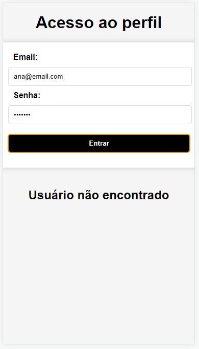
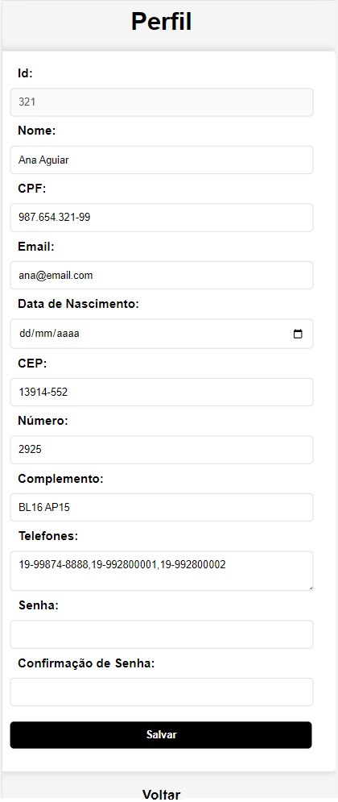

# Aula13 - Segurança
- Navegação entre páginas, tela de login
    - [Exemplo 1](./acesso1)
    - [Exemplo 2](./acesso2)
- Segurança
    - [HASH](./hash.md)
    - [MD5](./md5.md)

## Atividade 01
|Contextualização|
|-|
|A empresa que você traalha precisa de um aplicativo com controle de acesso em nível de usuário|

|Desafio|
|-|
|Com os dados apresentados no mockup a seguir, desenvolva uma tela de login e outra que exiba o perfil do usuário, não há necessidade de interação com API ou back-End neste momento, porém deixe as telas responsivas para monitores e celulares atuais|

- mokup.json
```json
{
    "id": 123,
    "nome": "Passos Dias Aguiar",
    "cpf": "123.456.789-01",
    "email": "passos@email.com",
    "senha": "-2884944701",
    "nascto": "2000-03-01",
    "endereco": {
        "cep": "13914-552",
        "numero": "2925",
        "complemento": "BL16 AP14"
    },
    "telefones": [
        "19-99874-8789",
        "19-992804020"
    ]
}
```
|login.html|perfil.html|
|-|-|
|||

|Obs:Criptografia|
|:-|
|Para alguma segurança, a senha deve ser criptografada com algoritmo md5(mesmo ultrapassado, usaremos para aprendizado)|

|Entregas|
|-|
|Teste o aplicativo de um colega de turma e tente acessar o perfil ou descobrir a senha|

## Atividade 02
|Desafio|
|-|
|Agora implemente com os mockups a seguir um banco de dados MySQL e uma API que receba os dados de login (email e senha) via POST retornando os dados do perfil do usuário. A tela de login deve enviar e-mail e senha, receber os dados completos do usuário e direcionar para a pagina de perfil. A página de perfil deve permitir alterar os dados ao clicar em salvar as alterações devem ser enviadas via PUT para a API que as efetiva no banco de dados|

- mokup.json
```json
[
    {
        "id": 123,
        "nome": "Passos Dias Aguiar",
        "cpf": "123.456.789-01",
        "email": "passos@email.com",
        "senha": "1234",
        "nascto": "2000-03-01",
        "endereco": {
            "cep": "13914-552",
            "numero": "2925",
            "complemento": "BL16 AP14"
        },
        "telefones": [
            "19-99874-8789",
            "19-992804020"
        ]
    },
    {
        "id": 321,
        "nome": "Ana Aguiar",
        "cpf": "987.654.321-99",
        "email": "ana@email.com",
        "senha": "1234",
        "nascto": "2000-03-20",
        "endereco": {
            "cep": "13914-552",
            "numero": "2925",
            "complemento": "BL16 AP15"
        },
        "telefones": [
            "19-99874-8888",
            "19-992800001",
            "19-992800002"
        ]
    },
    {
        "id": 333,
        "nome": "Fabiana Silva",
        "cpf": "987.654.300-10",
        "email": "fabiana@email.com",
        "senha": "1234",
        "nascto": "2000-03-20",
        "endereco": {
            "cep": "13914-552",
            "numero": "2900",
            "complemento": null
        },
        "telefones": [
            "19-99874-0000",
        ]
    }
]
```
|Obs:Criptografia|
|:-|
|Caso prefira mais um nível de segurança, no MySQL há as funções md5(txtsenha) ou password(txtsenha) utilizeas para armazenar as senhas|

|Entregas|
|-|
|Teste o aplicativo de um colega de turma **novamente** e tente acessar o perfil ou descobrir a senha. Comente com o professor e colega as dificuldades, compartilhe seus conhecimentos.|