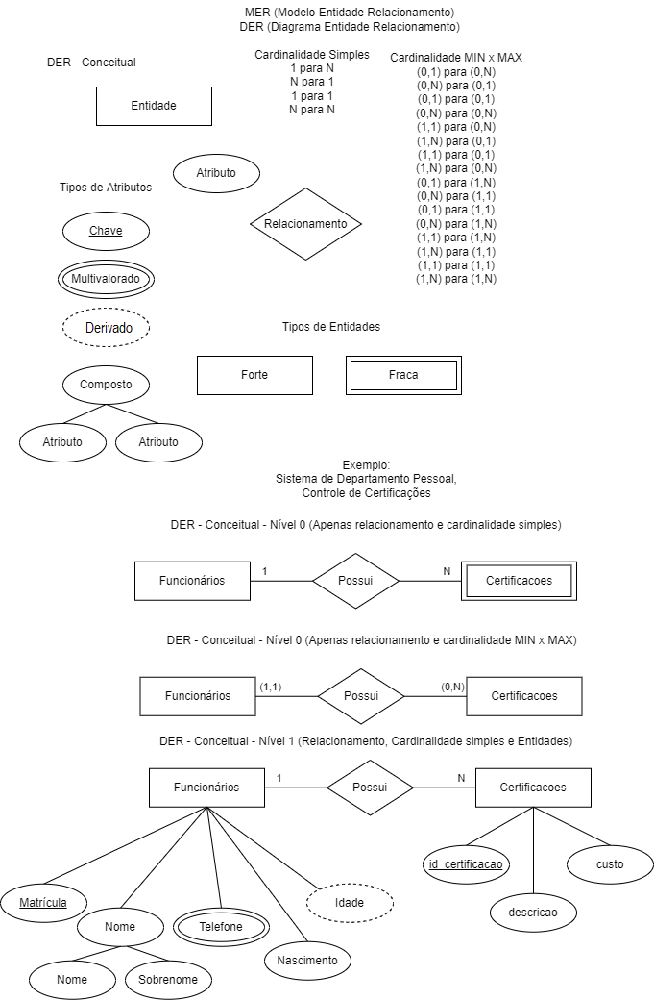
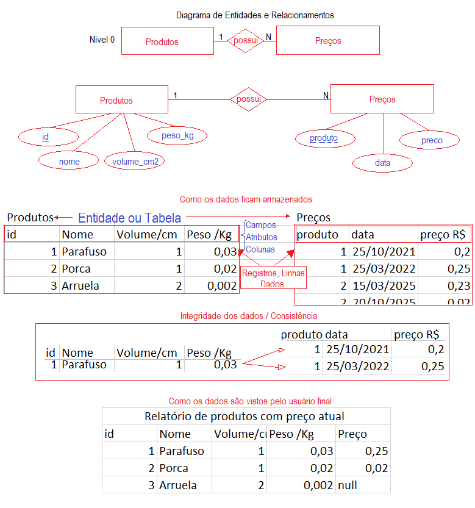
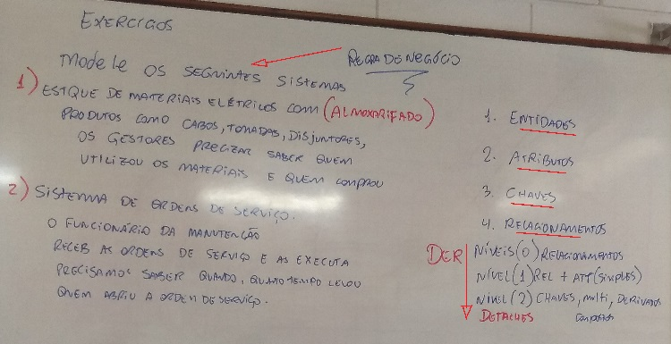

# Tipos de bancos de dados
- Não estruturado
  - TXT
  - DOC
  - PDF
  - XLS (Excel)
- Semi-estruturado
  - XML
  - JSON
- Estruturado
	- SGBD (Sistema Gerenciador de Banco de Dados)
	- Sem SGBD = CSV
	- Com SGBD
		- Não SQL (Ex: MongoDB, FireBase ...)
			- Não Relacional
		- SQL (Ex: Mysql, Oracle, SQL Server, Postgres, FireBird ...)
			- Relacionais

# MER x DER
- MER (Modelo Entidade Relacionamento)
- DER (Diagrama Entidade Relacionamento)
- Chave
	- Campo único que identifica o registro (A linha inteira de dados)
	- Chave Primária (Não se repete na tabela)
	- Chave Estrangeira (Se repete na tabela e sempre faz referência a uma chave primária em outra tabela)
- <b>Conceitual</b>
	- Mais próximo do problema,
	- descreve as concistências dos dados através dos relacionamentos
	- Não tem a necessidade de apresentar as chaves estrangeiras
	- Possui cardinalidades
		- 1 para 1
		- 1 para N
		- N para N
		- Min x Max
- <b>Lógico</b>
	- Mais próximo da solução
	- Possui apenas a cardinalidades
		- I para N
	- Chave primária e estrangeiras
# MER
- Exemplo:
	- Banco de dados de cadastro de produtos e histórico de preços:
	- Produtos (id[inteiro,4 dígitos, não nulo, autoincrementado], nome[40 caracteres, não nulo], volume[real,6.2 dígitos], peso[real, 6.2 dígitos]);
	- Preços (produto[inteiro,4 dígitos, não nulo] referencia produto(id), data[data, não nulo], preço[real, 8.2 dígitos, não nulo	]);
# DER
- 

# Exemplo:
- Banco de dados de cadastro de produtos e histórico de preços:
- 

# Exercícios
- 
- Criar os diagramas utilizando <b>um dos</b> meios a seguir
	- brModelo.jar (Neste repositório)
	- http://draw.io
	- mspaint
	- Papel e caneta