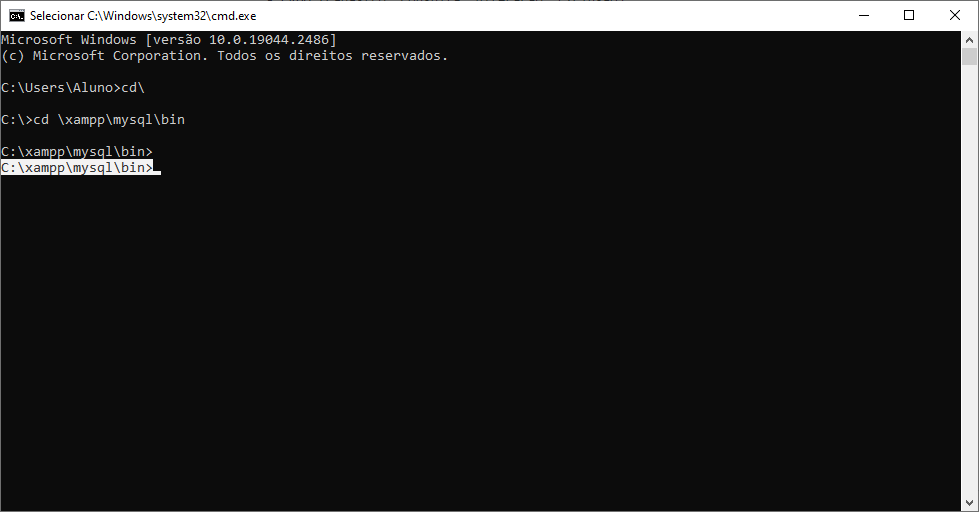
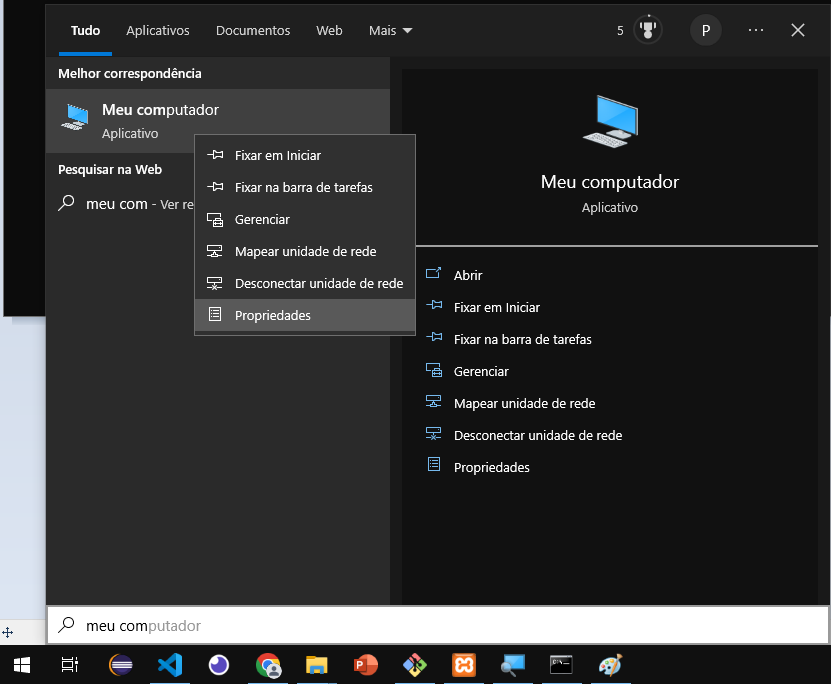
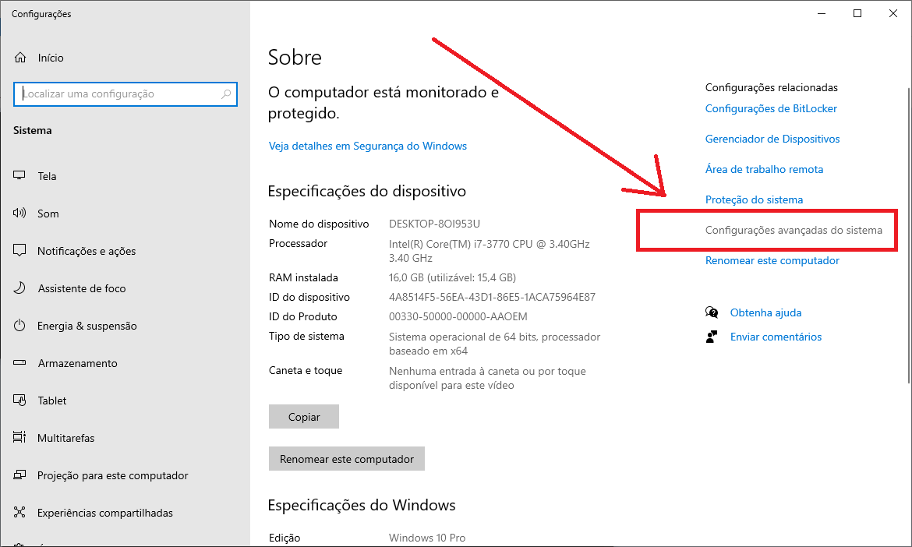
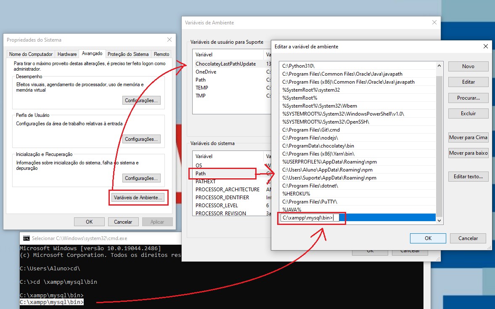

# Variáveis de ambiente
- Configurar o caminho do SGBD <b>c:\xampp\mysql\bin</b> como variável de ambiente:
    - 1. Copiar o endereço c:\xampp\mysql\bin
        - 
    - 2. Abrir as propriedades do Computador "Windows + Pause/Breack"
        - 2.1. Iniciar: Meu computador >>> Propriedades
        - 
    - 3. Configurações avançadas do sistema
        - 
    - 4. Variáveis de ambiente
    - 5. Procura a variável <b>Path</b>
    - 6. Clique em Novo e cole o entereço:
        - 