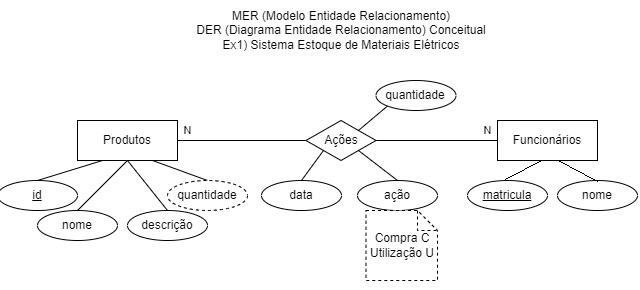
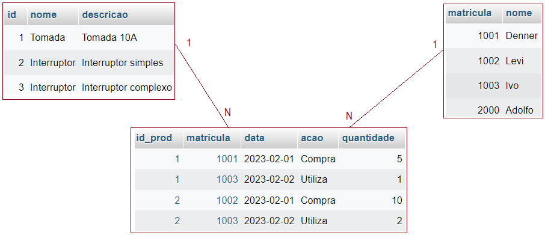
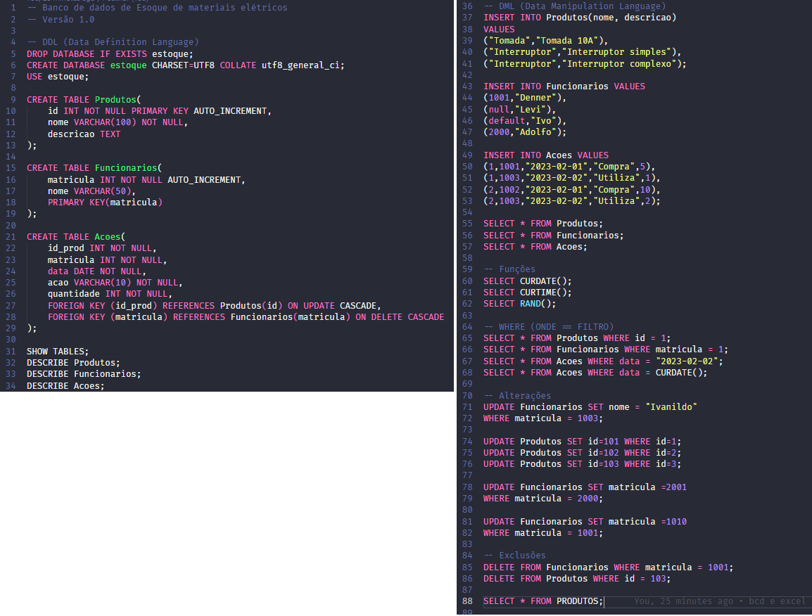
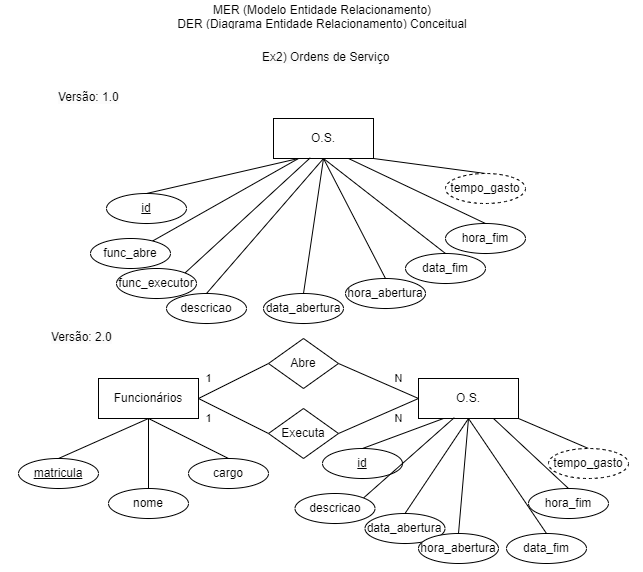
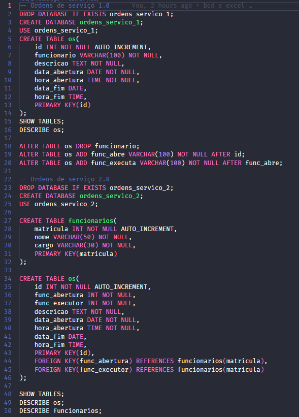
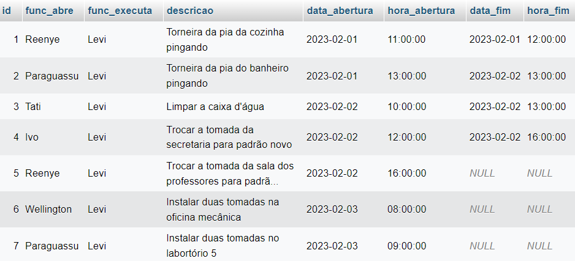
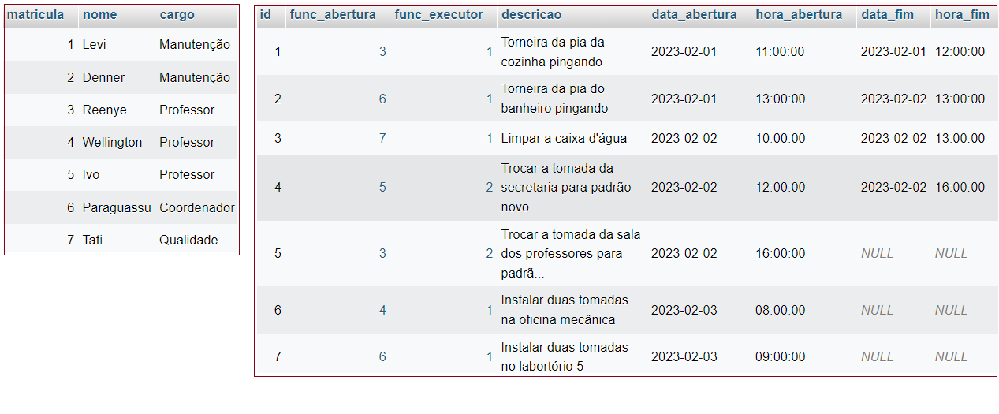

# SQL (structured query language)
- 2.4. DDL (data definition language)
	- 2.4.1. CREATE DATABASE
	- 2.4.2. DROP DATABASE
	- 2.4.3. USE
	- 2.4.4. CREATE TABLE
	- 2.4.5. ALTER TABLE
	- 2.4.6. DROP TABLE
- 2.6. DML (data manipulation language)
	- 2.6.1. INSERT
	- 2.6.2. UPDATE
	- 2.6.3. DELETE
	- 2.6.4. SELECT
- 2.8. Funções
	- 2.8.1. Data e hora
		- CURDATE() <- Retorna a data atual
		- CURTIME() <- Retorna a hora atual
	- 2.8.2. Matemáticas
		- RAND() <- Retorna um número aleatório entre 0 e 1
# Demonstração CRUD(Cadastro, Consulta, Alteração e Exclusão)
- 
- Dados para inserir no Banco de Dados de Estoque
- 
- Script de criação DDL e manipulação dos dados DML
- 
# Atividade
- Durante esta aula, construimos o script de criação DDL e inserimos os dados no banco de dados de estoque conforme MER e DER.
- Desafio: Popule o banco de dados de Ordens de Serviço com os dados a seguir:
	- 
	- Segue o script de DDL de Criação dos dois bancos de dados ordens_serviço_1 e ordens_servico_2.
	- 
	- Dados ordens_serviço_1:
	- 
	- Dados ordens_serviço_2:
	- 
	