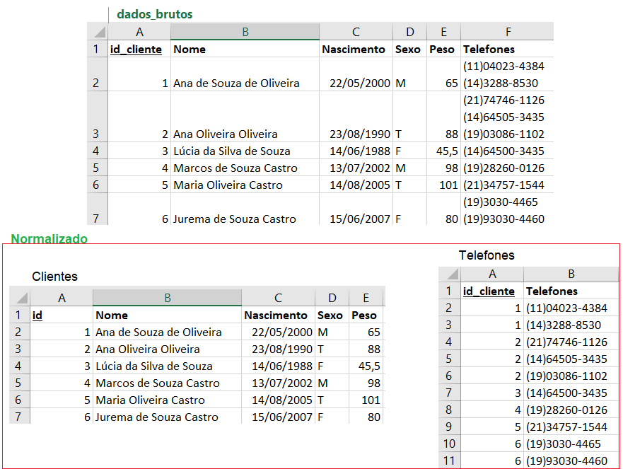
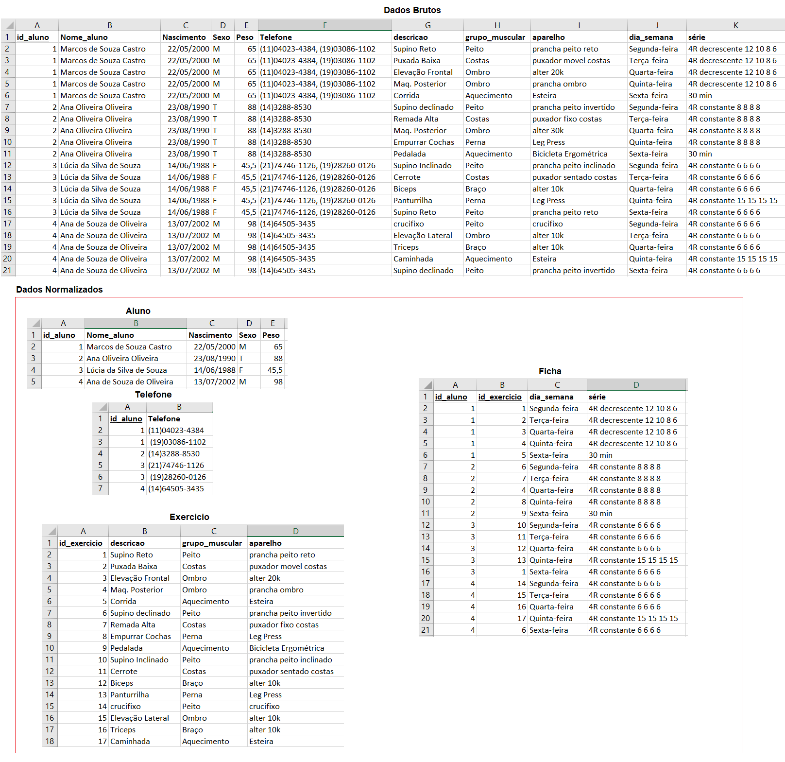
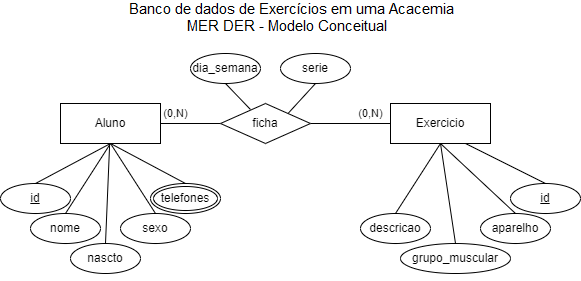
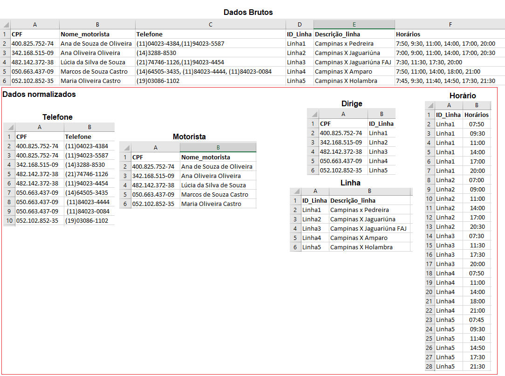
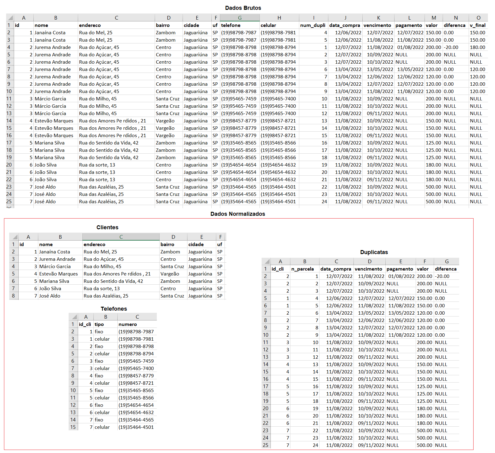
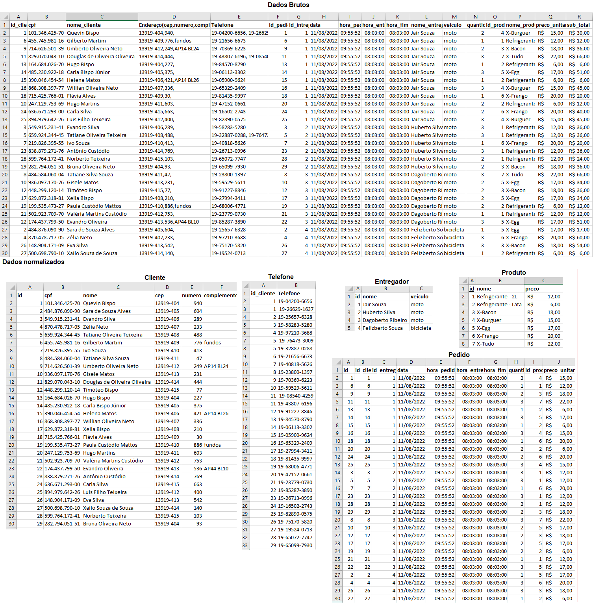
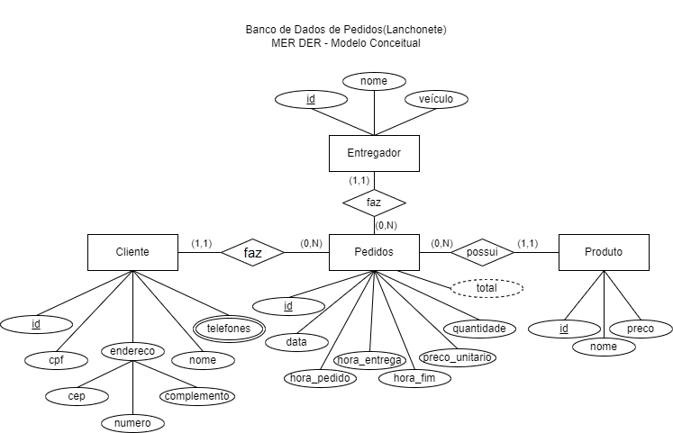

# Aula05 - Normalização e Projeto de Banco de Dados
## Correção dos exercícios de Normalização e (MER x DER Conceituais)
1. **./01.projeto_clientes**

2. **./02.projeto_academia**

3. **./03.projeto_onibus**

4. **./04.projeto_duplicatas**

5. **./05.projeto_pedidos**

# Exercícios
* Para cada um dos 5 projetos, elabore o script de SQL/DDL: