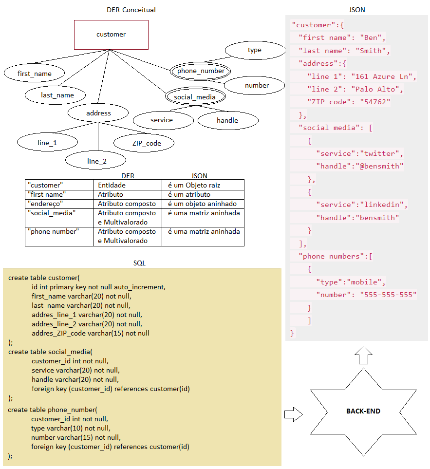
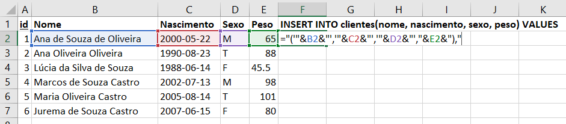
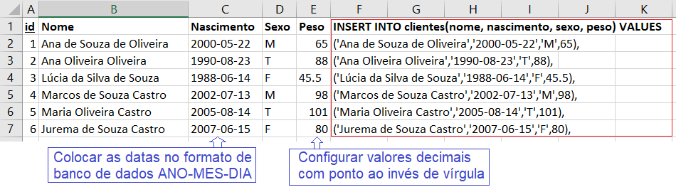
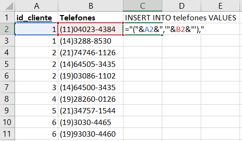
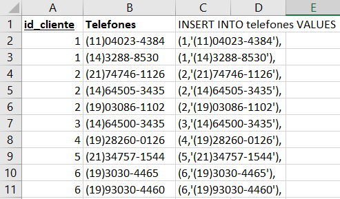
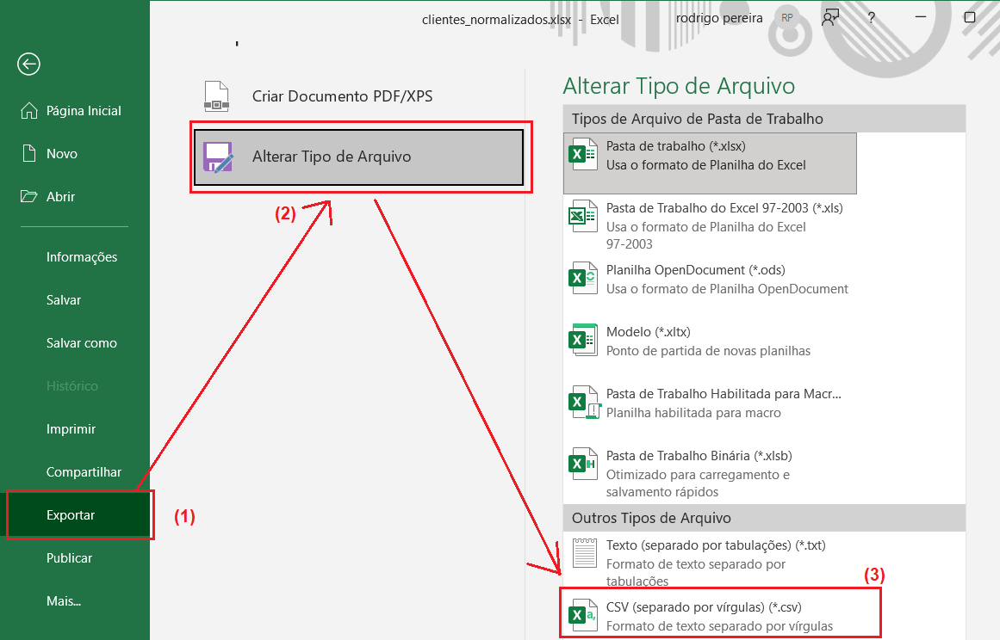

# Importação de dados para SGBD
- 2.5. Migração de dados
- 2.5.1. Exportação de dados
- 2.5.2. Importação de dados
- Tipos e padrões de dados
	- csv (Estruturado)
	- xml (Semi-estruturado)
	- json (Não estruturado)
- Interação de API com o Banco de Dados

- clientes.CSV
```csv
nome;sobrenome;tipo;numero
Arnaldo;Moreira;Celular;19-98787-7788
Arnaldo;Moreira;Residencial;19-38787-4567
Juliana;Silva;Celular;19-99987-4566
```
- clientes.XML
```xml
<clientes>
	<cliente>
		<nome>Arnaldo</nome>
		<sobrenome>Moreira</sobrenome>
		<telefones>
			<telefone>
				<tipo>
					Celular
				</tipo>
				<numero>
					19-98787-7788
				</numero>
			</telefone>
			<telefone>
				<tipo>
					Residencial
				</tipo>
				<numero>
					19-38787-4567
				</numero>
			</telefone>
		</telefones>
	</cliente>
	<cliente>
		<nome>Juliana</nome>
		<sobrenome>Silca</sobrenome>
		<telefones>
			<telefone>
				<tipo>
					Celular
				</tipo>
				<numero>
					19-99987-4566
				</numero>
			</telefone>
		</telefones>
	</cliente>
</clientes>
```
- cliente.json
```json
[
	{
		"nome":"Arnaldo",
		"sobrenome":"Moreira",
		"telefones":[
			{
				"tipo":"celular",
				"numero":"19-98787-7788"
			},
			{
				"tipo":"Residencial",
				"numero":"19-38787-4567"
			}
		]
	},
	{
		"nome":"Juliana",
		"sobrenome":"Silva",
		"telefones":[
			{
				"tipo":"celular",
				"numero":"19-99987-4566"
			}
		]
	}
]
```
## Importação de dados de planilhas do Excel para BD SQL
### Por concatenação de dados:

- Utilizamos o símbolo & "E comercial" para concatenar
- Lembrando de colocar aspas e apóstrofo nos campos tipo VARCHAR, DATE e os campos numéricos não necessitam de apóstrofo (aspas simples)
- Formatar as datas e números nos formatos de Banco de Dados


clientes.sql
```SQL
-- DML Importação por concatenação de dados
INSERT INTO clientes(nome, nascimento, sexo, peso) VALUES
('Ana de Souza de Oliveira','2000-05-22','M',65),
('Ana Oliveira Oliveira','1990-08-23','T',88),
('Lúcia da Silva de Souza','1988-06-14','F',45.5),
('Marcos de Souza Castro','2002-07-13','M',98),
('Maria Oliveira Castro','2005-08-14','T',101),
('Jurema de Souza Castro','2007-06-15','F',80);
```
- Importando os dados de telefones:





clientes.sql
```SQL
-- DML Importação por concatenação de dados
INSERT INTO telefones VALUES
(1,'(11)04023-4384'),
(1,'(14)3288-8530'),
(2,'(21)74746-1126'),
(2,'(14)64505-3435'),
(2,'(19)03086-1102'),
(3,'(14)64500-3435'),
(4,'(19)28260-0126'),
(5,'(21)34757-1544'),
(6,'(19)3030-4465'),
(6,'(19)93030-4460');
```

### Por arquivos .CSV
- O processo de preparação dos dados segue o mesmo
- A planilha deve estar Normalizada (Nas três formas 1º, 2º e 3º)
- Colocar as datas e decimais no padrão do banco de dados
- E cada tabela deve ser exportada para o formato CSV

- Ficando no seguinte padrão, conforme exemplos no Banco de Dados de uma Academia a seguir:

aluno.csv
```
id;Nome;Nascimento;Sexo;Peso
1;Marcos de Souza Castro;2000-05-22;M;65
2;Ana Oliveira Oliveira;1990-08-23;T;88
3;Lúcia da Silva de Souza;1988-06-14;F;45.5
4;Ana de Souza de Oliveira;2002-07-13;M;98
```
telefone.csv
```
id_aluno;Telefone
1;(11)04023-4384
1; (19)03086-1102
2;(14)3288-8530
3;(21)74746-1126
3; (19)28260-0126
4;(14)64505-3435
```
exercício.csv
```
id;descricao;grupo_muscular;aparelho
1;Supino Reto;Peito;prancha peito reto
2;Puxada Baixa;Costas;puxador movel costas
3;Elevação Frontal;Ombro;alter 20k
4;Maq. Posterior;Ombro;prancha ombro
5;Corrida;Aquecimento;Esteira
6;Supino declinado;Peito;prancha peito invertido
7;Remada Alta;Costas;puxador fixo costas
8;Empurrar Cochas;Perna;Leg Press
9;Pedalada;Aquecimento;Bicicleta Ergométrica
10;Supino Inclinado;Peito;prancha peito inclinado
11;Cerrote;Costas;puxador sentado costas
12;Biceps;Braço;alter 10k
13;Panturrilha;Perna;Leg Press
14;crucifixo;Peito;crucifixo
15;Elevaçãoo Lateral;Ombro;alter 10k
16;Triceps;Braço;alter 10k
17;Caminhada;Aquecimento;Esteira
```
ficha.csv
```
id_aluno;id_exercicio;dia_semana;série
1;1;Segunda-feira;4R decrescente 12 10 8 6
1;2;Terça-feira;4R decrescente 12 10 8 6
1;3;Quarta-feira;4R decrescente 12 10 8 6
1;4;Quinta-feira;4R decrescente 12 10 8 6
1;5;Sexta-feira;30 min
2;6;Segunda-feira;4R constante 8 8 8 8
2;7;Terça-feira;4R constante 8 8 8 8
2;4;Quarta-feira;4R constante 8 8 8 8
2;8;Quinta-feira;4R constante 8 8 8 8
2;9;Sexta-feira;30 min
3;10;Segunda-feira;4R constante 6 6 6 6
3;11;Terça-feira;4R constante 6 6 6 6
3;12;Quarta-feira;4R constante 6 6 6 6
3;13;Quinta-feira;4R constante 15 15 15 15
3;1;Sexta-feira;4R constante 6 6 6 6
4;14;Segunda-feira;4R constante 6 6 6 6
4;15;Terça-feira;4R constante 6 6 6 6
4;16;Quarta-feira;4R constante 6 6 6 6
4;17;Quinta-feira;4R constante 15 15 15 15
4;6;Sexta-feira;4R constante 6 6 6 6
```
academia.sql
```sql
DROP DATABASE IF EXISTS academia;
CREATE DATABASE academia CHARSET=UTF8 COLLATE utf8_general_ci;
USE academia;

-- DDL
CREATE TABLE aluno (
    id INT NOT NULL PRIMARY KEY AUTO_INCREMENT,
    nome VARCHAR(50) NOT NULL,
    nascimento DATE NOT NULL,
    sexo CHAR(1) NOT NULL,
    peso FLOAT NOT NULL
);

CREATE TABLE telefone (
	id INT NOT NULL,
	numero VARCHAR(15) NOT NULL,
	FOREIGN KEY (id) REFERENCES aluno(id)
);

CREATE TABLE exercicio (
    id INT NOT NULL PRIMARY KEY AUTO_INCREMENT,
    descricao TEXT NOT NULL,
    grupo_muscular VARCHAR(30) NOT NULL,
    aparelho TEXT NOT NULL
);

CREATE TABLE ficha (
    id_aluno INT NOT NULL,
    id_exercicio INT NOT NULL,
    dia_semana VARCHAR(20) NOT NULL,
	serie VARCHAR(100) NOT NULL,
    FOREIGN KEY (id_aluno) REFERENCES aluno(id),
    FOREIGN KEY (id_exercicio) REFERENCES exercicio(id)
);

SHOW TABLES;

-- DML (Importação dos dados)
LOAD DATA INFILE 'E:/senai2023/2des/03-bcd/aula06/02.projeto_academia/aluno.csv'
INTO TABLE aluno
FIELDS TERMINATED BY ';'
ENCLOSED BY '"'
LINES TERMINATED BY '\r\n'
IGNORE 1 ROWS;

LOAD DATA INFILE 'E:/senai2023/2des/03-bcd/aula06/02.projeto_academia/telefone.csv'
INTO TABLE telefone
FIELDS TERMINATED BY ';'
ENCLOSED BY '"'
LINES TERMINATED BY '\r\n'
IGNORE 1 ROWS;

LOAD DATA INFILE 'E:/senai2023/2des/03-bcd/aula06/02.projeto_academia/exercicio.csv'
INTO TABLE exercicio
FIELDS TERMINATED BY ';'
ENCLOSED BY '"'
LINES TERMINATED BY '\r\n'
IGNORE 1 ROWS;

LOAD DATA INFILE 'E:/senai2023/2des/03-bcd/aula06/02.projeto_academia/ficha.csv'
INTO TABLE ficha
FIELDS TERMINATED BY ';'
ENCLOSED BY '"'
LINES TERMINATED BY '\r\n'
IGNORE 1 ROWS;

SELECT * FROM aluno;
SELECT * FROM telefone;
SELECT * FROM exercicio;
SELECT * FROM ficha;
```
## Exportação de dados no formato universal CSV
```SQL
-- Exportar para CSV
SELECT * FROM vw_exercicios_praticados
INTO OUTFILE 'D:/senai2023/2des/03-bcd/aula06/02.projeto_academia/rel_exercicio.csv'
FIELDS TERMINATED BY ';'
LINES TERMINATED BY '\r\n';
```
# Atividades
- Assim como foi feito em aula os exemplos do 01.projeto_clientes e 02.projeto_academia, faça a importação dos dados por arquivos CSV dos outros três projetos:
	- 03.projeto_onibus
	- 04.projeto_duplicatas
	- 05.projeto_pedidos