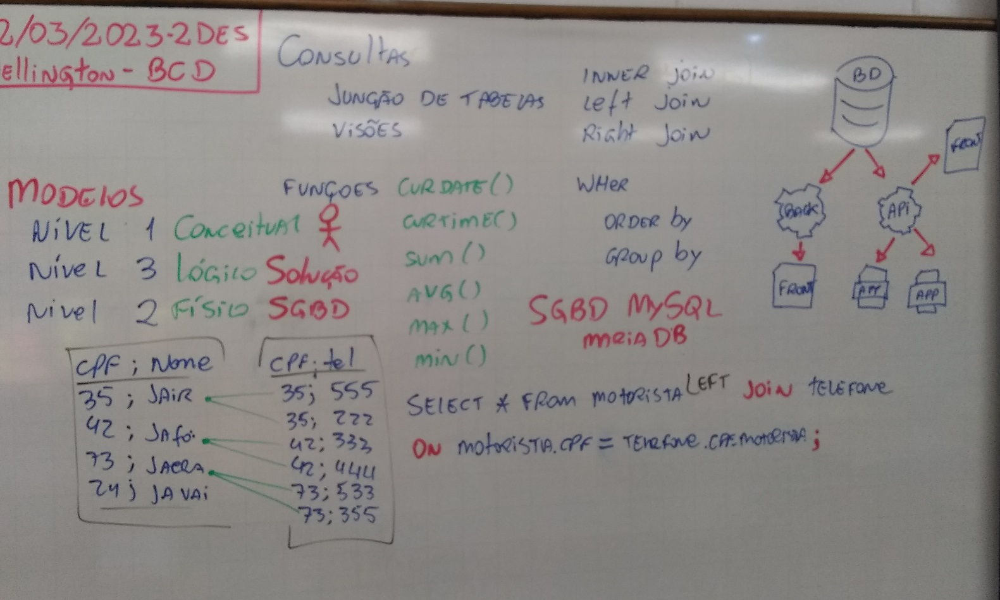

# SQL (structured query language)
- 2.7. Operadores
    - 2.7.1. Aritméticos
    - 2.7.2. Relacionais
    - 2.7.3. Lógicos
    - 2.7.4. Auxiliares
- 2.8. Funções
    - 2.8.1. Data e hora
    - 2.8.2. Matemáticas
    - 2.8.3. String
    - 2.8.4. De agregação
- 2.9. Agrupamento de dados (GROUP BY)
- 2.10. União de dados (UNION)
- 2.11. Associação de tabelas
    - 2.11.1. WHERE
    - 2.11.2. CROSS JOIN
    - 2.11.3. INNER JOIN
    - 2.11.4. OUTER JOIN
    - 2.11.5. LEFT
    - 2.11.6. RIGTH
## Views (Visões, Relatórios)
- São consultas salvas que trazem "informações" do banco de dados

## Banco de dados: Academia
```SQL
DROP DATABASE IF EXISTS academia;
CREATE DATABASE academia CHARSET=UTF8 COLLATE utf8_general_ci;
USE academia;

-- DDL
CREATE TABLE aluno (
    id INT NOT NULL PRIMARY KEY AUTO_INCREMENT,
    nome VARCHAR(50) NOT NULL,
    nascimento DATE NOT NULL,
    sexo CHAR(1) NOT NULL,
    peso FLOAT NOT NULL
);

CREATE TABLE telefone (
	id INT NOT NULL,
	numero VARCHAR(15) NOT NULL,
	FOREIGN KEY (id) REFERENCES aluno(id)
);

CREATE TABLE exercicio (
    id INT NOT NULL PRIMARY KEY AUTO_INCREMENT,
    descricao TEXT NOT NULL,
    grupo_muscular VARCHAR(30) NOT NULL,
    aparelho TEXT NOT NULL
);

CREATE TABLE ficha (
    id_aluno INT NOT NULL,
    id_exercicio INT NOT NULL,
    dia_semana VARCHAR(20) NOT NULL,
	serie VARCHAR(100) NOT NULL,
    FOREIGN KEY (id_aluno) REFERENCES aluno(id),
    FOREIGN KEY (id_exercicio) REFERENCES exercicio(id)
);
-- DML (Importação dos dados)
LOAD DATA INFILE 'E:/senai2023/2des/03-bcd/aula06/02.projeto_academia/aluno.csv'
INTO TABLE aluno
FIELDS TERMINATED BY ';'
ENCLOSED BY '"'
LINES TERMINATED BY '\r\n'
IGNORE 1 ROWS;

LOAD DATA INFILE 'E:/senai2023/2des/03-bcd/aula06/02.projeto_academia/telefone.csv'
INTO TABLE telefone
FIELDS TERMINATED BY ';'
ENCLOSED BY '"'
LINES TERMINATED BY '\r\n'
IGNORE 1 ROWS;

LOAD DATA INFILE 'E:/senai2023/2des/03-bcd/aula06/02.projeto_academia/exercicio.csv'
INTO TABLE exercicio
FIELDS TERMINATED BY ';'
ENCLOSED BY '"'
LINES TERMINATED BY '\r\n'
IGNORE 1 ROWS;

LOAD DATA INFILE 'E:/senai2023/2des/03-bcd/aula06/02.projeto_academia/ficha.csv'
INTO TABLE ficha
FIELDS TERMINATED BY ';'
ENCLOSED BY '"'
LINES TERMINATED BY '\r\n'
IGNORE 1 ROWS;
```
## View ou Visão (Consulta salva, Relatório)
```SQL
-- Missão, ver uma tabela com os exercícios mais praticados (Relatório)
CREATE VIEW vw_exercicios_praticados AS
SELECT f.id_aluno, e.id, e.descricao, e.aparelho, COUNT(e.id) AS Qtdade
FROM exercicio e JOIN ficha f
ON e.id = f.id_exercicio
GROUP BY e.id;

SELECT * FROM vw_exercicios_praticados;
```

## Lousa da aula 02/03/2023


## Queries, Recursos avançados de consultas
### JOIN (Associação de tabelas) INNER, LEFT, RIGHT
- Banco de dados: **./03.projeto_onibus**
```sql
-- Query
-- Inserir um motorista novo, que ainda não possui telefone
INSERT INTO motorista VALUE ('111.111.111-11','Jair');
-- 1.Criar uma consulta que mostre os motoristas e telefones
-- Detalhe: mesmo que o motorista não possua telefone deve aparecer na consulta
SELECT * FROM motorista m
	LEFT JOIN telefone t
	ON m.cpf = t.cpf_motorista;
-- 2. Criar uma consulta que mostre o "nome do motorista" e o "id da linha"
SELECT m.nome, d.id_linha FROM motorista m
	INNER JOIN dirige d
	ON m.cpf = d.cpf_motorista;
-- Detalhe: Caso o motorista não possua nenhuma linha deve aparecer
SELECT m.nome, d.id_linha FROM motorista m
	LEFT JOIN dirige d
	ON m.cpf = d.cpf_motorista;
-- Inserir uma linha ainda sem motorista
INSERT INTO linha VALUE ('linha6','Pedreira x Arcadas');
-- Detalhe: Caso a linha não possua motorista deve aparecer
SELECT m.nome, l.id FROM motorista m
	JOIN dirige d
	ON m.cpf = d.cpf_motorista
	RIGHT JOIN linha l
	ON d.id_linha = l.id;
-- Detalhe: A consulta deve mostrar tanto motoristas com ou sem linha e linhas sem motoristas
SELECT m.nome, d.id_linha FROM motorista m
	LEFT JOIN dirige d
	ON m.cpf = d.cpf_motorista
	UNION
	SELECT m.nome, l.id FROM motorista m
		JOIN dirige d
		ON m.cpf = d.cpf_motorista
		RIGHT JOIN linha l
		ON d.id_linha = l.id;
-- A admnistração da empresa de onibus, percebeu qe existe uma linha sem motorista e um motorista sem linha
-- Registre esta linha para este motorista.
INSERT INTO dirige VALUE ('111.111.111-11','linha6');
-- Podemos colocar o Jair em outra linha também
INSERT INTO dirige VALUE ('111.111.111-11','linha1');
```
## Salvar as consultas (VIEW/RELATORIOS)
```sql
-- Geradas as conultas necessárias, salva como VISÕES

-- Motoristas com seus telefones
CREATE VIEW vw_motorista AS
	SELECT m.cpf, m.nome, t.numero AS telefone FROM motorista m
		LEFT JOIN telefone t
		ON m.cpf = t.cpf_motorista;

-- Nomes dos motoristas e linhas que dirige
CREATE VIEW vw_moto_x_linha AS
	SELECT m.nome, d.id_linha FROM motorista m
		LEFT JOIN dirige d
		ON m.cpf = d.cpf_motorista
		UNION
		SELECT m.nome, l.id FROM motorista m
			JOIN dirige d
			ON m.cpf = d.cpf_motorista
			RIGHT JOIN linha l
			ON d.id_linha = l.id;
		
-- testar as visões
SELECT * FROM vw_motorista;
SELECT * FROM vw_moto_x_linha;
```
# Atividades
- DESAFIO: Ainda com o Banco de Dados de linhas de ônibus (Crie consultas que:)
    - A: Mostre o nome, os telefone e id_linha do motorista ou motoristas da linha1
    - B: Mostre os horários da linha1
    - C: Mostre o id_linha das linhas que tenham horário  as 11:00hs.
    - D: Mostre os nomes, telefones, id_linha, descricao e horários orenado por id_linha
    - E: Mostre uma consulta que mostre os nomes dos motoristas e quantas linhas este dirige
    - F: Mostre o id_linha, a descrição e quantos motoristas esta possui
