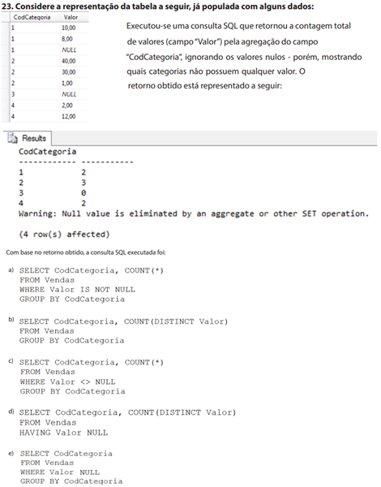

# Avaliações
## Formativa VOF01 (Verificação objetiva formativa 01)
- https://forms.gle/3CYphjj9ZANoXiLz7
- Questão sobre consultas no banco de dados vendas:
- 
- Solução
```sql
create database teste;
use teste;
create table vendas(
	codCategoria int not NULL,
	valor decimal(10,2)
);

insert into vendas VALUES
(1,10),
(1,8),
(1,null),
(2,40),
(2,30),
(2,1),
(3,null),
(4,2),
(4,12);

select * from vendas;


SELECT codCategoria, count(*)
FROM vendas
WHERE valor IS NOT NULL
GROUP BY codCategoria;

SELECT codCategoria, count(DISTINCT valor)
FROM vendas
GROUP BY codCategoria;

SELECT codCategoria, count(*)
FROM vendas
GROUP BY codCategoria;

SELECT codCategoria, count(*)
FROM vendas
WHERE valor <> NULL
GROUP BY codCategoria;

SELECT codCategoria, count(DISTINCT valor)
FROM vendas
HAVING valor NULL;
```
## Somativa VPS01 (Verificação objetiva somativa 01)
### Critérios
|Criticidade|Científicos ou Capacidades Técnicas|Critério|
|:-:|-|:-:|
|**Crítico**|1. Identificar as características de banco de dados relacionais e não-relacionais|**Classificou entidades, atributos e relacionamento resolvendo o problema proposto**|
|Desejável|2. Configurar o ambiente para utilização de banco de dados relacional|	Instalou se necessário, executou o SGBD MySQL e executou os scripts SQL|
|Desejável|3. Utilizar tipos de dados para definição dos atributos do banco de dados.|Resolveu o problema proposto com evidências através do script SQL|
|**Crítico**|4. Elaborar diagramas de modelagem do banco de dados de acordo com a arquitetura definida (3).	|**Desenvolveu o MER DER conforme solicitado**|
|**Crítico**|9. Utilizar linguagem de definição de dados (DDL)|**Criou as tabelas e relacionamentos no SGBD MySQL, MariaDB**|
|Desejável|10. Utilizar linguagem de manipulação de dados (DML)|Inseriu dados nas tabelas importando da planilha ou arquivo CSV disponibilizados|
|**Crítico**|5. Utilizar relacionamentos entre as tabelas do banco de dados|**Utilizou e referenciou as chaves primárias e estrangeiras**|
|Desejável|7. Normalizar a estrutura do banco de dados.|Separou os dados brutos em tabelas específicas resolvendo o problema proposto|
|Desejável|2. Demonstrar capacidade de organização (4).|Entregou cada arquivo gerado conforme solicitado|
|Desejável|1. Demostrar atenção a detalhes (11).|Os scripts executaram sem apresentar erros pelo SGBD|
|Desejável|3. Seguir método de trabalho (15)|Aplicou as três formas normais, criou o DER, criou o script DDL e script DML de inserção de dados ou importação|

### Situação Problema
|Contextualização:|
|-|
|O Sr. Adamastor Silva é dono de um estacionamento na cidade de Jaguariúna, possui um funcionário que anota em uma planilha do **Excel** os dados dos clientes e veículos estacionados, os horários de entrada e saída destes veículos. Contratou você para desenvolver um sistema que facilite o trabalho de seu funcionário|

|Desafio:|
|-|
|Como primeiro passo para desenvolver este sistema, analise os dados brutos da planilha que o funcionário do sr. Adamastor criou e faça:<br>- A normalização destes dados<br>- O MER **DER**, modelo **conceitual**<br>- O Script DDL<br>- DML importando os dados, via arquivos CSV ou concatenação de dados no Excel|

- Anexo: **vps01.xlsx**

|Entregas:|
|-|
|Em uma pasta disponibilize:<br>&ensp;- A planilha com as abas normalizadas<br>&ensp;- Um arquivo de imagem do DER<br>&ensp;- Um arquivo SQL com os scripts DDL e DML<br>&ensp;- Utilizando o desenhador do phpmyadmin tire um print do DER Lógico e salve a imagem<br> Ao final da aula o professor irá disponibilizar uma pasta na rede para que possa enviar seus arquivos|

|NÍVEIS DE DESEMPENHO|NÍVEIS|NOTA|
|-|-|-|
|Atingiu todos os critérios críticos e desejáveis|1|100|
|Atingiu todos os critérios críticos e 6 desejáveis|2|90|
|Atingiu todos os critérios críticos e 5 desejáveis|3|80|
|Atingiu todos os critérios críticos e 4 desejáveis|4|65|
|Atingiu todos os critérios críticos |5|50|
|Atingiu 3 critérios críticos e 3 desejáveis|6|40|
|Atingiu 3 critérios críticos e 2 desejáveis|7|30|
|Atingiu 1critério crítico|9|10|
|**NÍVEL MÍNIMO DE DESEMPENHO ESPERADO**|**5**|

