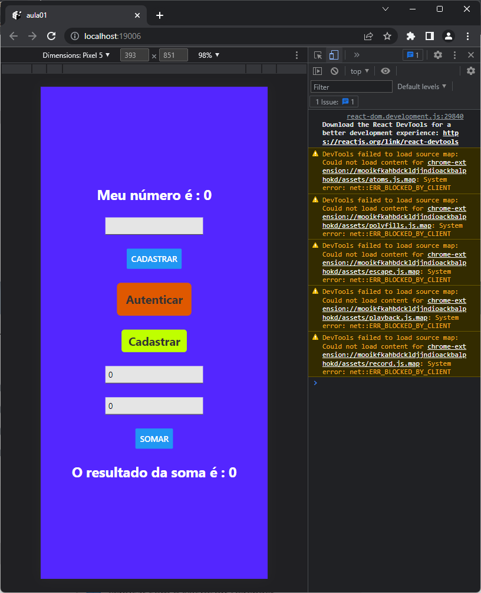

# Alo Mundo
## React Native com Expo

### Ambiente
- Necessário ter instalado NodeJS e VsCode

### Para executar via Navegador Web
- Clonar este repositório
- Abrir com o VsCode
- Abrir o Terminal CTRL + '"' **cmd**
```cmd
npm install
expo start
```
-Pressione w para executar no Navegador Webb
- Ou digite: http://localhost:19006
    - Ao abrir abra o **Inspecionar**, F12 (Google Chrome)
- 
