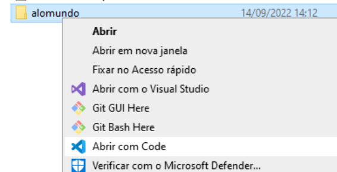
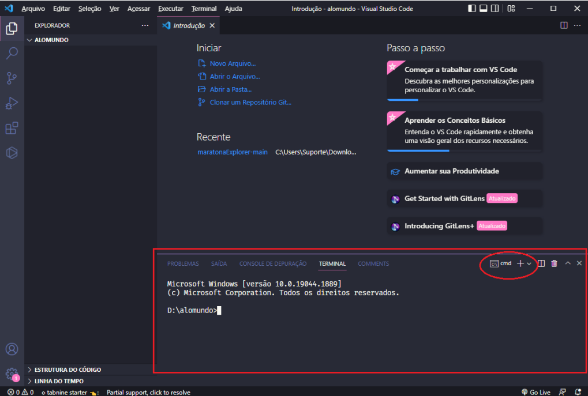
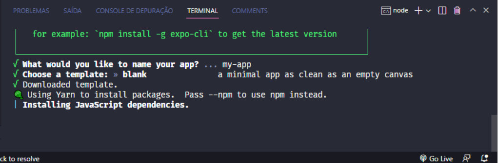
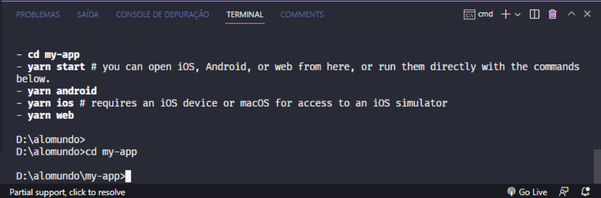
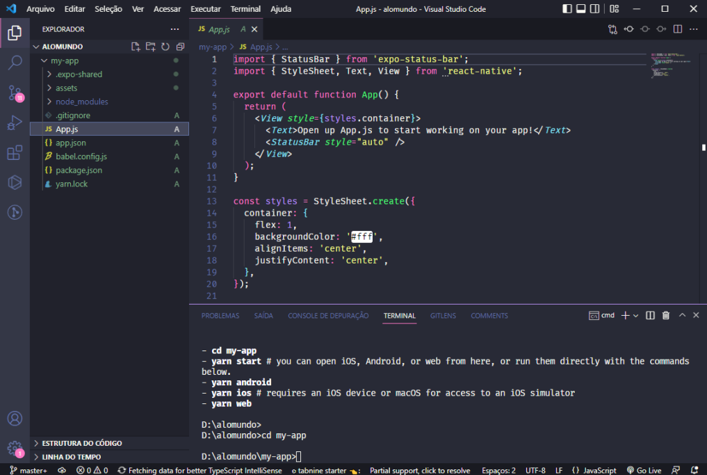

# Tutorial: Iniciando um projeto mobile React Native com Expo
- Certificar-se de ter instalado em seu computador:
    - Node JS - versão LTS
    - VSCode
- 1. Criar uma pasta para seu projeto
- 2. Abrir com o vscode
<br>
– 3. Abrir um terminal, preferencialmente “CMD”
<br>
- 4. Instalar o Expo **globalmente** utilizando o gerenciador de pacotes “NPM”
```cmd
npm install -g expo
```
- 5. Iniciar um novo projeto
```cmd
expo init
```
<br>
- 5.1. Escolher um nome para o projeto ou pressionando “Enter” para nomear como “my-app” e também “Enter” para os outros parâmetros, caso solicite.
<br>
- 5.2. Acessar a pasta do seu projeto:
```cmd
cd my-app
```
<br>
- 6. Expandir a pasta do seu projeto no explorador e clicar no arquivo App.js
<br>
    - O inicio/coração do código é no arquivo **App.js**
- 7. Executar seu projeto pela primeira vez.
```cmd
expo start
```
- 8. Pressione **w** para executar no Navegador Webb
    - Ou digite: http://localhost:19006
    - 8.1. Ao abrir abra o **Inspecionar**, F12 (Google Chrome)
<br>

    - 8.2 Ou executar com o seguinte comando:
    ```cmd
    expo start –web
    ```
- 9. Para testar o aplicativo no seu próprio celular, basta instalar o app “ExpoGo” em seu dispositivo, e se estiver na mesma rede wifi LAN que seu computador, leia o QRcode, se estiver via internet 4G, 5G clique em “Tunel” e leia o QRcode.

### Obss:
- Poderá ser informado que deve instalar duas dependências: react-native-web, react-dom
```cmd
npm install react-native-web --force
npm install react-dom –force
```