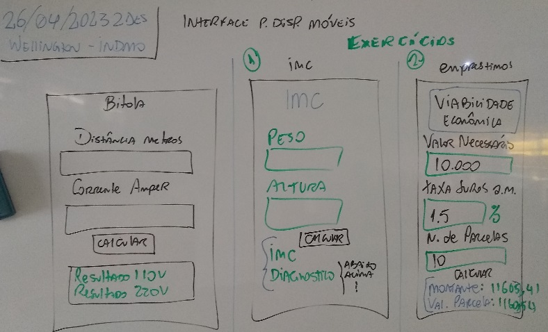
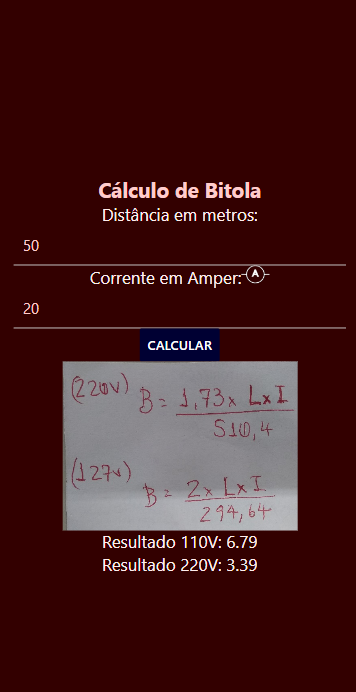

# Componentes Básicos - Aulao2

|Subpasta|Descrição|
|-|-|
|./lampada|App exemplo com botão que altera uma imagem.|

## Conhecimentos
- 1. Dispositivos móveis
	- 1.1. Definição
	- 1.2. Histórico
	- 1.3. Características
	- 1.4. Arquitetura
	- 1.5. Ambiente de desenvolvimento
		- 1.5.1.Instalação e configuração
		- 1.5.2.Gerenciamento de dependências
		- 1.5.3.Recursos e interfaces
- 2. Criação de interface
	- 2.1. Leiaute de tela
		- 2.1.1.Estrutura
		- 2.1.2.Tipos
		- 2.1.3.Gerenciadores
		- 2.1.4.Componentes de tela
		- 2.1.5.Menu
		- 2.1.6.Diálogos
		- 2.1.7.Barra de ação

## Lousa

## Aula
- 1. Abrir uma nova pasta com VsCode
- 2. Criar um novo projeto com **React Native** com **Expo**
	- 2.1. Caso não esteja instalado **npm i expo -g**
	- 2.2. Resolver os problemas de dependência conforme orientações do prórpio sistema
- 3. Criar um novo projeto chamado bitola **expo init bitola**
- 4. Acessar a pasta bitola **cd bitola**
- 5. Executar o projeto no navegador web **expo start -w**
	- 5.1. Caso não execute com o comando acima tentar com NPX **npx expo start** e pressionar **w** para executar no navegador web.

- 6. Desenvolver a aplicação no arquivo **App.js**
```javascript
import { useState } from 'react';
import { StatusBar } from 'expo-status-bar';
import { StyleSheet, Text, View, TextInput, Button, Image } from 'react-native';

export default function App() {
  const [distancia, setDistancia] = new useState(0)
  const [corrente, setCorrente] = new useState(0)
  const [bitola110, setBitola110] = new useState(0)
  const [bitola220, setBitola220] = new useState(0)
  const calcular = () => {
    setBitola110(((2 * (distancia * corrente)) / 294.64).toFixed(2))
    setBitola220(((1.73 * (distancia * corrente)) / 510.4).toFixed(2))
  }
  return (
    <View style={styles.container}>
      <Text style={styles.titulo}>Cálculo de Bitola</Text>
      <Text style={styles.textos}>Distância em metros:</Text>
      <TextInput
        style={styles.inputs}
        value={distancia}
        onChangeText={(val) => { setDistancia(Number(val)) }}
      />
      <Text style={styles.textos}>Corrente em Amper:
      <Image
        style={styles.amper}
        source={require('./assets/amper.png')}
      />
      </Text>
      <TextInput
        style={styles.inputs}
        value={corrente}
        onChangeText={(val) => { setCorrente(Number(val)) }}
      />
      <Button
        style={styles.botao} title='Calcular'
        color='#000033'
        onPress={calcular}
      />
      <Image
        style={styles.formula}
        source={require('./assets/formula.jpg')}
      />
      <Text style={styles.textos}>Resultado 110V: {bitola110}</Text>
      <Text style={styles.textos}>Resultado 220V: {bitola220}</Text>
      <StatusBar style="auto" />
    </View>
  );
}

const styles = StyleSheet.create({
  container: {
    flex: 1,
    backgroundColor: '#330000',
    alignItems: 'center',
    justifyContent: 'center',
  },
  titulo: {
    fontSize: '22px',
    color: '#fcc',
    fontWeight: 'bold',
  },
  textos: {
    fontSize: '18px',
    color: '#fee',
  },
  inputs: {
    borderBottomColor: '#ccc',
    borderBottomWidth: '1px',
    width: '90%',
    padding: '10px',
    color: '#fcc',
    fontSize: '16px',
  },
  formula:{
    width:'250px',
    height:'180px',
  },
  amper:{
    width:'30px',
    height:'20px',
  }
});
```
## Resultado


|Atividades|
|-|
|Desenvolver dois aplicativos conforme imagem da lousa, um chamado **imc** e outro **emprestimos**, o primeiro deve calcular o IMC (Índice de massa corpórea) e informar o diagnóstico (pesquise na internet alguma tabela de IMC), o segundo deve calcular utilizando juros compostos o montante e as parcelas de um empréstimo, recebendo a taxa de juros o valor e o n. de parcelas como entrada.|
