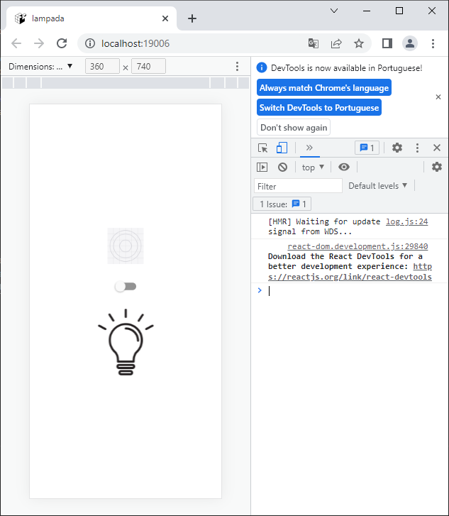

# Acender uma lâmpada
## React Native com Expo

### Ambiente
- Necessário ter instalado NodeJS e VsCode

### Para executar via Navegador Web
- Clonar este repositório
- Abrir com o VsCode
- Abrir o Terminal CTRL + '"' **cmd**
- Instalar as dependências
```cmd
npm i
```
```cmd
expo start -w
```
- ou
```cmd
expo start
```
- E escolha a a opção que deseja executar
- Ao abrir abra o **Inspecionar**, F12 (Google Chrome)
<br>
