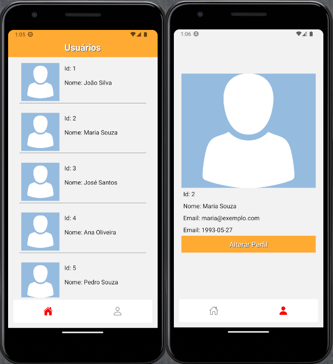

# Atividade prática
|Contextualização|
|-|
|Como programador de interfaces mobile, você foi contratado para desenvolver um aplicativo que auxilie um gestor de usuários a administrar os perfis de usuários|
|inicialmente o aplicativo deve permitir que o gestor liste todos os usuários cadastrados, e que ele possa visualizar os detalhes de cada usuário|
|<br>Wireframe com o exemplo de como o aplicativo deve ficar|
|Utilize os tab navigator para criar as duas telas do aplicativo e ícones conforme wireframe|

#### Dependências:
```cmd
yarn add @react-navigation/native
yarn add @react-navigation/bottom-tabs
yarn add @expo/vector-icons
yarn add react-native-safe-area-context
yarn add react-native-screens
yarn add react-native-reanimated
```
#### Mockups: usuarios.js
```javascript
const usuarios = [
    {
        id:1,
        nome: 'João Silva',
        email: 'joao@exemplo.com',
        foto: 'https://raw.githubusercontent.com/wellifabio/senai2023/main/2des/projetos/assets/avatares/cli2.png',
        nascimento: '1990-01-01'
    },
    {
        id:2,
        nome: 'Maria Souza',
        email: 'maria@exemplo.com',
        foto: 'https://raw.githubusercontent.com/wellifabio/senai2023/main/2des/projetos/assets/avatares/cli1.png',
        nascimento: '1993-05-27'
    },
    {
        id:3,
        nome: 'José Santos',
        email: 'jose@exemplo.com',
        foto: 'https://raw.githubusercontent.com/wellifabio/senai2023/main/2des/projetos/assets/avatares/cli5.png',
        nascimento: '1992-10-10'
    },
    {
        id:4,
        nome: 'Ana Oliveira',
        email: 'ana@exemplo.com',
        foto: 'https://raw.githubusercontent.com/wellifabio/senai2023/main/2des/projetos/assets/avatares/cli3.png',
        nascimento: '1995-12-30'
    },
    {
        id:5,
        nome: 'Pedro Souza',
        email: 'pedro@exemplo.com',
        foto: 'https://raw.githubusercontent.com/wellifabio/senai2023/main/2des/projetos/assets/avatares/cli7.png',
        nascimento: '1991-07-07'
    },
    {
        id:6,
        nome: 'Paula Santos',
        email: 'paula@exmplo.com',
        foto: 'https://raw.githubusercontent.com/wellifabio/senai2023/main/2des/projetos/assets/avatares/cli4.png',
        nascimento: '1994-03-15'
    }
]
export default usuarios;
```

[Código da solução](../../projetos/react_native/usuarios_crud);