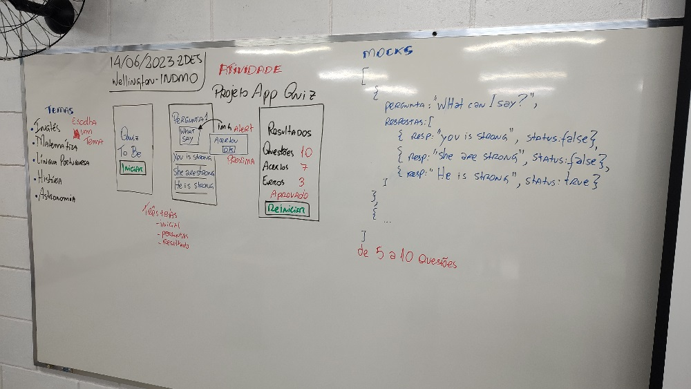

# Projeto QUIZ

|Contextualização|
|-|
|Os professores do SENAI jaguarúna percebendo que seus alunos utilizam muito o celular então solicitaram para a turma de desenvolvimento de sistemas aplicativos com perguntas e respostas (quiz) para testar o conhecimento dos alunos e incentivar a estudar|

|Desafio|
|-|
|Desenvolva um aplicativo com um dos temas apresentados na imagem a seguir, três telas e preencha o mockup com de 5 a 10 perguntas|



|Entrega|
|-|
|Apresente seu app ao instrutor|

## Para executar o projeto de exemplo e testar
- Clonar este repositório
- Abrir com VsCode
- Abrir um terminal "cmd" ou "bash"
- Instalar as dependências
```bash
yarn
```
- Executar com expo em um dispositivo virtual, real ou web
```bash
expo start

```
ou
```bash
yarn web
```
## Tutorial para iniciar um novo projeto
- Criar uma pasta
- Abrir com **VsCode**
- Abrir o terminal "cmd", "bash" ou o que preferir
- Iniciar o projeto com
    ```bash
    expo init {nome_projeto}
    ```
- Pressione **Enter** várias vezes até concluir a criação
- Acesse a pasta do projeto
    ```bash
    cd {nome_projeto}
    ```
- Instale as dependências, de preferência com **yarn**

## Dependências
```bash
yarn add @react-navigation/native
yarn add @react-navigation/native-stack
yarn add react-native-safe-area-context
yarn add react-native-screens
yarn add react-native-reanimated
```