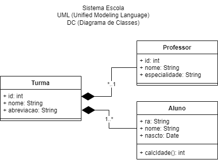

# Exemplo de sistema academico[professores, turmas e alunos]


## Recursos necessários
- NoddeJS (JavaScript)
- MySQL (Preferencialmente XAMPP)
- VsCode
- Insomnia (Para executar os testes)
## Para Executar e Testar
- Clonar este repositório
- Abrir com VsCode e/ou um Terminal (cmd)
- Acessar a pasta ./back
```cmd
cd back
```
- Instalar e executar o Banco de dados ./docs/script_simples.sql
- Instalar as dependências
```cmd
npm i
```
- Executar a API
```cmd
nodemon
```
ou
```cmd
npm start
```