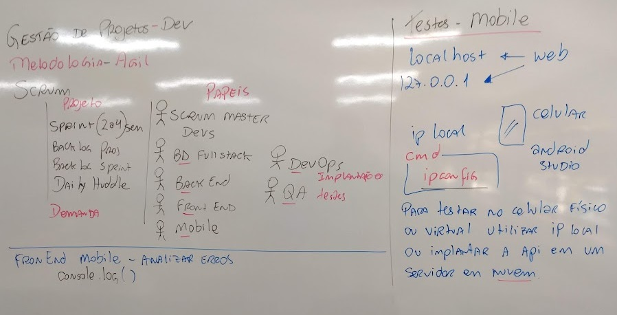
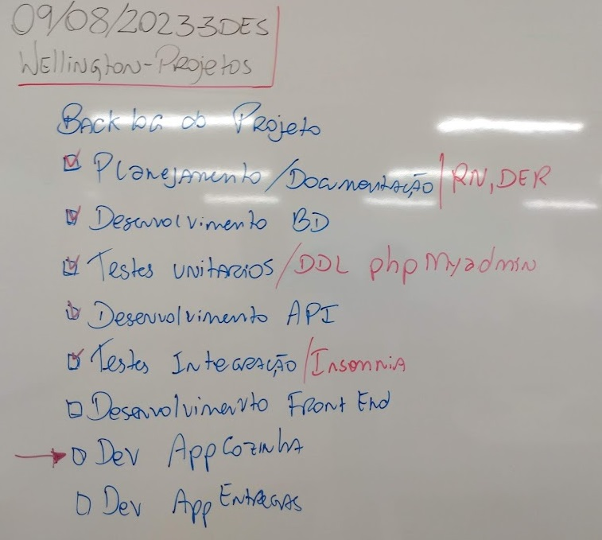

# Aula03 - Projeto Restaurante
## Metodologia Ágil Scrum
- Papéis e responsabilidades em um time Scrum
    - Product Owner
    - Scrum Master
    - Time de Desenvolvimento

### Backlog do Projeto
- Planejamento
    - Listar regras de negócio
    - Requisitos (Funcionais e Não funcionais)
    - Modelo Conceitual do Banco de Dados (DER)
- Execução
    - Implementação do banco de dados com ORM Prisma
    - Testes com dados aleatórios
    - Desenvilvimento da API
    - Testes da API
        - Testes unitários
        - Testes de Integração
    - Desenvimento o Front-End (Site)
    - Testes do Site
        - Testes unitários
        - Testes de Integração
        - Testes de Ponto a Ponto
    - Desenvimento Mobile (App Cozinha)
    - Testes da App
        - Testes unitários
        - Testes de Integração
        - Testes de Ponto a Ponto
    - Desenvimento Mobile (App Entregas)
    - Testes da App
        - Testes unitários
        - Testes de Integração
        - Testes de Ponto a Ponto
## Repositório do projeto exemplo
- https://github.com/wellifabio/restaurante3des

## Lousa
- 
