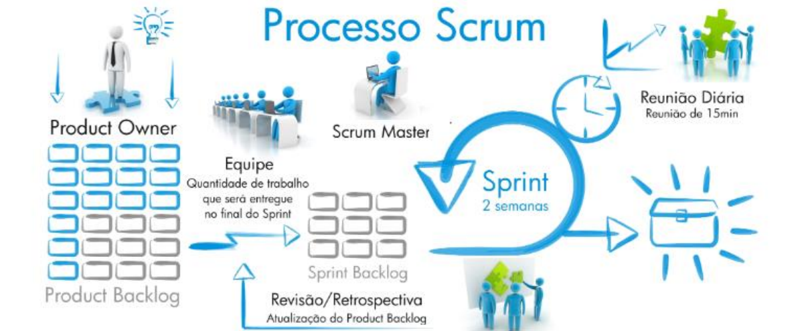
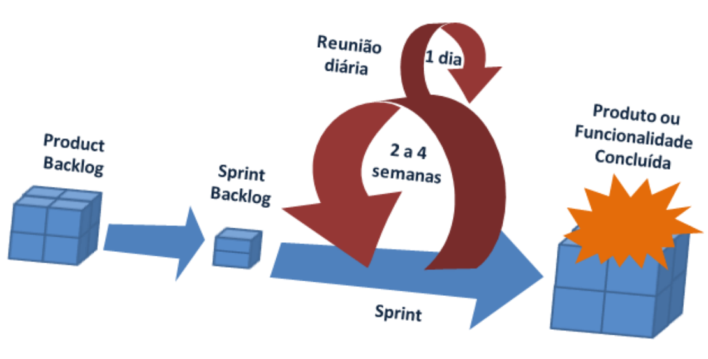

# Planejemanto do Projeto
## Conhecimentos
- 2. Metodologias de desenvolvimento
	- 2.1. Clássicas
		- 2.1.1. Definição
		- 2.1.2. Características
		- 2.1.3. Aplicabilidade
	- 2.1.4. Fases de desenvolvimento
	- 2.2. Ágeis
		- 2.2.1. Definição
		- 2.2.2. Características
		- 2.2.3. Aplicabilidade
		- 2.2.4. Fases de desenvolvimento
### Metodologias Clássicas:

- Benefícios
	- Organização (Clareza)
	- Planejamento
	- Execução
	- Controle
	- Nos levou a lua
	- Prineipais clientes (Bancos e Empresas aéreas)

### Metodologias ágeis
- XP
- SCRUM

- Product Owner (Dono do produto, Gerente do Projeto, Executivo do Projeto)
- Product BackLog (Escopo do projeto)
- Equipe de desenvolvimento:
	- Dev Full-Stack
	- Dev Back-End
	- Dev Front-End
	- Dev QA (Tester)
	- Dev DevOps (Implantação)
	- InfraEstrutura (Rede, Nuvem)
- Scrum Master (Responsável pela equipe e pelo sprint)
- Sprint (Semanal, quinzenal, mensal(implantação))
- Sprint Backlog (Escopo do Sprint)
- Daily huddle (Reunião diária (max 15min), (em pé))

- BackLog

- Benefícios
	- Versatilidade
	- Sprints (Planejamento, Execução, Controle)
	- Nos trouxe:
		- Facebook
		- Spotfy
		- Uber
		- Bancos digitais
		- Entre outros
		