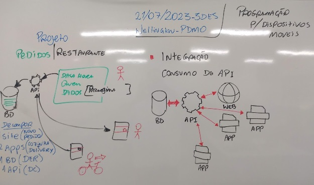
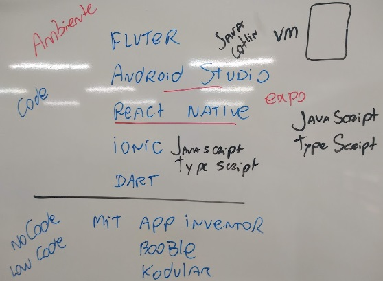

# Aula01 - Programação para dispositivos móveis

## Projeto Restaurante XPTO

### Contextualização
O restaurante XPTO será inaugurado em breve em jaguariúna e precisa de uma sistema para fazer a gestão dos seus pedidos, o restaurante trabalha com refeições no local e serviço de entregas. O sistema precisa gerar dados de BI(Busines Inteligence) para seus investidores.

## Dados iníciais do projeto exemplo (Pedidos em um Restaurante)

### Desafios
Criar um sistema que atenda aos seguintes requisitos e regras de negócio:
- 1. Desenvolver um Banco de Dados
    - 1.1. DER
    - 1.2. Script de criação e população com dados de teste.
- 2. Desenvolver uma API que atenda aos Apps e a página Web.
- 3. Desenvolver uma Página Web:
    - 3.1. Para cadastrar o pedido.
    - 3.2. BI, mostrar um gráfico dos pedidos em andamento.
    - 3.2. BI, mostrar um gráfico ou tabela com o tempo médio de entrega dos pedidos.
- 4. Desenvolver 1 aplicativo que liste os pedidos para a cozinha e tenha um botão que informe que está pronto.
- 5. Desenvolver um aplicativo para o os entregadores que liste os pedidos, endereços e cliente e que contenha um botão que finalize a entrega.
- **OBS:** não necessária mente nesta ordem.

### Passo 1 - Decompor o Problema (RN, RF, NF)
#### RN (Regras de negócio) //Foco no Problema
- RN01 Gestão de pedidos
- RN01.1 CRUD de pedidos
- RN01.2 BI de pedidos (Relatório)
- RN02 Separar em página web e aplicativos
- RN02.1 Página para fazer pedido
- RN02.2 Página de relatório
- RN02.3 App para Cozinha
- RN02.4 App Entrega
#### RF (Requisitos funcionais) //Foco na Solução
- RF01 UI(User Interface) Web: Fazer Pedido (Essencial) ref. RN01
- RF02 UI(User Interface) Web: Gerar Relatório (Importante) ref. RN01
- RF02.1 Os relatórios em forma de Gráfico (Desejável) ref. RN01
- RF03 UI Mobile: App cozinha (Essencial) ref. RN02
- RF03.1 Listar os pedidos em andamento. (Essencial) ref. RN02
- RF03.2 Botão para concluir o pedido. (Essencial) ref. RN02
- RF04 UI Mobile: App Entrega (Essencial) ref. RN02
- RF04.1 Listar os pedidos em entrega. (Essencial) ref. RN02
- RF04.2 Botão para concluir a entrega. (Essencial) ref. RN02
#### NF (Requisito não funcional) //Recursos para a solução
- NF01 SGBD (Sistema Gerenciador de Banco de Dados) MySQL
- NF02 Back-End/API NodeJS com JavaScript
- NF03 Front-End - HTML + CSS + JavaScript
- NF04 Mobile - React Native + Expo, JavaScript
- NF05 Modelagem dos dados DER e documentação do projeto

# Tarefas
- 1. Modelar o DER