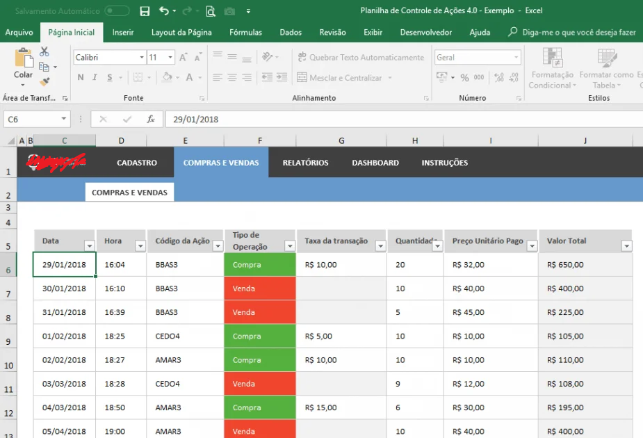
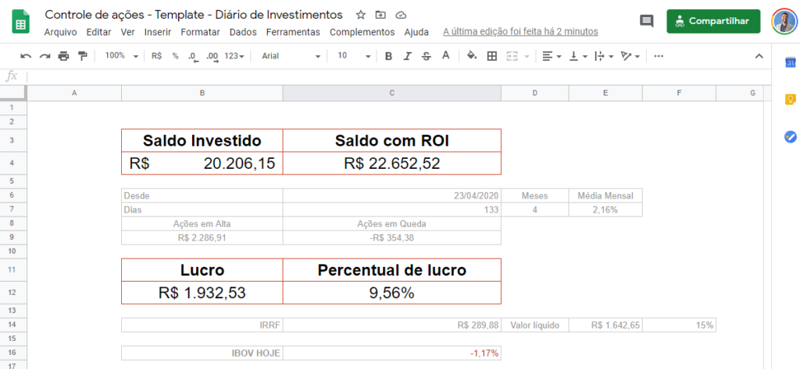
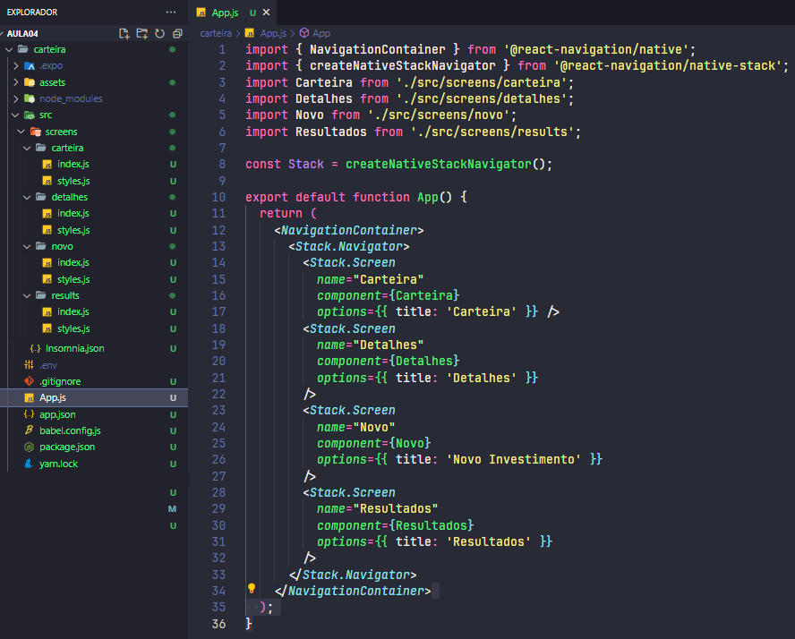
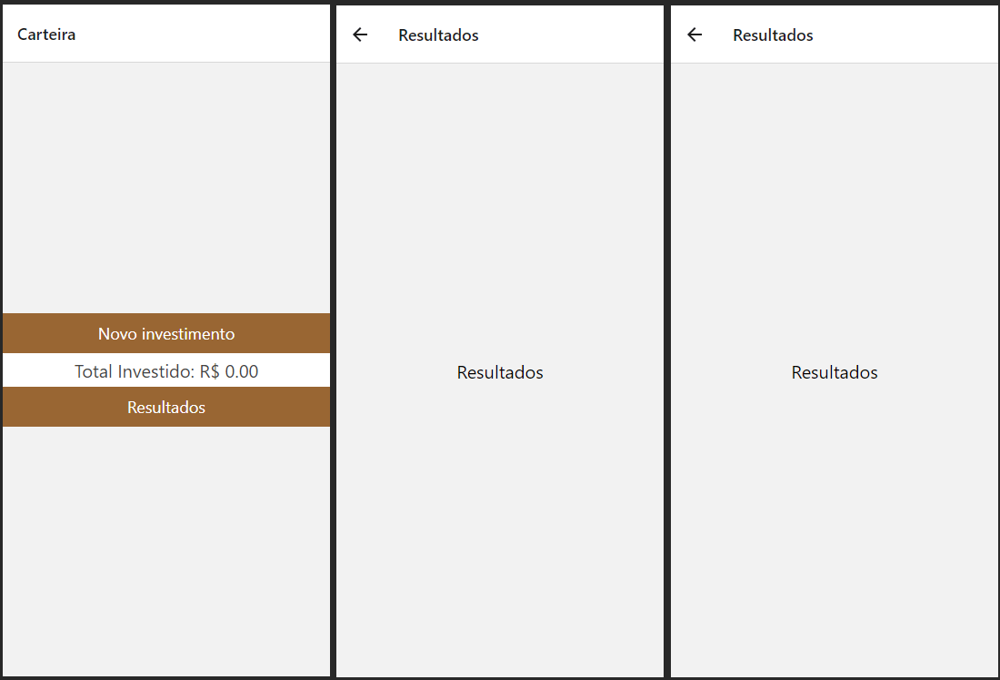

# Aula04 - SQLite e API externa

### Plano de Curso
- DADOS:
- 3.1. Operações em banco de dados;
- 3.2. Acesso a dados através de conexões WEB;
- 3.3. Extração de dados XML, JSON.
- 3.4. Arquivos locais:
    - 3.4.1. Armazenamento de dados (Async Storage e SQLite),
    - 3.4.2. Preferências do usuário para a aplicação.

## Banco de dados Local - Android SQLite
## Consumindo dados de APIs externas

## Projeto
Aplicativo de gestão de carteira de ações
|Contextualização|
|-|
|Com o crescente número de corretoras online, muitas pessoas começaram investir suas economias em ações, para não perder o controle de seus investimentos, normalmente utilizam planilhas para fazer a gestão de sua carteira de investimentos|
||
||
|**Desafio:**|
|Como programador Mobile, você precisa desenvolver um App para substituir esta planilha com a comodidade das funcionalidades do smartphone, como consumo de uma API que traga o valor atual das ações|

## API Externa
- https://brapi.dev/
- Para conseguir dados de valores de ações gratuitamente, atualizadas diáriamente

## Tutorial
### Necessário ter instalado o ambiente a seguir
- NodeJS LTS (Para gerenciar os pacotes, instalar expo, yarn, etc)
- VsCode (Para editar os códigos)
- Expo (Framework para facilitar a interface mobile)
- Yarn (Gerenciador de pacotes)
- Insomnia (Para testar APIs externas)
- Android Studio (Virtual Device Manager - Disp. virtual para testar a aplicação)

### Iniciando a aplicação
- Criar uma pasta
- Abrir com VsCode
- Acessar o Terminal "CTRL" + """, verificar se o terminal é "cmd" ou "bash" se estiver usando Linux
    - Instalar o Expo globalmente,iniciar um novo projeto chamado carteira e acessar a pasta do projeto.
```bash
npm i expo-cli -g
expo init carteira
cd carteira
```
- Instalar as dependências básicas, navegação de tela, máscara para números...
```bash
    yarn add @react-navigation/native
    yarn add react-native-safe-area-context
    yarn add react-native-screens
    yarn add react-native-svg
    yarn add @react-navigation/native-stack
    yarn add react-native-mask-input
```
- Executar o Projeto via Web
```bash
yarn web
```
- E ou executar no Emulador Android (A maior parte das funcionalidades só é possível testar com emulador ou o próprio celucar com ExpoGO)
```bash
yarn start -a
```
- Criar a estrutura de pastas **src** para as tela do App


## Preencher o arquivos index.js a seguir com as bases das telas e no Navigation no App.js
- App.js
```js
import { NavigationContainer } from '@react-navigation/native';
import { createNativeStackNavigator } from '@react-navigation/native-stack';
import Carteira from './src/screens/carteira';
import Detalhes from './src/screens/detalhes';
import Novo from './src/screens/novo';
import Resultados from './src/screens/results';

const Stack = createNativeStackNavigator();

export default function App() {
  return (
    <NavigationContainer>
      <Stack.Navigator>
        <Stack.Screen
          name="Carteira"
          component={Carteira}
          options={{ title: 'Carteira' }} />
        <Stack.Screen
          name="Detalhes"
          component={Detalhes}
          options={{ title: 'Detalhes' }}
        />
        <Stack.Screen
          name="Novo"
          component={Novo}
          options={{ title: 'Novo Investimento' }}
        />
        <Stack.Screen
          name="Resultados"
          component={Resultados}
          options={{ title: 'Resultados' }}
        />
      </Stack.Navigator>
    </NavigationContainer>
  );
}
```

- ./src/screens/carteira/index.js
```js
import React, { useState, useEffect } from 'react';
import { View, FlatList, TouchableOpacity, Text } from 'react-native';
import styles from './styles';

export default function Carteira({ navigation }) {
    const total = 0;
    const novo = () => {
        navigation.navigate('Novo');
    }
    const resultados = () => {
        navigation.navigate('Resultados');
    }
    return (
        <View style={styles.container}>
            <TouchableOpacity style={styles.button} onPress={novo}>
                <Text style={styles.textButton}>Novo investimento</Text>
            </TouchableOpacity>
            <Text style={styles.textTotal}>Total Investido: R$ {total.toFixed(2)}</Text>
            <TouchableOpacity style={styles.button} onPress={resultados}>
                <Text style={styles.textButton}>Resultados</Text>
            </TouchableOpacity>
        </View >);
};
```
- ./src/screens/carteira/styles.js
```js
import { StyleSheet } from 'react-native';
export default StyleSheet.create({
    container: {
        flex: 1,
        alignItems: 'center',
        justifyContent: 'center',
    },
    button: {
        width: '100%',
        padding: 10,
        backgroundColor: '#963',
        alignItems: 'center',
        color: '#fff',
    },
    textButton: {
        fontSize: 18,
        color: '#fff',
    },
    textTotal: {
        width: '100%',
        textAlign: 'center',
        padding: 5,
        backgroundColor: '#fff',
        fontSize: 20,
        color: '#444',
    },
});
```
- ./src/screens/detalhes/index.js
```js
import React, { useState, useEffect } from 'react';
import { View, FlatList, TouchableOpacity, Text } from 'react-native';
import styles from './styles';

export default function Detalhes({ navigation }) {
    return (
        <View style={styles.container}>
            <Text style={styles.text}>Detalhes</Text>
        </View >);
};
```
- ./src/screens/detalhes/styles.js
```js
import { StyleSheet } from 'react-native';
export default StyleSheet.create({
    container: {
        flex: 1,
        alignItems: 'center',
        justifyContent: 'center',
    },
    text: {
        width: '100%',
        textAlign: 'center',
        padding: 5,
        fontSize: 20,
    },
});
```
- ./src/screens/novo/index.js
```js
import React, { useState, useEffect } from 'react';
import { View, FlatList, TouchableOpacity, Text } from 'react-native';
import styles from './styles';

export default function Novo({ navigation }) {
    return (
        <View style={styles.container}>
            <Text style={styles.text}>Novo</Text>
        </View >);
};
```
- ./src/screens/novo/styles.js
```js
import { StyleSheet } from 'react-native';
export default StyleSheet.create({
    container: {
        flex: 1,
        alignItems: 'center',
        justifyContent: 'center',
    },
    text: {
        width: '100%',
        textAlign: 'center',
        padding: 5,
        fontSize: 20,
    },
});
```
- ./src/screens/result/index.js
```js
import React, { useState, useEffect } from 'react';
import { View, FlatList, TouchableOpacity, Text } from 'react-native';
import styles from './styles';

export default function Resultados({ navigation }) {
    return (
        <View style={styles.container}>
            <Text style={styles.text}>Resultados</Text>
        </View >);
};
```
- ./src/screens/result/styles.js
```js
import { StyleSheet } from 'react-native';
export default StyleSheet.create({
    container: {
        flex: 1,
        alignItems: 'center',
        justifyContent: 'center',
    },
    text: {
        width: '100%',
        textAlign: 'center',
        padding: 5,
        fontSize: 20,
    },
});
```
## Ao executa seu projeto deve ficar semelhante ao wireframe a seguir
