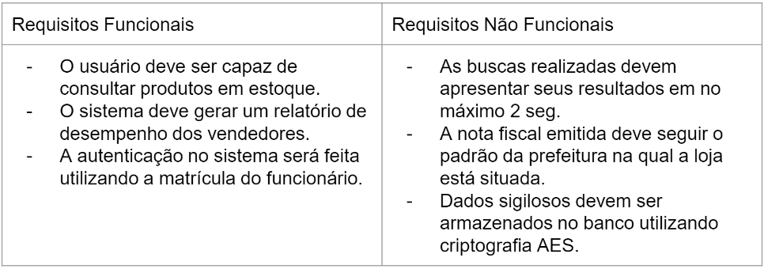
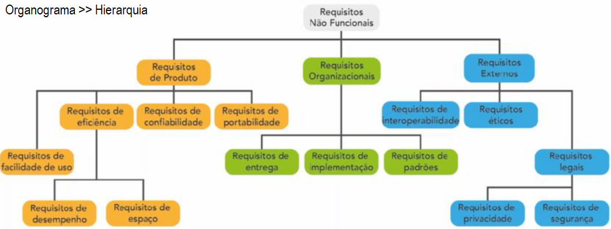

# Requisitos
- 1.1.Definição
	- 1.2.Modelos de documentação
		- 1.2.1.Requisitos
		- 1.2.2.Modelagem de dados
	- 1.3.Regras de Negócio
	- 1.4.Restrições
	- 1.5.Tipos
		- 1.5.1.Funcionais
		- 1.5.2.Não funcionais

## O que são:
- [RN] Regras de negócio: **Problema**
- [RF] Requisito Funcional: **Proposta de Solução**
- [NF] Requisito não funcional: **Faz parte da solução**

### Regras de negócio RN00..

### Requisitos Funcionais RF00..

### Requisitos Não Funcionais NF00..

- Simbologia

- Organograma

