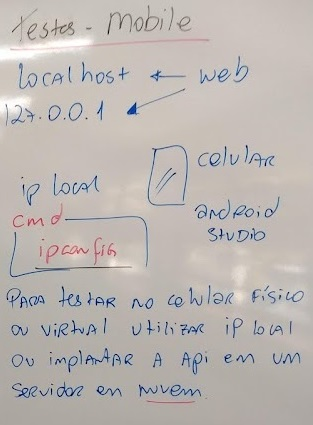

# Aula01 - Testes de Software
## 1. Introdução
### 1.1. O que é um teste de software?
- Teste de software é um processo de execução de um programa com o objetivo de encontrar erros.
- O teste é uma atividade de execução de um sistema com o objetivo de encontrar falhas.

## Erro x Falla
- Erro: é a diferença entre o valor calculado e o valor correto.
- Falha: é a manifestação do erro durante a execução do programa.

## Falha e Defeito
- Falha: é a manifestação do erro durante a execução do programa.
- Defeito: é o erro no código fonte que causa a falha.
### Falha x Defeito segundo o ISTQB
- Falha: é a **incapacidade** de um sistema ou componente de executar suas funções requeridas dentro de requisitos especificados.
    - Ex: normalmente quando há uma falha o sistema **não funciona**.
- Defeito: é um desvio do comportamento especificado de um sistema ou componente.
    - Ex: o sistema funciona, mas **não funciona como deveria**.

## 2. Tipos de Testes
### 2.1. Teste de Unidade
- Teste de unidade é o teste de menor nível, é o teste de um único componente ou unidade do sistema.
- O teste de unidade é realizado pelo desenvolvedor, que testa cada unidade de código assim que é desenvolvida.
- Ex: Testes que realizamos no nosso banco de dados, alimentando com dados e verificando se os dados estão sendo salvos corretamente (CRUD).

### 2.2. Teste de Integração
- Teste de integração é o teste de um conjunto de unidades de código.
- O teste de integração é realizado pelo desenvolvedor, que testa o conjunto de unidades de código assim que são desenvolvidas.
- Ex: Utilizando a ferramenta Insomnia para testar as rotas da nossa aplicação.

### 2.3. Teste de Sistema (Ponto a Ponto)
- Teste de sistema é o teste de todo o sistema.
- O teste de sistema é realizado pelo desenvolvedor, que testa o sistema assim que é desenvolvido.
- Ex: Testes que realizamos no nosso aplicatio React, testando as funcionalidades da aplicação.
