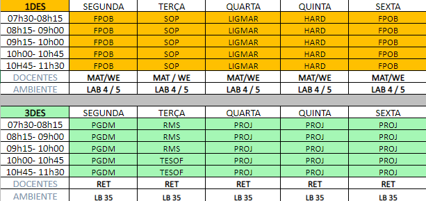

# senai2023
## Conteúdos dos cursos ministrados no SENAI:
- Técnico em Desenvolvimento de Sistemas (1200 horas)
	- FPOO (Fundamentos de Programação Orientada a Objetos)
	- SOP (Fundamentos e Administração de Sistemas Operacionais)
	- HARE (Fundamentos de Hardware e Redes de Computadores)
	- LIMA (Linguagens de Marcação - HTML + CSS)
	- PWBE (Programação Web Back-End - NodeJS e/ou JSP e/ou PHP)
	- PWFE (Programação Web Front-End - JavaScript + BootStrap e/ou React)
	- INDMO (Interface para dispositivos moveis - React Native e/ou noCode AppInventor)
	- BCD (Bancos de Dados Relacionais e Não relacionais - XAMPP MariaDB e/ou Postgres e/ou MongoDB e/ou CosmosDB)
	- PPDM (Programação para dispositivos Móveis - React Native + consumo de API e utilização de sensores)
	- RMS (Requisitos de Modelagem de Software - Ingenharia de Software (UML (DC, DCU, Diagrama de Atividades)))
	- TESTES (Fundamentos de Testes de Software, Testes automatizados, boas práticas)
	- Projetos (Metodologias de Desenvolvimento de Sistemas (Clássicas, Ágeis(XP, SCRUM))
- Operador de Microcomputador (160)
	- Conceitos fundamentais da computação
	- Gestão do Sistema Operacional
	- Edição de Textos
	- Planilhas eletrônicas
	- Desenvolvimento de Apresentações
- Web designer – Front-End (180 horas)
	- HTML
	- CSS
	- JavaScript
- Excel Básico (40 Horas)
- Excel Avaçado + VBA (40 Horas)
- Implantação e Análise de Dados em Núvem - Microsoft DP900 (40 Horas)
- Implantação de serviços de Inteligêcia Artificical em Núvem - Microsoft AI900 40 Horas)
- Implantação de serviços em Núvem - Google Cloud Foundations (40 Horas)
- Implantação de serviços de Inteligêcia Artificical em Núvem - Google Cloud AI oundations (40 Horas)
## OBS
- Os códigos fonte, exemplos e materiais didáticos serão adicionados a este repositório ao longo do ano de 2023
- Consulte também o repositório senai2022 que está repleto de materiais do ano pasvsado.

## Componentes e Dias da Semana
|Turmas: Técnico em Desenvolvimento de Sistemas|
|-|
||

## Calendário

## Competências transversais
- Acessar o portal EAD https://ead.sp.senai.br
- Enviar os arquivos **PDF** dos certificados em: https://forms.gle/STMxikkU8qVfLuEb8
- Tutorial de como acessar o Portal EAD a primeira vez https://ead.sp.senai.br/tutorial/comoacessar/
- Verificar se está matriculado em algum dos cursos a seguir:
	- Desvendando a Indústria 4.0
	- Desvendando a BlockChain
	- Economia circular
	- Outro se estiver matriculado
- Caso deseje fazer mais cursos gratuitos acessar o site do senai:
	- https://jaguariuna.sp.senai.br/cursos/13/899/formacao-inicial-e-continuada?Parent=898

## GitHub dos professores
- [Renato](https://github.com/remajag)
- [Reenye](https://github.com/ReenyeLima)
- [Matheus](https://github.com/MatheusPignata)
- [Wellington](https://github.com/wellifabio)
