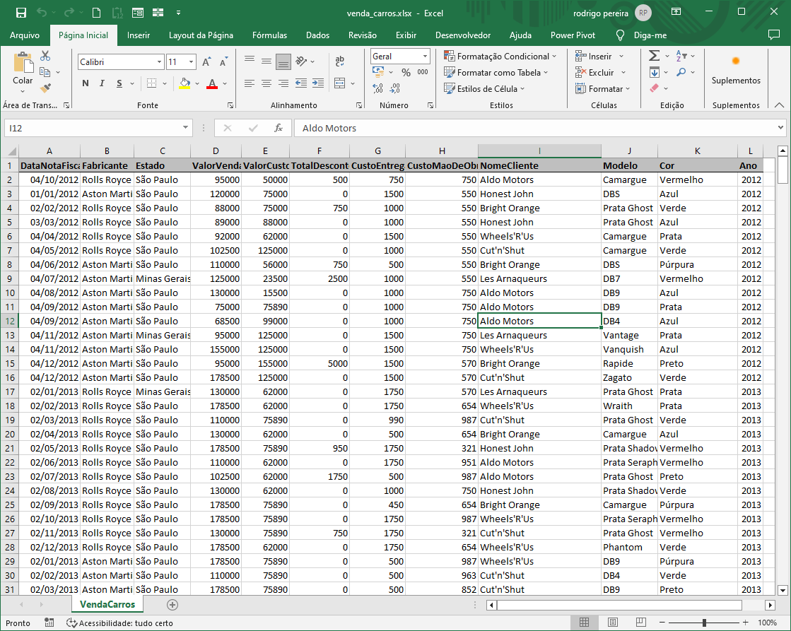
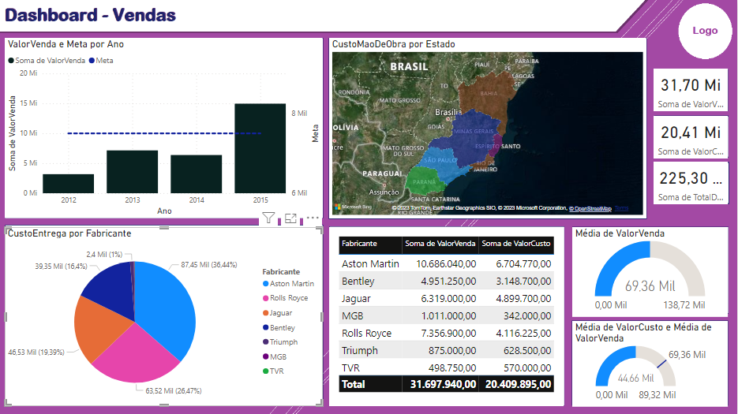
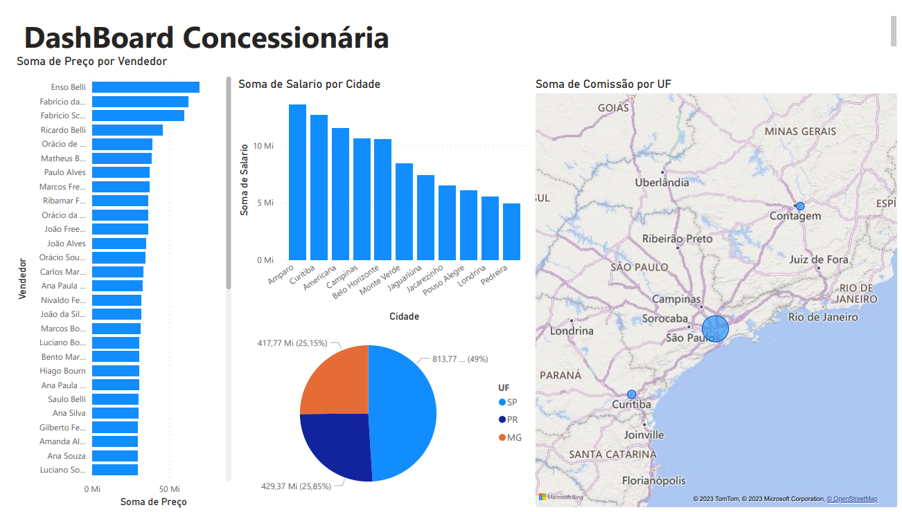

# Aula02 - DashBoard
## Visualizações com diversas fontes de dados
- Dados não estruturados Excel
- Dados estruturados CSV

# Atividade 01
## Extração
- Fazer download da planilha **venda_carros.xlsx** que está na pasta ./concessionaria_xls, e do arquivo **fundo.png** na pasta ./ilustracoes
- Vamos abrir o Power BI, clicar em obter dados >> Pasta de trabalho do excel
- Navegar até a planilha venda_carros.xlsx, abrir e marcar a tabela **VendaCarros**
## Transformação
- Clicar em **Transformar** para fazer o tratamento dos dados na importação com **Power Query**
- Classificar as colunas, os valores numéricos utilizando localidade e o que mais for necessário
- Criação de Dashboards (Paineis de controle - intereção -visualização de dados)
## Visualização
- Uma prática utilizada para formatar um Dasboar é desenhar o painel de controle antes de iniciar.
- podemos utilizar o Paint, Canvas, Figma ou outra ferramenta de desenho, para esboçar um layout.
- Para esta atividade vamos usar como fundo o arquivo **./ilustracoes/fundo.png**

## Segue um modelo de Layout/Esboço para utilizar-mos

## Print da planilha do Excel com os dados brutos

## Criar um painel de visualização (DashBoard) semelhante ao da imagem a seguir:

OBS: Parque o gráfico de Mapas funcione, será necessário **habilitar a exibição de mapas**

## Atividade 02
- Faça a análise dos dados contidos no arquivo **./concessionaria_csv/concessionaria.csv**
- Crie um layout utilizando uma ferramenta de desenho Paint, Canvas, Figma ou outra qualquer.
- Crie um Dashboard destes dados apresentando pelo menos três gráficos básicos
    - Gráfico de barras
    - Gráfico de mapas
    - Gráfico de pizza
- **Desafio:** Realizando análise com cálculos DAX, crie uma coluna chamada Comissão valendo 3% do preço.
- 

## Links
- [Kaggle](https://www.kaggle.com/) Comunidade de Aprendizagem de Máquina e Inteligência Artificial
- [Via CEP](https://viacep.com.br/) API (Aplication Process Interface), (Interface de Processamento de Aplicações) com dados de endereços, CEPs de ruas, etc.

# Conhecimentos
## Modelagem de Dados
- 3.1. Power Query
- 3.2. Power Pivot
- 3.3. Relacionamento de tabelas
- 3.4. Power View

## Power Query:
O Power Query é uma ferramenta de transformação de dados usada para conectar, importar e preparar dados para análise. Ele permite que você se conecte a várias fontes de dados, como bancos de dados, planilhas, serviços web e arquivos, e depois transforme esses dados de acordo com suas necessidades.
Você pode realizar tarefas como limpeza de dados, remoção de duplicatas, renomear colunas, aplicar filtros e criar colunas calculadas. O Power Query possui uma interface amigável que facilita a transformação de dados complexos em um formato adequado para análise.
Após preparar os dados usando o Power Query, você pode carregá-los em uma ferramenta como o Power Pivot para criar um modelo de dados.
Power Pivot:

## Power Pivot:
O Power Pivot é uma ferramenta de modelagem de dados dentro do Excel e do Power BI que permite criar modelos de dados complexos e relacionados.
Com o Power Pivot, você pode criar tabelas de fatos e tabelas de dimensões para modelar dados de maneira eficiente. Ele usa o DAX (Data Analysis Expressions), uma linguagem de fórmula, para criar medidas personalizadas e colunas calculadas que agregam e analisam os dados.
O Power Pivot também oferece recursos avançados de gerenciamento de relacionamento, permitindo que você estabeleça conexões entre tabelas com base em colunas-chave.

## Relacionamento de Tabelas:
O relacionamento de tabelas é uma parte essencial da modelagem de dados em Power BI e Power Pivot. Ele permite que você conecte diferentes tabelas em seu modelo de dados com base em campos comuns.
Os relacionamentos ajudam a criar uma estrutura hierárquica em que as tabelas de dimensão (que contêm informações descritivas, como datas, produtos ou clientes) se relacionam com a tabela de fatos (que contém métricas ou medidas de negócios).
Os relacionamentos são usados para combinar dados de várias tabelas e criar visualizações significativas nos relatórios.

## Power View:
O Power View é uma ferramenta de visualização de dados interativa que faz parte do Microsoft Excel e do Power BI. Com o Power View, você pode criar relatórios interativos e painéis de controle que permitem a exploração de dados de maneira intuitiva.
Ele oferece uma variedade de tipos de visualizações, como gráficos, tabelas dinâmicas, mapas e segmentações, que podem ser conectados dinamicamente para explorar diferentes aspectos dos dados.
O Power View é particularmente útil para criar relatórios que permitem aos usuários explorar dados e descobrir insights por conta própria.
Em resumo, essas ferramentas e conceitos estão interconectados e desempenham papéis complementares na criação de modelos de dados robustos e na apresentação de informações de maneira eficaz. O Power Query ajuda a preparar os dados, o Power Pivot permite a criação de modelos de dados, o relacionamento de tabelas une os dados e o Power View facilita a criação de visualizações interativas para comunicar os insights derivados desses dados. Tudo isso faz parte do ecossistema do Microsoft Power BI, que é amplamente utilizado para análise de dados e geração de relatórios.
