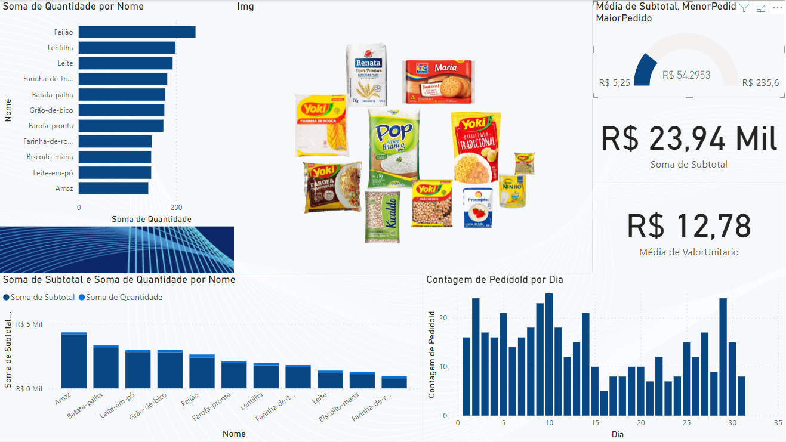
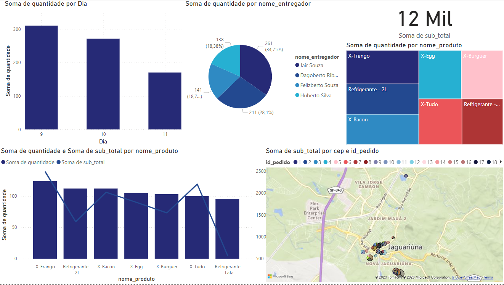
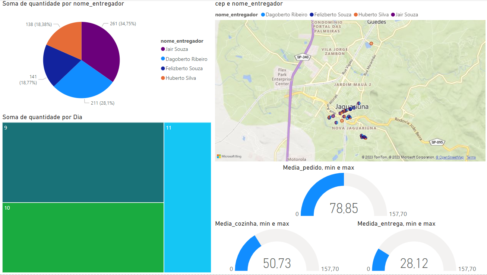

# Aula03

## Fontes de dados variadas
### Temas
- Cantina: Online HTML https://wellifabio.github.io/cantina/
- Mercearia: Excel Online https://1drv.ms/x/s!AiDjuTwZCwoIglankFeV27w6OVbU?e=dZGdmE
- Entrega de lanches: Base de dados em arquivos CSV.

# Bancos de dados
## Normalização de dados
- Preparar dados brutos para serem depositados em um BD
- Benefícios
	- Reduz redundância
	- Reduz inconcistência
	- Melhora o desempenho

|Anotações|
|:-:|
||
||
||

|Exemplos:|
|:-:|
||
||

## Demonstração com dados obtidos da Web
- Cantina: https://wellifabio.github.io/cantina/

## Situação problema
|Contextualização|
|-|
|Você foi contratado para trabalhar em uma consultoria de pequenos negócios, seu superior solicitou que você faça algumas análises de dados de duas empresas, um armazém (centro de distribuição de produtos alimentícios) e uma empresa de entregas de lanches.|

|Desafio: 01|
|-|
|Faça uma análise de dados da planilha online com dados de uma mercearia  https://1drv.ms/x/s!AiDjuTwZCwoIglankFeV27w6OVbU?e=dZGdmE|
|A) Faça download da planilha B) Abra o PowerBI e importe os dados C) Transforme os dados numéricos D) Acrescente uma coluna subtotal na tabela de Pedidos E) Crie um DashBoard com pelo menos três gráficos, respondendo: - Quais produtos mais ou menos pedidos - Preço médio dos produtos - Valor total dos pedidos - Caso possua um e-mail corporativo, adicione um novo visual: com imagens.|

|Entregas|
|-|
||
|<i>Exemplo de dashboard do desafio1</i>|

|Desafio: 02|
|-|
|Faça uma análise de dados de um serviço de entrega de lanches com os dados CSV na pasta ./baitacaodelivery|
|A) Baixe os 6 arquivos CSV com as tabelas do sistema  B) Abra o power BI e iporte as planilhas C) crie os relacionamentos identificando as chaves primárias e estrangeiras D) Crie um dashboard onde o gestor possa ver os seguintes indicadores: - Faturamento total - Qual entregador fez mais ou menos entregas - Qual o produto mais ou menos vendidos - Qual região da cidade faz mais pedidos (mapa) E) Crie outra página de dashboard onde o gestor possa verificar o desempenho dos pedidos como: - Tempo médio dos pedidos na cozinha - Tempo médio dos pedidos na entrega - Entregas por entregador - Entregas por dia - Entregadores por região (mapa)|

|Entregas|
|:-:|
||
|<i>Exemplo de dashboard 01 do desafio 02</i>|
||
|<i>Exemplo de dashboard 02 da desafio 02</i>|