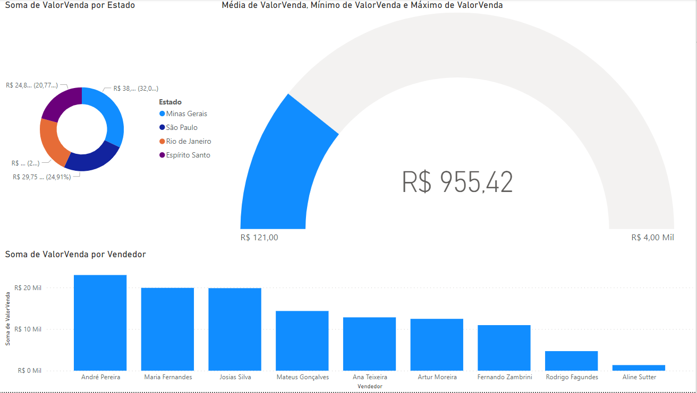
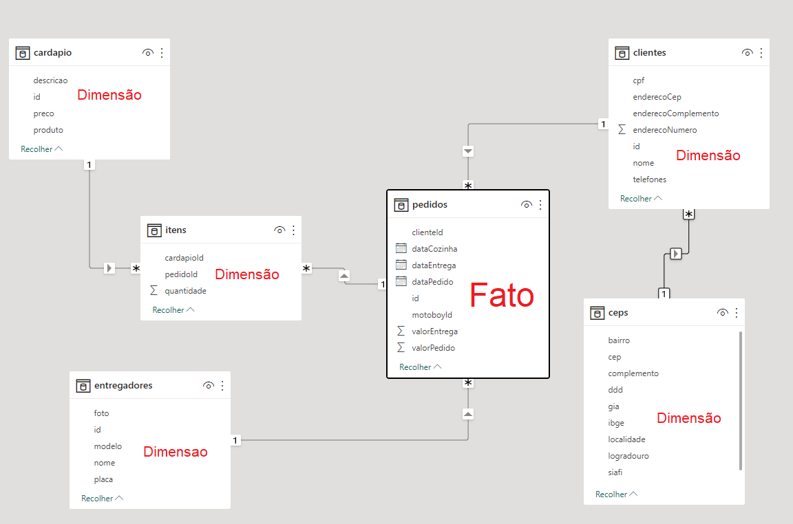

# Aula04
## Fontes de dados variadas e API
### Temas
- Varegistas do Sudeste (Combinar dados csv)
- Restaurante Delivery: JSON local
- Endereços a partir da API Via CEP: JSON https://viacep.com.br/ws/SP/Jaguari%C3%BAna/Bueno/json

### Atividade 01
Em seu computador crie uma pasta chamada **"sudeste"** e baixe para dentro dela os arquivos **.csv** condidos neste repositório, na subpasta **/varegistasudeste**.
- 1 Abra o **Power BI** e crie um novo projeto, importe os arquivos **csv** e mescle os dados.
- 2 Crie dois relatórios com os dados dos arquivos conforme imagens a seguir:
  -  2.1 Uma análise gráfica do valor de venda por categoria
  -  2.2 Outra de vendedor por categoria em um gráfico de mapa de árvore
  -  2.3 E um com uma análise com mapa.

- 3 Crie outra página de dashboard analisando:
  - 3.1 Faça um gráfico de valor de venda por estado.
  - 3.2 Uma de valor de venda do primeiro segmento.
  - 3.3 Um gráfico de valor de venda por vendedor

### Atividade 02
Relacionamento de dados e arquivos JSON: em outra pasta salve os dados de um restaurante, que estão no repositório **/restaurante**, importe estes dados em um novo projeto Power BI e crie os relacionamentos conforme imagem a seguir:
 
  Ao concluir os relacionamentos, faça um ou dois dashboards analisando os dados para mostrar as seguintes informações.
- Faturamento total do restaurante
- Entregas por entregador
- Pedidos no local (sem entrega)
- Tempo médio na cozinha
- Tempo médio de entrega

