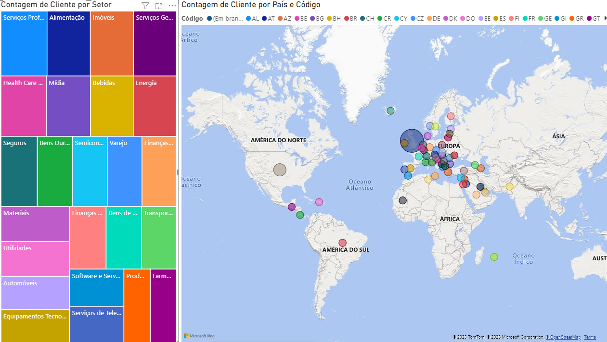
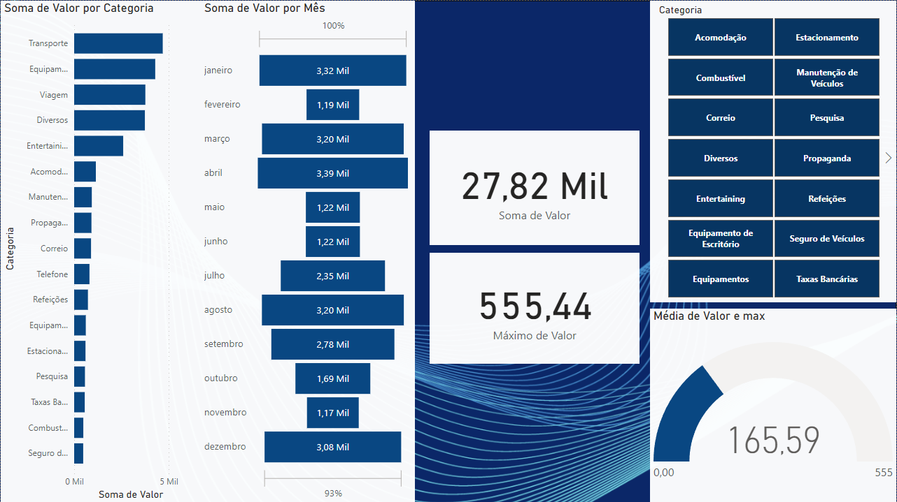
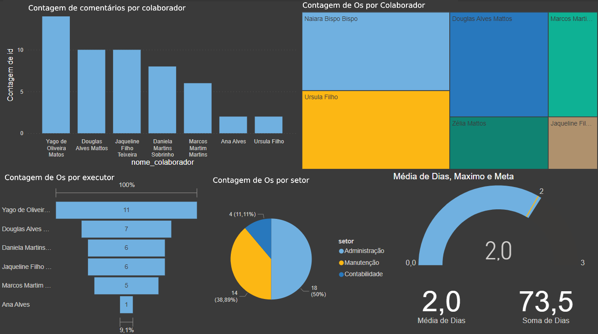

# Aula05

### Temas

- Códigos de Clientes e Setores
- Orsens de Serviço

## Funções DAX

O DAX (Data Analysis Expressions) é uma linguagem de programação usada no Microsoft Power BI para criar colunas calculadas, medidas e tabelas personalizadas. É uma coleção de funções, operadores e constantes que pode ser usada em uma fórmula ou expressão para calcular e retornar um ou mais valores.

## Indicadores/Bookmarks

Os Indicadores permitem uma apresentação dos seus dados de forma organizada, criando uma história a partir dos seus dashboards. Criar histórias com seus dados, facilita apresentar um painel para diversas audiencias, incluindo um roteiro dos indicadores que queremos demonstrar.

## Dados não estruturados

- Nem sempre os dados seguem o padrão CSV, eles podem estar semiestruturados em JSON ou XML ou não estruturados TXT

## Situação Problema - Somativa:

| Contextualização                                                                                                                                                              |
| ----------------------------------------------------------------------------------------------------------------------------------------------------------------------------- |
| Você faz parte de uma empresa de auditoria e precisa analizar dados da empresa XPTO que foram obtidos de seus sistemas, os dados são de seus **clientes** e suas **despesas** |

| Desafio                                                                                                                                          |
| ------------------------------------------------------------------------------------------------------------------------------------------------ |
| Os dados não estão em nenhuma estrutura como CSV ou semiestrutura como XML ou JSON, são apenas arquivos TXT presentes na pasta ./naoestruturados |
| Baixe ou importe diretamente da Web os dados da subpasta **./naoestruturados/clientes**                                                          |
| A) Transforme os dados com Power Query e faça análise com um dashboard, conforme modelo a seguir:                                                |
|                                                                                                                           |
| Crie indicadores que mostrem, **Todos os dados, somente América do Sul e em seguida todas as Américas**                                          |
| B) Baixe ou importe diretamente da Web os dados da subpasta **./naoestruturados/gastos**                                                         |
| C) Transforme os dados e faça uma análise com um dashboard semelhante ao da imagem a seguir:                                                     |
|                                                                                                                       |

| Entregas:                                                            |
| -------------------------------------------------------------------- |
| Apresente ao professor os dois arquivos com as análises solicitadas. |

## Situação Problema - 02:

| Contextualização                                                                                                                                                                                                                                                        |
| ----------------------------------------------------------------------------------------------------------------------------------------------------------------------------------------------------------------------------------------------------------------------- |
| O líder do setor de manutenção da empresa XPTO onde você é colaborador utiliza um sistema que gerou os dados do mês de outubro de 2023 das Ordens de Serviços executadas, ele precisa de sua ajuda para vizualisar em forma gráfica o desempenho do setor de manutenção |

| Desafio                                                                                                                      |
| ---------------------------------------------------------------------------------------------------------------------------- |
| Importe os dados semiestruturados da pasta **./ordensservico**                                                               |
| Transforme os dados com Power Query                                                                                          |
| Faça os relacionamento de tabelas                                                                                            |
| E com Power Pivot descubra o tempo de atendimento em decimal e em dias                                                       |
| Faça uma análise onde possa ver as OS por executor, por colaborador e tempo médio de solução, semelhante ao modelo a seguir: |
|                                                                                                   |
| Crie **indicadores** que mostrem:                                                                                            |
| - as **OSs** atendidas pelo funcionário **Yago**                                                                             |
| - depois pelo funcionário **Douglas**                                                                                        |
| - finalmente as **OSs abertas pelo setor de Administração**                                                                  |

| Entregas:                                                            |
| -------------------------------------------------------------------- |
| Apresente ao professor os dois arquivos com as análises solicitadas. |

# Publicar

Necessáro estar logado/conectado com email corporativo, ao publicar podemso compartilhar para que outros vejam através da Web ou App.

# Importar Vizualizações

Necessáro estar logado/conectado com email corporativo, podemos obter mais visuais como a tabela de imagens
