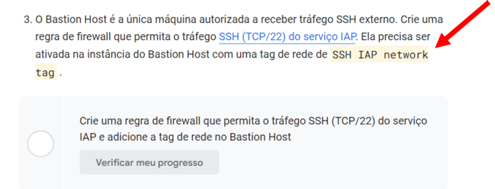
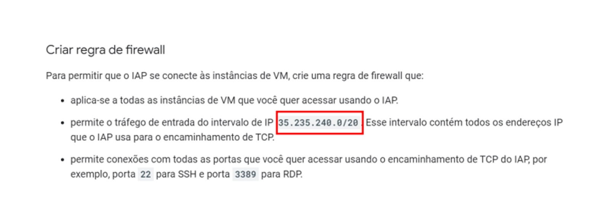
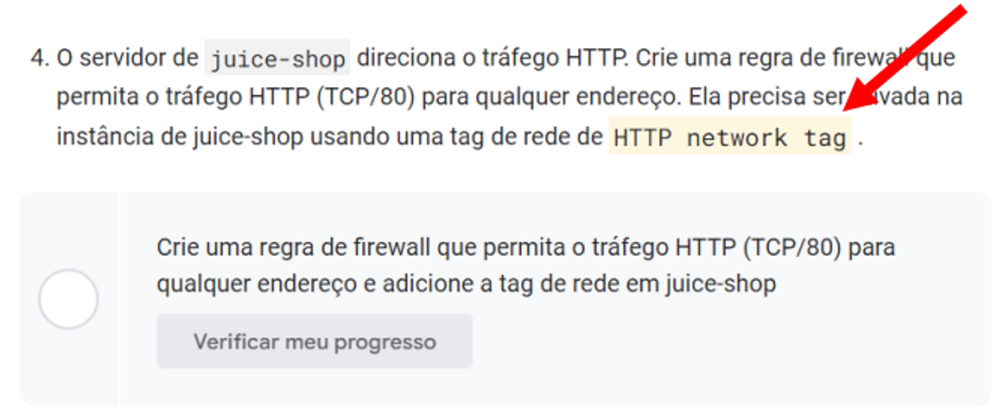
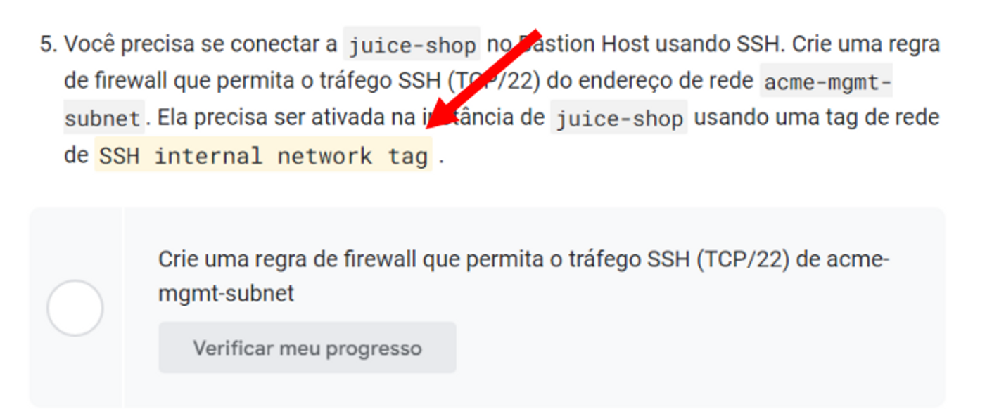
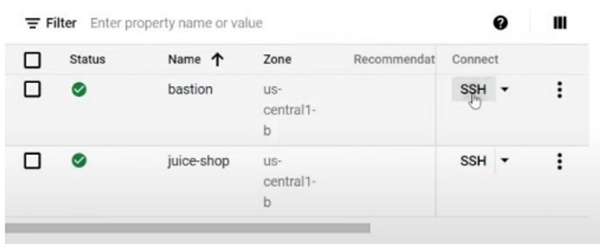

# **3 -** Build and Secure Networks (28 Créditos)

Link da Quest: https://www.cloudskillsboost.google/quests/128

Link do desafio final: https://www.cloudskillsboost.google/focuses/12068

## Tarefa 1

**VPC NETWORK > FIREWALL**
- DELETE O FIREWALL QUE ESTÁ CRIADO (O MEU VEIO COM O NOME OPEN-ACCESS)

## Tarefa 2

**COMPUTE ENGINE > VM´s**
- Ligue a Máquina bastion clicando no 3 pontinhos direita e clique em Start/Resume ao abrir a
tela
- clique em START

## Tarefa 3

**VPC NETWORK > FIREWALL**
- CREATE A FIREWALL RULE
- NO NOME COLOQUE UM NOME DE SUA ESCOLHA
- EM NETWORK SELECIONE A NETWORK QUE APARECER (NO MEU FOI O ACME-VPC)
- EM TARGET TAGS É A TAG QUE O LAB TE SUGERIU CONFORME DESCRITO NA IMAGEM ABAIXO



[CLIQUE NO LINK SSH (TCP/22)](https://cloud.google.com/iap/docs/using-tcp-forwarding) do serviço IAP e ABRA EM UMA NOVA JANELA PQ VOCÊ VAI
PRECISAR DE UMA INFORMAÇÃO QUE ESTÁ NESSA PÁGINA

AGORA VOCÊ COPIA O IP QUE ESTÁ NA PÁGINA QUE VC ABRIU ANTERIORMENTE



- NO CAMPO Source IPv4 ranges COLE O IP QUE VC COPIOU ANTERIORMENTE
- EM PROTOCOLS AND PORTS HABILITE TCP E COLOQUE A PORTA 22 CONFORME ELE PEDE NO
LAB.
- CLIQUE EM CRIAR
- AGORA VOCÊ VAI TER QUE INSERIR ESSA MESMA REGRA DENTRO DA VM.
**COMPUTE ENGINE > VM MACHINES**
- ABRA A VM BASTION E CLIQUE EM EDIT E NO CAMPO NETWORK TAGS, COLOQUE A MESMA
- TAG QUE VC UTILIZOU LÁ EM CIMA E CLIQUE EM SAVE.

## Tarefa 4

**VPC NETWORK > FIREWALL**
- CREATE FIREWALL RULE
- NO NOME DO FIREWALL COLOQUE UM NOME DE SUA DE SUA ESCOLHA
- NETWORK SELECIONE A QUE ESTIVER DISPONÍVEL (A MINHA FOI ACME-VPC)
- EM TARGET TAGS É A TAG QUE O LAB TE SUGERIU CONFORME IMAGEM ABAIXO



- EM SOURCE IPV4 RANGES COLOQUE O IP **0.0.0.0/0**
- HABILITE O TCP E COLOQUEI 80 NA PORTA CONFORME PEDIU NO LAB.
- CLIQUE EM CREATE

- AGORA VA NA VM **JUICE-SHOP** E ADICIONE A REGRA TBM CONFORME LA EM CIMA
CAMINHO:  **COMPUTE ENGINE > VM MACHINE**

## Tarefa 5

**VPC NETWORK > FIREWALL**
- CREATE FIREWALL RULE
- NO NOME DO FIREWALL COLOQUE UM NOME DE SUA DE SUA ESCOLHA
- NETWORK SELECIONE A QUE ESTIVER DISPONÍVEL (A MINHA FOI ACME-VPC)
- EM TARGET TAGS É A TAG QUE O LAB TE SUGERIU CONFORME IMAGEM ABAIXO



- NO MENU AO LADO VA EM VPC NETWORKS E ABRA EM NOVA JANELA PARA PEGAR O IP DA
VPC
- NA PORTA TCP HABILITE E COLOQUE A PORTA 22 CONFORME LAB E CLIQUE EM CREATE
- AGORA VÁ NA VM **JUICE-SHOP** E ADICIONE ESSE TAG JUNTO COM TAG QUE VOCÊ ADICIONOU
- ANTES (VAI FICAR 2 TAGS MESMO, PORQUE VOCÊ ESTÁ CONECTANDO UMA MÁQUINA NA OUTRA E DANDO PERMISSÃO)

## Tarefa 6

VÁ EM **COMPUTE ENGINE > VM MACHINE**
- E CLIQUE PARA CONECTAR VIA SSH NA VM BASTION.



NA TELA SSH COLOQUE O COMANDO:

```jsx
gcloud compute ssh juice-shop --internal-ip
```

COM ESSE COMANDO ELE ACESSA A MAQUINA **JUICE-SHOP**

- PRESSIONE ENTER 2 VEZES E DE O CHECK NO LAB