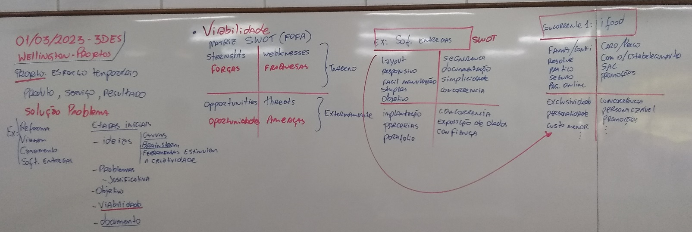
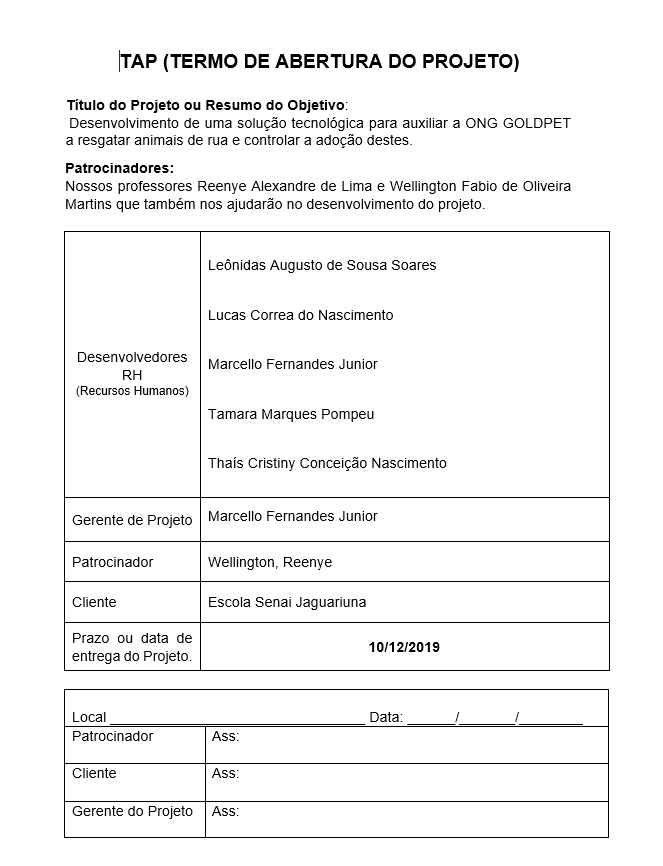
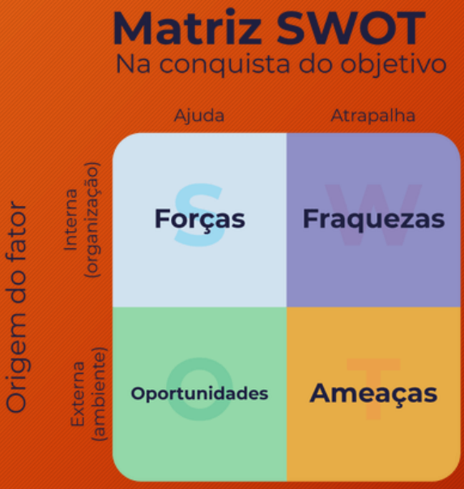
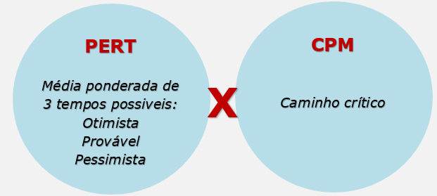
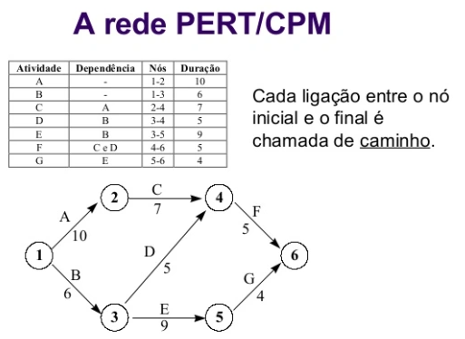
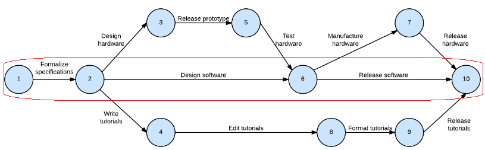
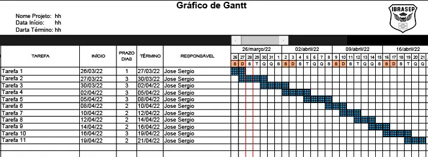

# Metodologia de gerenciamento de projeto
- 3.1. Escopo
- 3.2. Revisão dos objetivos
- 3.3. Análise de riscos
- 3.4. Cronograma
- 3.5. Recursos
- 3.6. Custos
- 3.7. Documentação
- 3.8. Avaliação do projeto
	- 3.8.1. Análise do projeto
	- 3.8.2. Documentação de avaliação
 
## Gerente do projeto: (Você)

## Termo de abertura do projeto:

## EAP (Estrutura Analítica de Projeto)
- Documento que define o Escopo (Requisitos do Projeto)

## Custos
- O EAP descreve o orçamento do projeto, definindo seus custos iniciais
- Estes custos podem variar durante a execução do projeto, por fatores internos e externos

## Revisão dos objetivos
- Matriz SWOT (FOFA)

## Análise de riscos
- Ao desenvolver a Matriz SWOT fazemos a primeira análise de riscos

## Cronograma
- PERT, CPM

- Caminho:

- Caminho crítico:

- A análise PERT x CPM auxilia a criação do cronograma
- Gráfico de Gantt (Cronograma)

## Recursos

- Gerente do Projeto, Project Owner, Equipe de desenvolvimento, implantação e infra.
- Ao desenvolver o gráfico Gantt, alocamos os recursos
