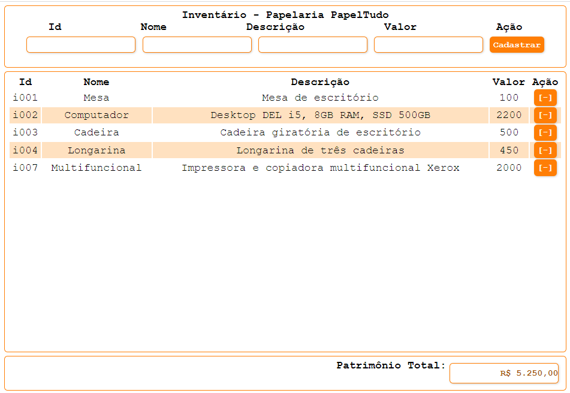
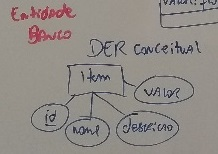
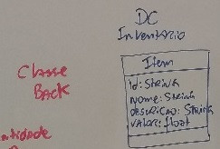
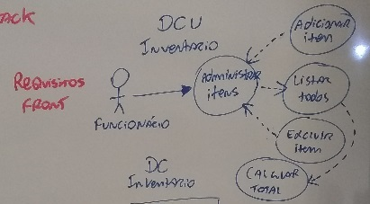

# Projeto Modelo Básico Full-Stack (NodeJS Front dentro do Back)
## Para executar
- Clonar o projeto
- Abrir o XAMPP e dar start em MySQL
- Rodar o script /docs/inventario.sql no MariaDB ou PHPMuAdmin
- acessar a pasta /back
    - cd back
- baixar as dependencias
    - npm i
- executar
    - npm start //Ou
    - nodemon //Ou
    - node server.js
- Acessar o caminho http://localhost:3000 no navegador

## Docs

- DER

- Diagrama de Classes

- Diagrama de Casos de Uso

