# Exemplo BackEnd (NodeJS + Prisma(ORM) MySQL + Pug)
* Necessário ter NodeJS e MySQL instalados
1. Clonar este reposiório:
    - git clone
2. Instalar as dependência
    - npm install
3. Criar um arquivo chamado **.env** contendo
```env
DATABASE_URL="mysql://root@localhost:3306/os?schema=public&timezone=UTC"
```
4. Instalar prisma globalmente e executar a migração
```cmd
npm i -g prisma
prisma migrate dev --name "primeira_migracao"
```
5. Instalar pelo menos os dados de teste a seguir no banco de dados, via phpmyadmin, mysqlworkbank ou cmd
```sql
use os;
insert into colaborador values
(300,'Maria Silva','Gerente','Administração',1234),
(301,'Marta Souza','Aux. Manutenção','Manutencao',1234),
(302,'Paula Oliveira','Recepcionista','Recepção',1234),
(303,'Renata Penna','Aux. Manutenção','Manutencao',1234);

insert into os values
(default,"Troca da torneira da pia da cozinha",300,301,"3023-04-07 08:23:00","3023-04-08 08:23:00"),
(default,"Instalação do batente da porta do banheiro masculino",300,301,"3023-04-07 09:20:00","3023-04-08 09:20:00"),
(default,"Instalação do batente da porta do banheiro feminino",300,303,"3023-04-07 10:19:00","3023-04-08 10:19:00"),
(default,"Troca da torneira da pia do banheiro masculino",302,303,"3023-04-07 11:22:00",null),
(default,"Instalação de lâmpada de emergência na recepção",302,301,"3023-04-07 12:23:00",null),
(default,"Instalação de lâmpada de emergência no corredor",302,301,"3023-04-07 13:24:00",null),
(default,"Instalação de tomada 220v na administração",303,303,"3023-04-08 08:23:00",null),
(default,"Pintura das faixas da garagem",300,303,"3023-04-08 09:20:00",null);

insert into comentario values
(1,1,301,"2023-04-08 08:23:00","Falta vedarosca"),
(2,1,301,"2023-04-08 08:23:01","Concluído com sucesso"),
(3,2,301,"2023-04-08 09:20:00","Falta parafusos"),
(4,2,301,"2023-04-08 09:20:01","Concluído com resalvas"),
(5,3,303,"2023-04-08 10:19:00","Parcialmente concluído"),
(6,4,303,"2023-04-08 11:20:00","Aguardando material"),
(7,5,301,"2023-04-08 12:21:00","Aguardando material"),
(8,6,301,"2023-04-08 13:22:00","Aguardando material"),
(9,7,303,"2023-04-09 08:23:00","Aguardando material"),
(10,8,303,"2023-04-09 09:20:00","Aguardando aprovação da gerência");


```
6. Iniciar a aplicação
    - npm start
    - ou node app.js
    - ou nodemon
7. Executar no caminho: http://localhost:3000<br>
## WireFrames
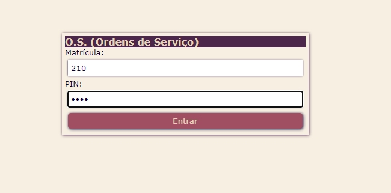<br>
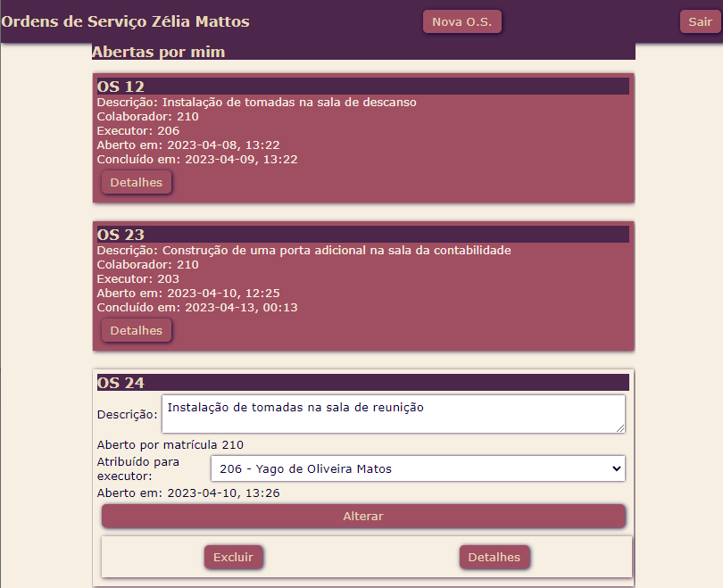<br>
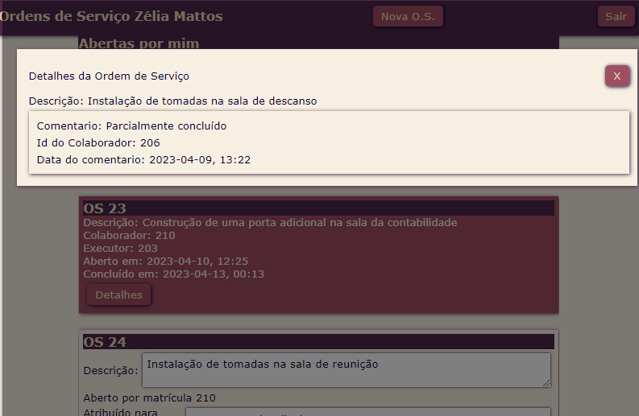<br>
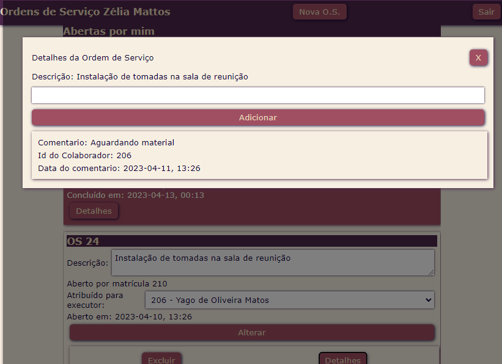<br>
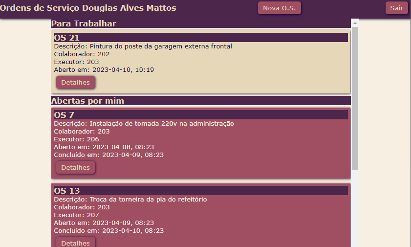<br>
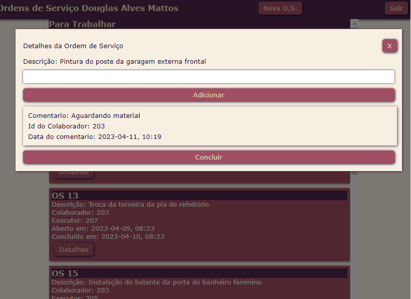<br>
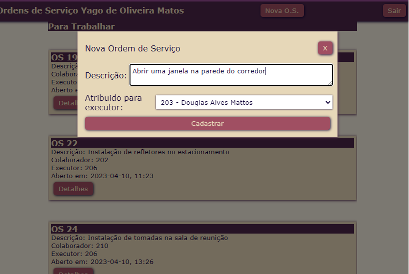<br>
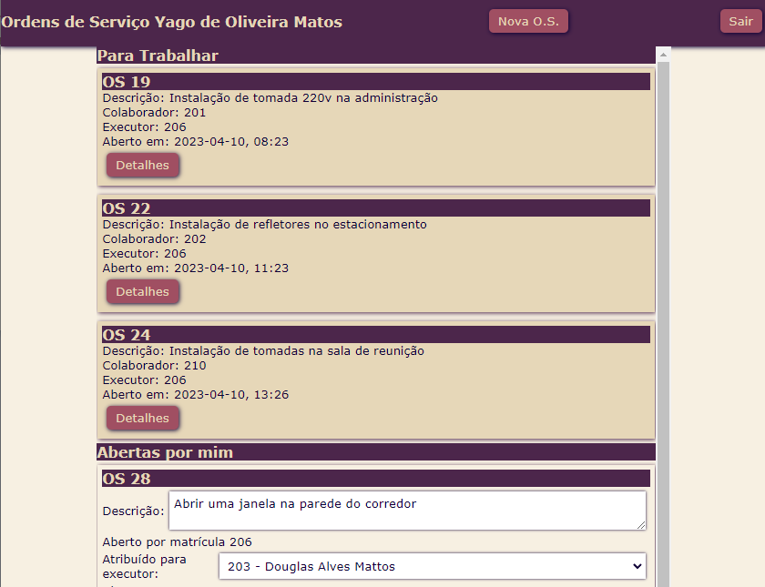<br>
## MER, DER
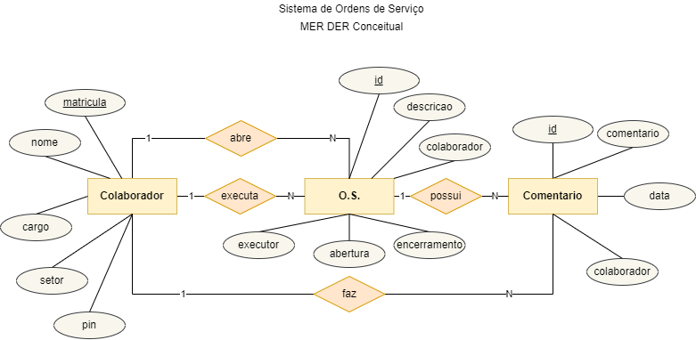<br>
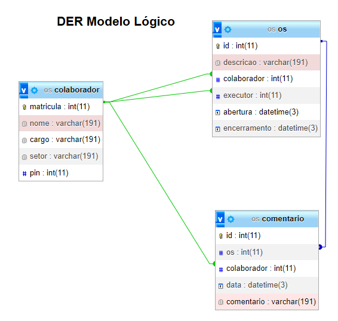<br>
## UMA - Diagrama de Atividades
### Colaborador da manutenção concluíndo uma O.S.
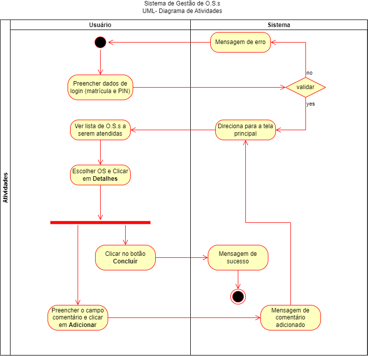<br>