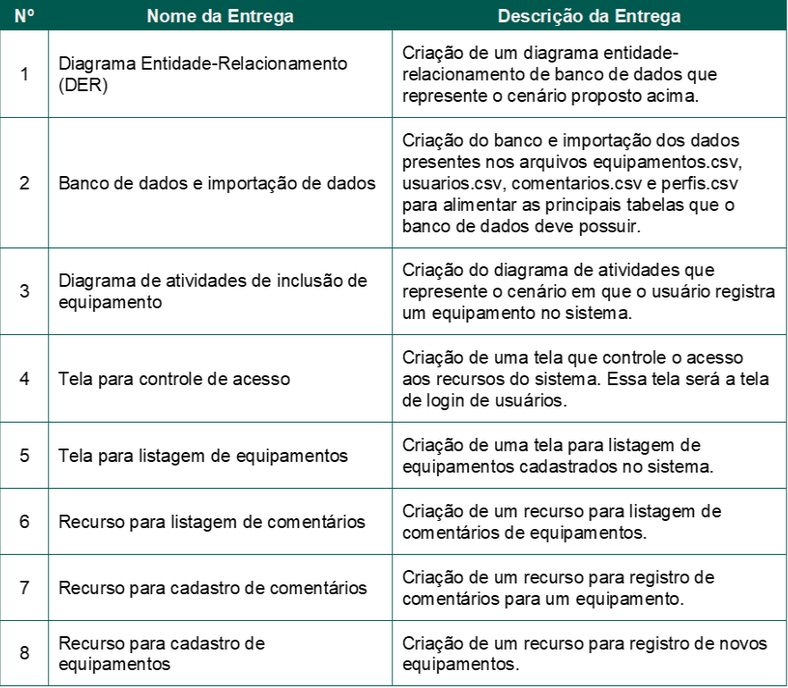
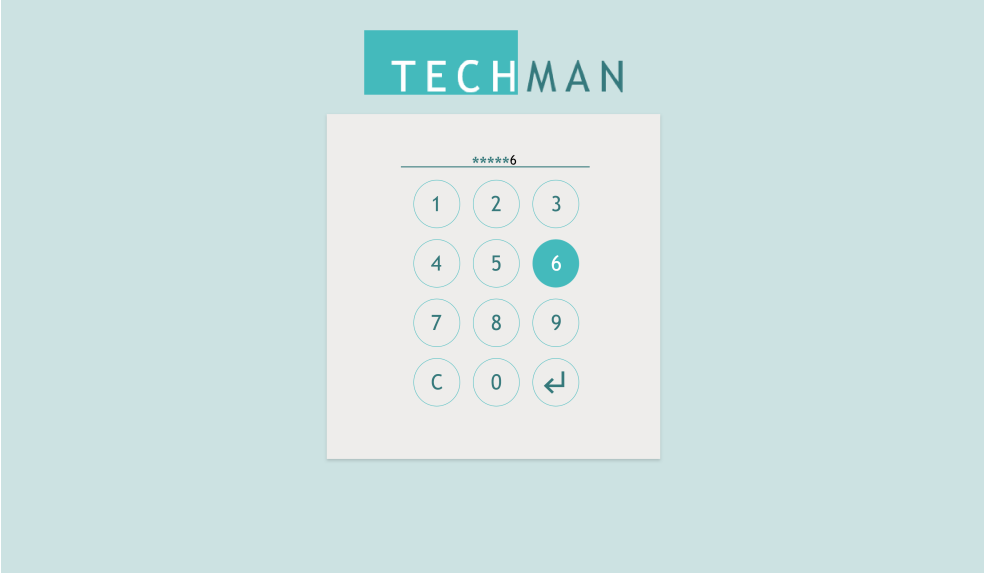
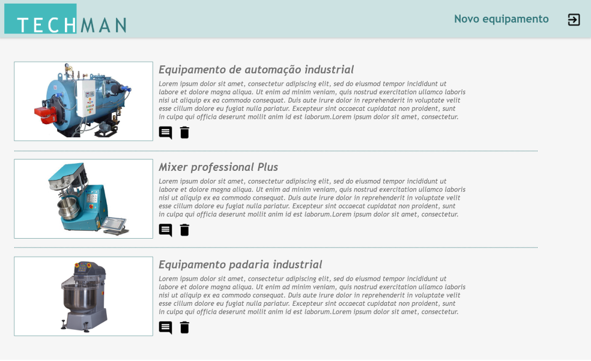
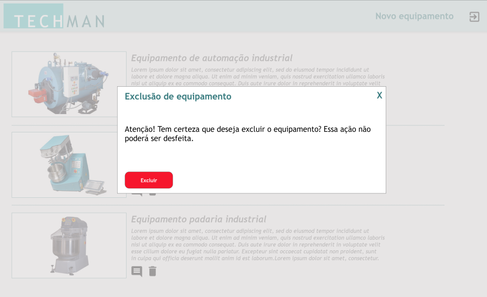
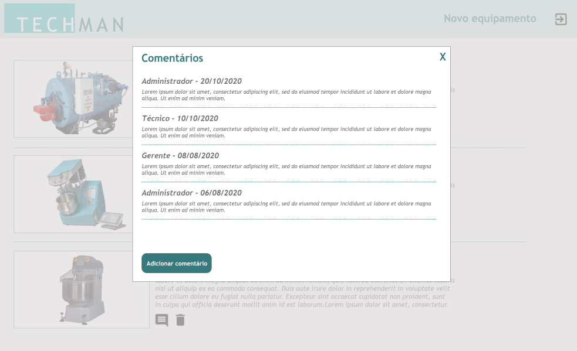
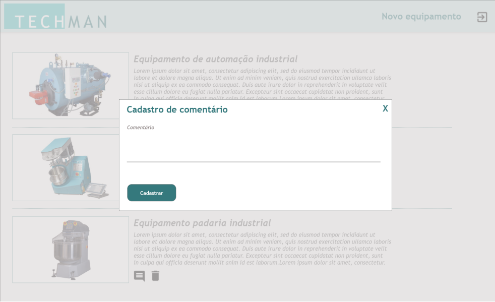
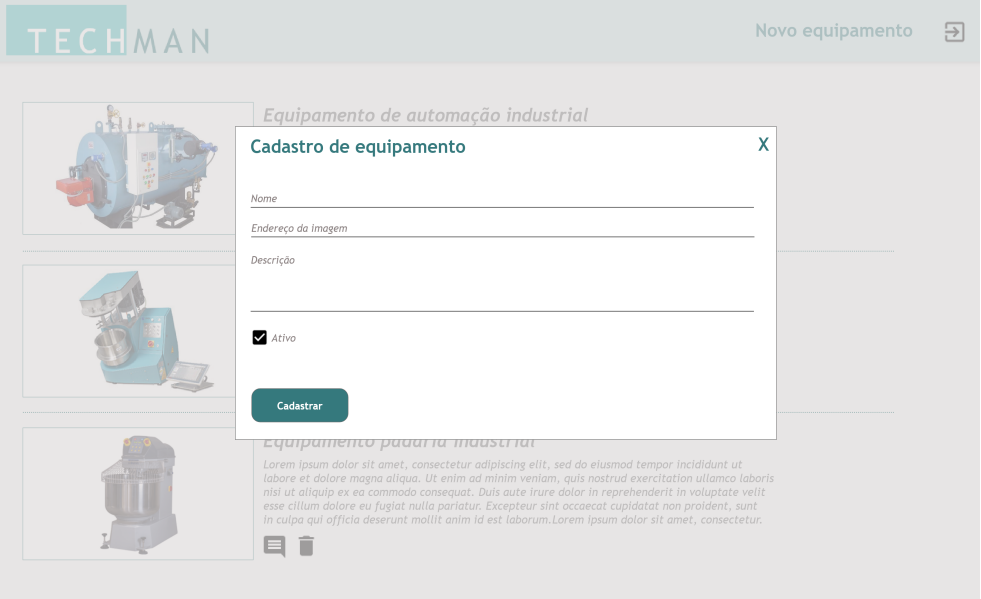
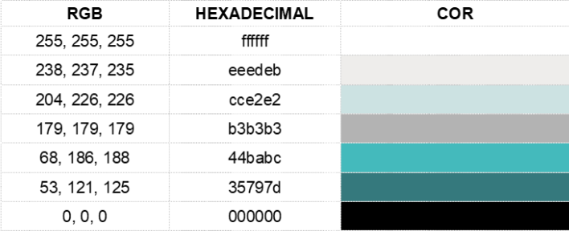

|Situação Problema (Techman)|
|-|
|**Contextualização:**|
|Para facilitar o controle e gerenciamento do histórico de manutenções e demais registros de informações sobre determinado equipamento, as indústrias buscam constantemente soluções de software que tornem esse processo mais intuitivo, prático e dinâmico.|
|**Desafio:**|
|Para ajudar nesse problema, você deverá criar um sistema em sua plataforma de preferência que permita a gestão de equipamentos e de comentários sobre cada um dos equipamentos disponíveis na base de dados. Nesse sistema, os usuários poderão inserir comentários de manutenção preventiva, manutenção corretiva, configurações e/ou qualquer outro compartilhamento de informação sobre o equipamento. Além disso, você deverá manter um relatório/histórico de todos os equipamentos com seus respectivos comentários já inseridos no sistema. O sistema desenvolvido deverá se chamar Techman e tem que conter uma área de login, recursos para cadastrar e excluir equipamentos (somente administrador) e recursos para exibição e inserção de comentários para cada equipamento.|
|**Entregas:**|
||

## 1. Diagrama Entidade-Relacionamento (DER)
Você deve criar um diagrama entidade-relacionamento que contenha as tabelas, relações, campos e chaves do banco de dados previsto por você para atendimento ao cenário proposto acima. Ao criar seu diagrama, leve também em consideração a base de dados fornecida pelo instrutor.  O diagrama criado deve ser exportado em formato *.pdf e entregue para avaliação posterior.

## 2. Banco de dados e Importação de dados
Para essa entrega você deve criar toda a estrutura física de banco de dados com suas respectivas tabelas, relacionamentos e consultas/views necessários para atender a proposta do cenário acima. O banco de dados criado deve considerar a estrutura projetada no diagrama entidade e relacionamento construído por você. Importe os dados presentes nos arquivos equipamentos.csv, usuarios.csv, comentarios.csv e perfis.csv para tabelas equivalentes do banco de dados criado por você. Lembre-se que somente poderão realizar login no sistema usuários que existam na tabela de usuários que deve possuir dados importados por você. O banco de dados criado deve ter sua estrutura e dados exportados para um arquivo em formato **script.sql** e entregue para avaliação posterior.

## 3. Diagrama de atividades de inclusão de equipamento
Você deve criar um diagrama de atividades que represente os passos do login do usuário
administrador e o registro de um novo equipamento no sistema. Você precisará entregar para o instrutor um documento em formato *.pdf contendo atividades, transições e ações que representam esse cenário.

## 4. Tela para Controle de Acesso
Diante do cenário apresentado você deve implementar uma tela de login para controle de acesso de usuários que restrinja o acesso ao sistema somente para usuários cadastrados no banco de dados, ou seja, a validação de acesso deverá considerar os dados importados para o banco e não será necessário que você crie uma tela para cadastro de usuários.  Essa será a primeira tela exibida para o usuário quando ele executar/acessar a aplicação e nessa tela o usuário deverá informar uma senha de acesso.

### Atente para as regras de negócio a serem implementadas:
- 1. Se o usuário inserir uma senha válida, isto é, que conste no banco de dados, e clicar em “Entrar” então o sistema dará acesso à tela de listagem de equipamento de acordo com o perfil cadastrado, descrita na entrega 5.
- 2. O botão “Entrar”, representado no layout abaixo pelo símbolo da tecla enter, só ficará habilitado quando o usuário tiver clicado em 6 números.
- 3. O sistema não deve permitir que sejam digitados números ou letras. A inserção da senha só pode ocorrer através dos botões da tela de login, que simulam um teclado virtual.
- 4. Quando o usuário parar o mouse em cima de um dos botões de número, esse botão deve ter sua cor de fundo alterada, conforme exemplo do layout abaixo.
- 5. Deve existir um campo que vai recebendo um caractere sempre que o usuário clica em um número. Esse recurso é importante para que o usuário tenha um feedback do sistema de quantos dígitos ele já clicou. Esse campo deve apresentar cada número clicado como um asterisco, conforme layout abaixo.
- 6. Deve existir um botão que ao ser clicado limpe a senha que já foi digitada. No layout modelo abaixo esse botão é representado pelo botão “C”, abreviação de Clear (limpar, em inglês).
- 7. Caso o usuário clique em 6 dígitos e, posteriormente, clique no botão para entrar e a senha
for inválida (que não consta no banco de dados), então o sistema deve apresentar uma mensagem de erro “ERRO: Senha incorreta.” para o usuário e limpar o campo de senha clicada.

|A imagem a seguir ilustra um exemplo de como essa tela poderia ser implementada:|
|-|
||
|
Wireframe 1: Tela modelo para login no sistema.
|

Atente que essa imagem é apenas um exemplo, sinta-se livre para criar seu próprio layout, mas lembre-se de considerar o fluxo de navegação do sistema apresentado no vídeo fluxo_navegação.mp4.

## 5. Tela para listagem de equipamentos

|Após fazer login no sistema, o usuário poderá visualizar a listagem de equipamentos cadastrados por meio de uma tela como a visualizada abaixo:|
|-|
||
|
Wireframe 2: Tela modelo para listagem de equipamentos.
|

Essa tela também é meramente ilustrativa, você pode implementar sua própria tela, desde que
atenda aos seguintes requisitos:

- 1. Essa tela deve possuir uma barra de navegação em seu topo contendo a logomarca do sistema, um item de menu chamado “Novo equipamento” e um botão/ícone que permita sair do sistema.
- 2. O item de menu “Novo equipamento” só fica visível se o usuário logado for administrador.
- 3. A lista de equipamentos deve apresentar a imagem de cada equipamento cadastrado no sistema, nome do equipamento, descrição um botão/ícone que permita acessar os comentários do equipamento e um botão/ícone que permita excluir o equipamento.
- 4. A lista de equipamentos deve exibir somente os equipamentos que possuem status ativo.
- 5. O botão/ícone que permite a exclusão de um equipamento só deve ficar visível caso o usuário logado seja administrador. Para os outros perfis esse botão não deve aparecer.
- 6. Caso o usuário com perfil administrador clique no botão/ícone para exclusão do equipamento, então a mensagem de confirmação “Atenção! Tem certeza que deseja excluir o equipamento? Essa ação não poderá ser desfeita.”

|Deve ser exibida, conforme modelo abaixo:|
|-|
||
|
 Wireframe 3: Recurso modelo para exclusão de equipamentos. 
|

    - 6.1. Nesse caso, se o usuário confirmar a exclusão, então o sistema excluirá permanentemente o equipamento e direcionado o usuário para a tela de listagem de equipamentos.
- 7. Caso o usuário clique no botão/ícone para sair do sistema, então a tela de listagem de equipamentos deve ser fechada e a tela de login (layout 1) deve ser exibida para ele.
- 8. Essa tela deve possuir barra de rolagem vertical, permitindo que o usuário role a lista de
equipamentos listados.

## 6. Recurso para listagem de comentários

Na listagem de equipamentos, o usuário poderá visualizar a lista de comentários de determinado equipamento ao clicar no botão/ícone de comentário. Esse botão/ícone deve ser acessível para todos os perfis de usuário que fizerem login no sistema. Ao clicar nesse botão/ícone, a lista de comentários do equipamento será apresentada por meio de um recurso (tela, popup, modal...)

|Como o exemplo abaixo:|
|-|
||
|
 Wireframe 4: Recurso modelo para listagem dos comentários dos equipamentos. 
|

Essa tela também é meramente ilustrativa, você pode implementar sua própria tela, desde que
considere o fluxo de navegação do sistema e atenda aos seguintes requisitos:

- 1. A lista de comentários deve apresentar, para cada comentário listado, o perfil do usuário que fez o comentário, a data de inclusão do comentário e a descrição dele.
- 2. Essa tela deve ter um botão que, ao ser clicado, fecha a sua exibição e direciona o usuário 
para a lista de equipamentos.
- 3. Essa tela deve ter um botão “Adicionar comentário” que ao ser clicado direcionará o usuário para a tela de cadastro de comentário, descrita na entrega 7.
- 4. Essa tela lista os comentários por ordem de cadastro, com os mais recentes aparecendo primeiro.

## 7. Recurso para cadastro de comentários

Na visualização dos comentários de um equipamento, caso o usuário clique no botão “Adicionar comentário” (conforme modelo apresentado na entrega 6), então deve ser exibido um recurso (tela, popup, modal) que permita a inserção de um comentário para o equipamento que estava com sua lista de comentários sendo exibida.

|A imagem a seguir apresenta um modelo desse recurso:|
|-|
||
|
 Wireframe 5: Recurso modelo para inserir um comentário de um equipamento. 
|

As seguintes regras de negócio se aplicam para essa tela:

- 1. Essa tela deve possuir um campo que permita a inserção de comentários textuais pelo usuário.
- 2. Deve possuir um botão/ícone que permita fechar a tela e, ao ser clicado, direcionará o usuário para a lista de equipamentos, conforme vídeo do fluxo de navegação do sistema.
- 3. Deve possuir um botão “Cadastrar” que permita o cadastro do comentário no banco de dados.
- 4. O botão “Cadastrar” só ficará habilitado se o usuário inserir algum texto, exceto espaço, no campo de comentário.
- 5. O cadastro do comentário no banco de dados deve ser para o equipamento que estava com sua lista de comentários visualizada, perfil de usuário logado e data atual do sistema.
- 6. Após clicar no botão “Cadastrar” e o sistema cadastrar o comentário para o equipamento, então a mensagem “Sucesso! Comentário cadastrado para o equipamento.” deve ser exibida, a tela de cadastro de comentário deve ser fechada e a lista de equipamentos (tela principal) deve ser exibida.
- 7. Sinta-se livre para criar o formulário como preferir, mas atribua a ele as funcionalidades citadas acima e o fluxo de navegação apresentado no vídeo.

## 8. Recurso para cadastro de equipamentos

Na tela principal do sistema (lista de equipamentos), caso o usuário clique na opção de menu “Novo equipamento”, então deve ser exibido para ele um recurso que permita a inclusão de equipamentos para o usuário do perfil administrador.

|A imagem a seguir apresenta um modelo de tela desse recurso:|
|-|
||
|
 Wireframe 6: Recurso modelo para inserir um equipamento. 
|

As seguintes regras de negócio se aplicam para essa tela:

- 1. Essa tela deve possuir um campo que permita que o usuário realize o cadastro do nome do equipamento.
- 2. Essa tela deve possuir um campo que permita que o usuário realize o cadastro do endereço onde a imagem do equipamento se encontra.
- 3. Essa tela deve possuir um campo para o cadastro da descrição do equipamento.
- 4. Essa tela deve possuir um recurso que permita ao administrador definir se o equipamento que está sendo cadastrado é ativo ou não.
- 5. O botão “Cadastrar” só ficará habilitado caso o administrador preencha todos os campos do cadastro de equipamentos.
- 6. Quando o usuário clicar em “Cadastrar”, então o sistema deve cadastrar os dados do equipamento e seu status. A data de inclusão deve ser a data atual do sistema.
- 7. Essa tela deve ter um botão que ao ser clicado fechará a tela atual e direcionará o usuário para a tela principal do sistema (lista de equipamentos).

Sinta-se livre para criar o formulário como preferir, mas atribua a ele as funcionalidades citadas
acima e leve em consideração o fluxo de navegação apresentado no vídeo.

## Resumo das entregas

Ao final da sua atividade você precisa entregar ao instrutor:

- Um arquivo em formato *.pdf contendo o diagrama entidade-relacionamento criado por você;
- Um arquivo em formato *.pdf contendo o diagrama de atividade com atividades, transições e ações.
- Um arquivo em formato *.sql que gere o seu banco de dados contendo a estrutura e os dados dele.
- Os códigos fonte da aplicação criada contendo a tela de login, recurso para listagem, cadastro e exclusão de equipamentos, e listagem e cadastro de comentários para determinado equipamento.

### Orientações Gerais

- No desenvolvimento dessa prova você deve considerar os seguintes padrões:
    - Para títulos a fonte deverá ser Trebuchet MS, 12 pt;
    - Para os demais textos a fonte padrão deverá ser Trebuchet MS, 10 pt.

- A logomarca entregue para ser usada em sua interface está em formato *.png e é um arquivo conforme visualizado a seguir:

 

- Essa logo deverá estar presente na tela de login do sistema e na tela principal do sistema (lista de equipamentos).

- As cores que podem ser utilizadas no desenvolvimento das suas telas são:
 

- Neste repositório estão:
    - No diretório **./assets** a logomarca, os ícones, e ilustrações de exemplo,
    - No diretório **./dados** os 4 arquivos **.csv** com os dados a serem importados para a base de dados que você precisará construir.

## Bom trabalho!

|Entregas|
|-|
|Crie um repositório público github com a seguinte organização: - pasta_projeto - documentacao - README.md (Explicando como executar)  Envie o endereço do repositório neste [Formulário](https://forms.gle/7c55mBYnb37RUrg8A)||