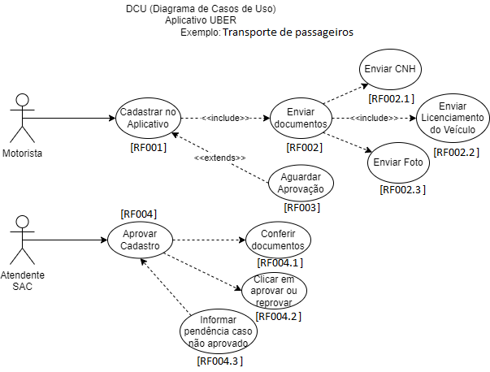

# CONHECIMENTOS - Levantamento, Análise e Registros
- 2. Levantamento de Requisitos
	- 2.1.Definição
	- 2.2.Técnicas
		- 2.2.1.Levantamento orientado a pontos de vista
		- 2.2.2.Etnografia (observação)
		- 2.2.3.Método Analítico
		- 2.2.4.Workshops
		- 2.2.5.Prototipagem
		- 2.2.6.Entrevistas
		- 2.2.7.Questionários
		- 2.2.8.Brainstorming
		- 2.2.9.Métodos Sistêmicos (JAD - Joint Application Design)
	- 2.3.Fases
		- 2.3.1.Coleta
		- 2.3.2.Análise
		- 2.3.3.Registros
- 3. Gerenciamento de Requisitos
	- 3.1.Definição
	- 3.2.Gestão de mudanças
	- 3.3.Rastreabilidade de requisitos
	- 3.4.Validação de requisitos
- 4. UML (Unified Modeling Language)
	- 4.1.Definição
	- 4.2.Casos de Uso
		- 4.2.1.Diagrama
		- 4.2.2.Narrativa
## Exemplos de UML - DCU (Diagramas de Casos de Uso)

# Atividade 1:
- Contextualização: Você é um pequeno empresário dono de um dos negócios elencados pelo instrutor, precisa de um sistema de informação e contratou um terceiro para desenvolver o seu projeto, para isso voê possui um limite de orçamento.
- Desafio: Crie um bloco de anotações detalhando as regras de negócio e numerando cada requisito funcional e não funcional que deseja que o sistema atenda.

Empreendimento	Orçamento	Nome
- [Nº],[Empreendimento],[Orçamento],[Empreendedores],[executores]
- 1, Academia,	R$ 2200,00	(Andreina Costa Moura, Gleidson Pereira Da Silva), 12
- 2, Agência de viagens,	R$	1600,00	(Rodolfo Dos Santos Aura, Leticia Amaral Lopes), 13
- 3, Farmácia,	R$	2000,00	(Ana Clara Oliveira Santos, Carlos Eduardo Silva Miranda), 11
- 4, Hotel ou Pousada,	R$	2000,00	(Guilherme Melro, Carlos Daniel De Abreu), 10
- 5, Livraria,	R$	1900,00	(Eduardo Venosi De Campos, Victória Helóise Cunha Duó), 1
- 6, Locação de Carros,	R$	1800,00	(Guilherme Henrique Dos Santos, Santiago Conti Zapparoli), 8
- 7, Loja Cookies,	R$	1500,00	(Beatriz Gabriela Godoi De Souza, Vinicius Campos Ferreira), 5
- 8, Loja de Roupas,	R$	1900,00	(Gabriel Alves Sousa Silva, Felipe Augusto Ribeiro Serra, Felipe Dos Santos Canizela), 2
- 9, Lojinha ChingLing,	R$	2100,00	(Bruno Favaro, João Augusto Rocha Carloto), 4
- 10, Padaria,	R$	1900,00	(Alice Michelle da Silva, Luiz Fernando De Souza), 3
- 11, Pet Shop,	R$	1500,00	(Breno Jorge De Lima Silva, Natã Batista Fernandes), 7
- 12, Posto de Gasolina,	R$	1500,00	(Rodrigo Caetano Silva, Julia Marra Pastorelli), 6
- 13, Salão de Beleza,	R$	1700,00	(Cyro Brandão Alvares, Luana Silva Brandão Lopes), 9

# Atividade 2:
- Contextualização: Você faz parte de uma equipe de desenvolvimento de software vai visitar um cliente com o objetivo de elencar os requisitos de um sistema de informação.
- Desafio: Criar um documento de requisitos utilizando UML:
	- Detalhar os termos, abreviações e linguagem técnica.
	- Diagrama de Casos de Uso (DCU) (Requisitos Funcionais)
	- Categorizar as prioridades.
	- Detalhar os requisitos não funcionais.
	
# Entregas:
- Ao concluir as atividades postar os 3 PDFs neste Forms: https://forms.gle/V2ktgTsSoVfsaLND7
