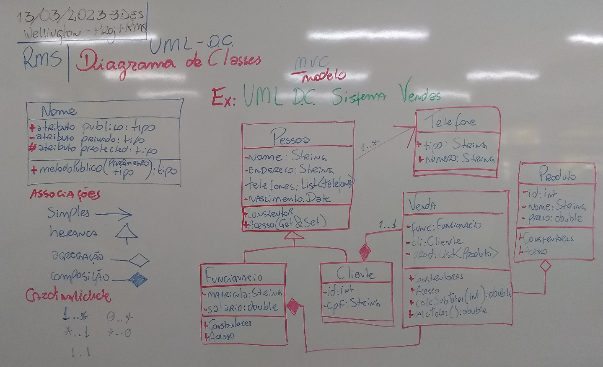
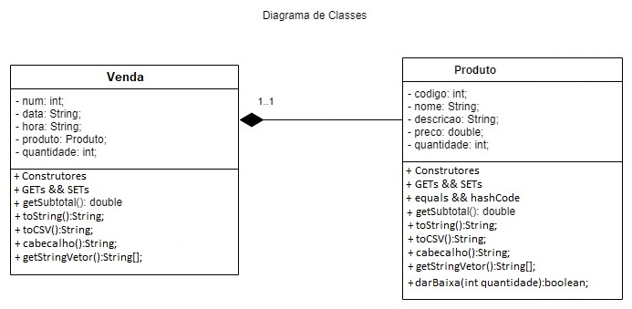

# UML (Unified Modeling Language)
- 4.1. Definição
- 4.2. Casos de Uso
	- 4.2.1. Diagrama
	- 4.2.2. Narrativa
- 4.3. Diagramas

|Definição|
|-|
|**UML** significa "Unified Modeling Language" ou Linguagem de Modelagem Unificada em português. É uma linguagem visual usada para modelar, especificar, construir e documentar sistemas de software.|
|A **UML** fornece um conjunto de notações gráficas padronizadas que permitem aos desenvolvedores de software representar visualmente o design de um sistema de software, incluindo seus requisitos, estrutura, comportamento e interações. Ela é usada em diversas áreas da engenharia de software, incluindo análise de requisitos, design de sistemas, implementação de software, testes e documentação.|
|A **UML** foi desenvolvida pela OMG (Object Management Group) e é amplamente utilizada na indústria de software em todo o mundo.|

## Casos de uso

### Diagrama

### Narrativa
- Nome do caso de uso: **Comprar produto**
- Ator principal: **Cliente**
- Pré-condições:
    1. O cliente já está autenticado no sistema e tem acesso ao catálogo de produtos.
- Fluxo básico:
    1. O cliente navega pelo catálogo de produtos e seleciona o produto que deseja comprar.
    2. O sistema exibe informações detalhadas sobre o produto selecionado, incluindo preço, disponibilidade e opções de entrega.
    3. O cliente adiciona o produto ao carrinho de compras e pode continuar navegando no catálogo ou finalizar a compra.
    4. O cliente finaliza a compra e o sistema exibe um formulário de pagamento.
    5. O cliente preenche o formulário com as informações de pagamento e confirma a compra.
    6. O sistema processa o pagamento e exibe uma mensagem de confirmação da compra.
    7. O sistema envia um e-mail de confirmação da compra para o cliente.
- Fluxo alternativo:
    1. Se o produto selecionado estiver indisponível, o sistema exibe uma mensagem de erro e permite ao cliente selecionar outro produto.
    2. Se o pagamento for recusado, o sistema exibe uma mensagem de erro e permite ao cliente corrigir as informações de pagamento ou selecionar outro método de pagamento.
- Pós-condições:
    1. O produto é removido do estoque.
    2. O cliente recebe um e-mail de confirmação da compra.
    3. O sistema atualiza o registro de vendas e estoque.

|Este é um exemplo simples e genérico de um diagrama de caso de uso e uma narrativa, mas ela pode ser personalizada e aprimorada para se adequar às necessidades específicas do sistema e dos usuários envolvidos. A narrativa de caso de uso é uma descrição detalhada do que o sistema deve fazer em resposta a uma ação do usuário.|
|-|

## Diagramas
### Diagrama de Classes

