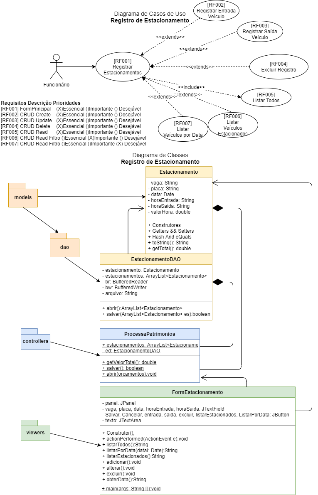
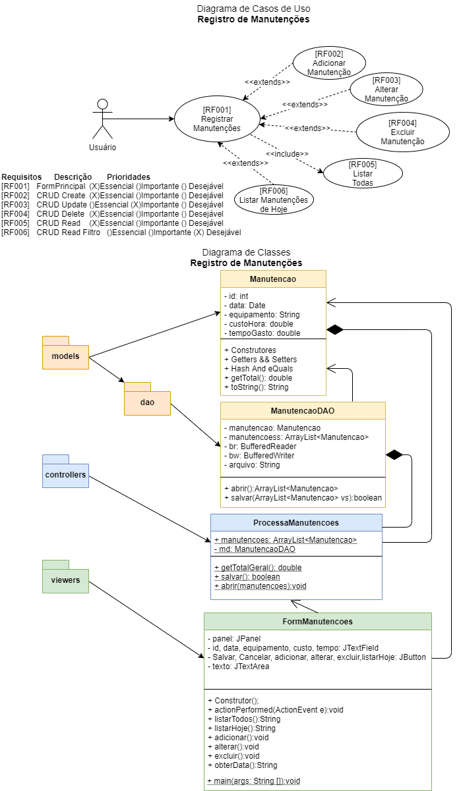
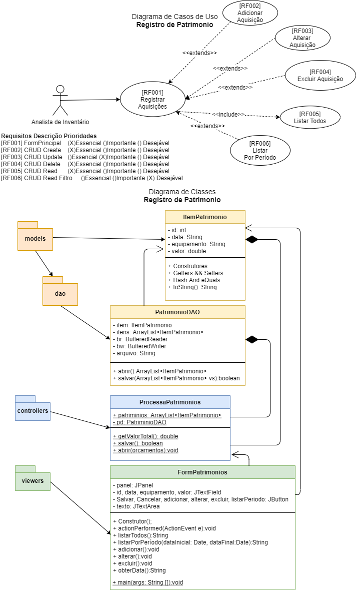

# Exemplos UML(DCU + DC)
- Projetos simples com apenas uma tabela em Banco de Dados
## Estacionamento:

## Manutenções:

## Orçamentos:

## Inventário: Itens de Patrimônio:

## Mapa de pontos de rede:

## Registro de Viagens:
