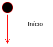
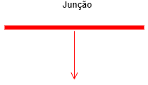
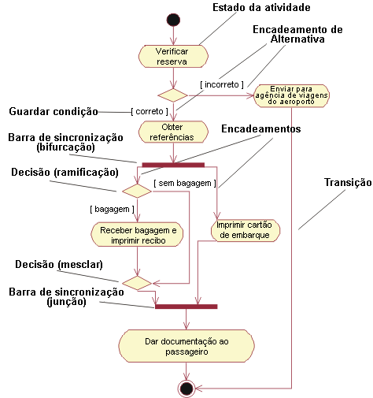

# UML (Unified Modeling Language)
## Diagrama de Atividades

- Os diagramas de atividades são semelhantes a **fluxogramas** porque mostram o fluxo entre as ações em uma atividade; no entanto, os diagramas de atividades também podem mostrar fluxos **paralelos** ou **simultâneos** e fluxos **alternativos**.

### Objetivo:
- O objetivo do diagrama de atividades é mostrar o fluxo de atividades em um único processo. O diagrama mostra como um atividade depende uma da outra.

### Como se faz um diagrama de atividades?
- Para criar um diagrama de atividade, é necessário um conjunto de símbolos especiais, incluindo aqueles para dar partida, encerrar, fundir ou receber etapas no fluxo:

|||||||
|-|-|-|-|-|-|

- Um diagrama de atividade pode ser dividido em regiões denominadas swimlanes. Estas regiões são associadas a um objeto do modelo ex: Cliente, Televendas, Contabilidade, Estoque:
 

### Exemplo 1 (Sem regiões):

### Exemplo 2 (Com regiões na Vertical):

### Exemplo 3 (Com regiões na Horizontal):
