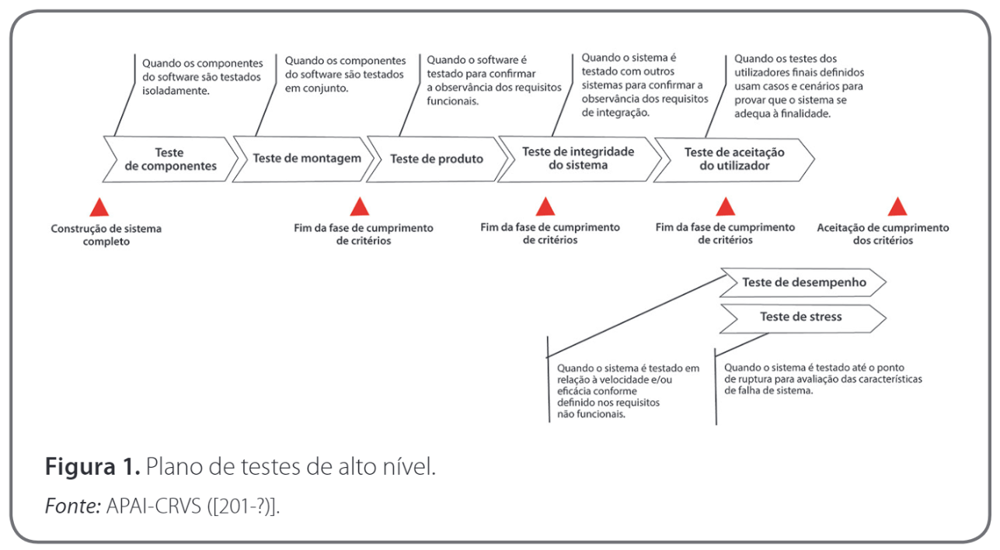
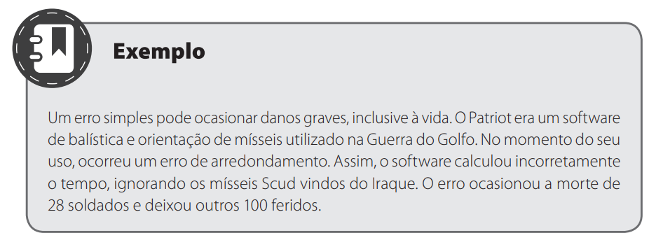
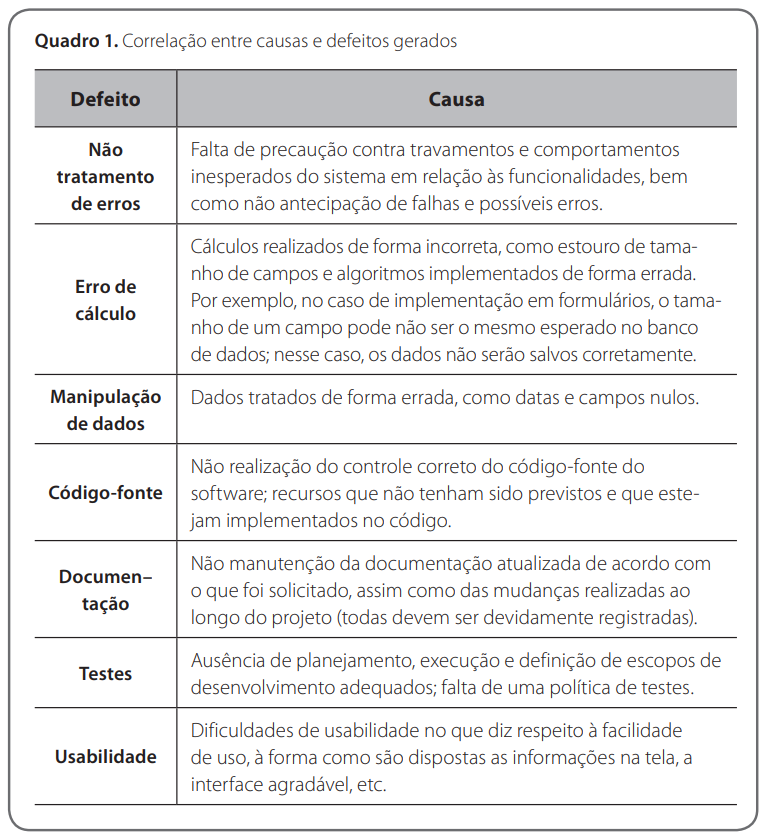
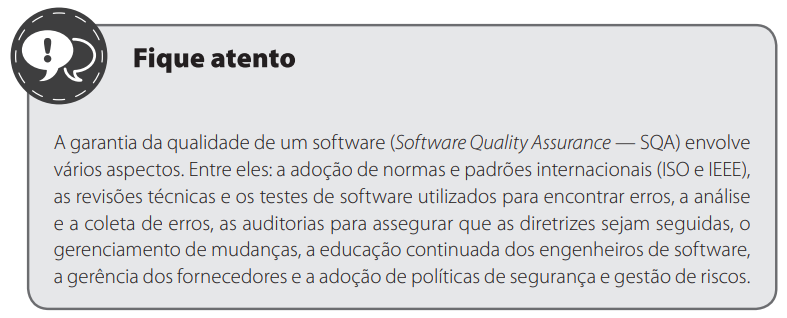

# Testes (Segundo Roger PressMan) Aula01

## Conhecimentos conforme Plano de Curso
- 1. Testes
    - 1.1.Definição
    
## Bibliografia - Engenharia de Software: Uma Abordagem Profissional
### Objetivos
- Definir Testes de Software
- Apontar causas de defeitos e o papel do analista de testes QA(Quality Analist)
- Explicar a Qualidade de SOftware

### Plano de testes:

### Classificações
- Os testes são classificados de diferentes formas. Veja a seguir.
    - **Teste de componentes:** componentes do software são testados isoladamente.
    - **Teste de montagem:** componentes do software são testados em conjunto.
    - **Teste de produto:** o software é testado para confirmar que os requisitos funcionais estão presentes.
    - **Teste de integridade de sistema:** testa a robustez do software, ou seja, a resistência a falhas.
    - **Teste de aceitação do utilizador:** usuários finais utilizam casos e cenários para provar que o sistema se adequa à sua finalidade.
    - **Teste de desempenho:** o sistema é testado em relação à velocidade ou à eficácia, conforme definição nos requisitos não funcionais.
    - **Teste de performance:** avalia a capacidade de resposta, a disponibilidade, a confiabilidade e a robustez do software diante de determinada carga de trabalho, em condições específicas e por determinado tempo. O objetivo é verificar comportamentos diferentes que condições diversas podem gerar.
    - **Teste de estresse:** o sistema é testado até o ponto de ruptura para avaliar características de falhas.
    - **Teste de integração:** verifica se um ou mais componentes combinados funcionam de maneira satisfatória.
    - **Teste de usabilidade:** é realizado com foco na experiência do usuário, analisando a consistência da interface, o layout, o acesso a funcionalidades, a facilidade de utilização e a viabilidade da manipulação do sistema pelo usuário.
    - **Teste de configuração ou instalação:** verifica como o software se comporta ao ser instalado em diferentes configurações de software e hardware.
    - **Teste de segurança:** verifica se o sistema e os dados são acessados de forma segura somente por quem executa as ações.
    - **Teste funcional:** verifica os requisitos funcionais, as funções e os casos de uso, ou seja, analisa se a aplicação faz o que deveria fazer.
    - **Teste de unidade:** testa um componente de forma isolada.
    - **Teste de volume:** verifica o comportamento do sistema funcionando com o volume “normal” de dados e transações, envolvendo o banco de dados durante um longo período.
 

### Defeitos, Erros e Falhas
- https://www.devmedia.com.br/testes-de-software-entendendo-defeitos-erros-e-falhas/22280
- **Bug/Defeito:** trata-se do resultado de um erro de código. Uma anomalia é gerada no funcionamento do software por meio de uma instrução errada ou um comando incorreto.
- **Erro:** é decorrente da ação humana. Um resultado incorreto é produzido,
como uma falha de escrita em um código-fonte.
- **Falha:** é o resultado da execução de um defeito gerado no código.
 

### Ferramentas
- **qTest:** ferramenta de teste de desempenho.
- **Testlink:** ferramenta open source de gerenciamento de testes de software que possibilita que equipes de teste trabalhem de forma sincronizada.
- **Loadrunner:** ferramenta de teste de software da Micro Focus utilizada para testar aplicativos, medir o comportamento do sistema e o desempenho sob a carga.
- **Selenium:** Ferramenta de testes de ponto a ponto.

### Qualidade
- A seguir, veja os fatores definidos pela norma **ISO 9126 (2001)** para que o software tenha um nível de qualidade adequado:
    - **Correção:** implica a capacidade de o software realizar as tarefas de forma precisa, ou seja, de acordo com os requisitos especificados pelo cliente.
    - **Extensibilidade:** é a forma como se podem inserir modificações no software; ou seja, ele deve ser flexível o suficiente para que modificações sejam realizadas de forma fácil.
    - **Reusabilidade:** é a facilidade com que os softwares podem ser reutilizados totalmente ou em partes para novas aplicações. Isso faz com que haja economia e níveis de qualidade satisfatórios durante a produção de novos softwares, pois ocorrerá menor esforço na escrita e menor risco de erros.
    - **Robustez (confiabilidade):** essa capacidade mostra que o software funciona mesmo em condições não validadas nas especificações dos requisitos.
    - **Compatibilidade:** refere-se à facilidade de combinar softwares com outros componentes. Ou seja, ao ser utilizado, o software deve funcionar plenamente sem interferir em outras aplicações. Dessa forma, não deve haver problemas devido à execução de dois ou mais tipos de softwares ao mesmo tempo. Como exemplo, considere a estrutura de dados padronizada, as interfaces homem-máquina padronizadas ou ainda a padronização de formatos de arquivos.
    - **Portabilidade:** é a facilidade com que um software pode ser transposto de um ambiente para outro, de acordo com os subatributos:** adaptabilidade, facilidade de instalação,  conformidade e facilidade de substituição (PRESSMAN; MAXIM, 2016). É um dos fatores difíceis de se obter, pois nem sempre é possível alinhar o software às diferentes plataformas, sistemas operacionais e periféricos.
    - **Eficiência:** esse fator está diretamente relacionado à utilização racional dos recursos de hardware e do sistema operacional em que o software será instalado. Entre esses recursos, estão:** memória, recursos gráficos, bibliotecas, entre outros.
 