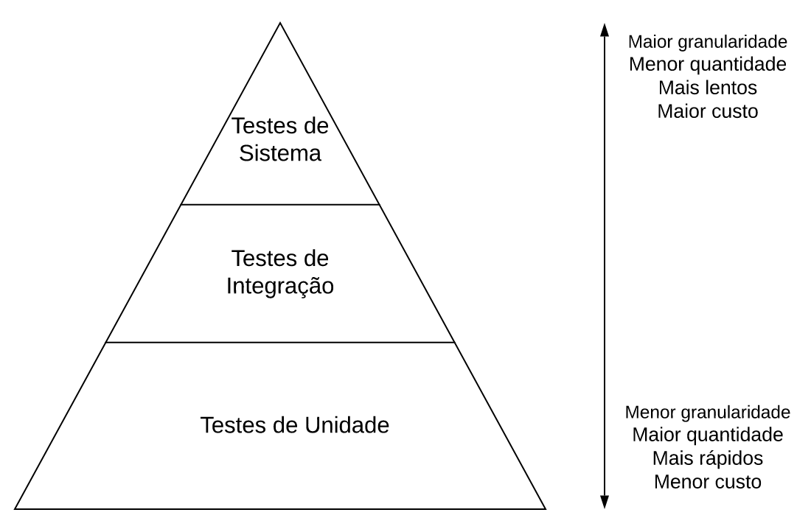
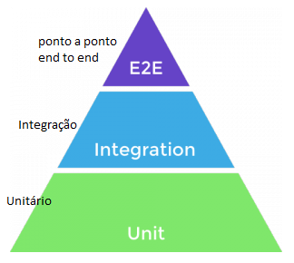

# Testes (Definição, Tipos e Níveis) Aula 02

## Conhecimentos conforme Plano de Curso
- 1.3.Níveis
	- 1.3.1.Unitário
	- 1.3.2.De integração
	- 1.3.3.De sistema
	- 1.3.4.De aceitação

## Tipos de testes

## Tipos de testes

## Tipos de testes

# Links Uteis
- Link: https://engsoftmoderna.info/cap8.html
- Selenium: https://www.selenium.dev/selenium-ide/
- Youtube Sobre o Selenium: https://www.youtube.com/watch?v=Fw9YW5_MZRs&t=3s
- Youtube Curso de Selenium: https://www.youtube.com/watch?v=YoV7Oa3vCIE&list=PLedtsFT8ymsgVCqgLvPiSrfYeGdujcqvv&index=1
- Youtube: https://www.youtube.com/watch?v=fxL04i00jJw
- youyube: JUNIT no VSCODE: https://www.youtube.com/watch?v=N_FWR1MJ37o
