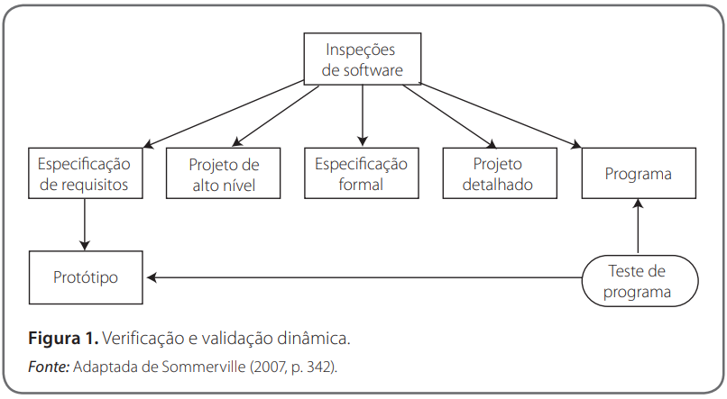
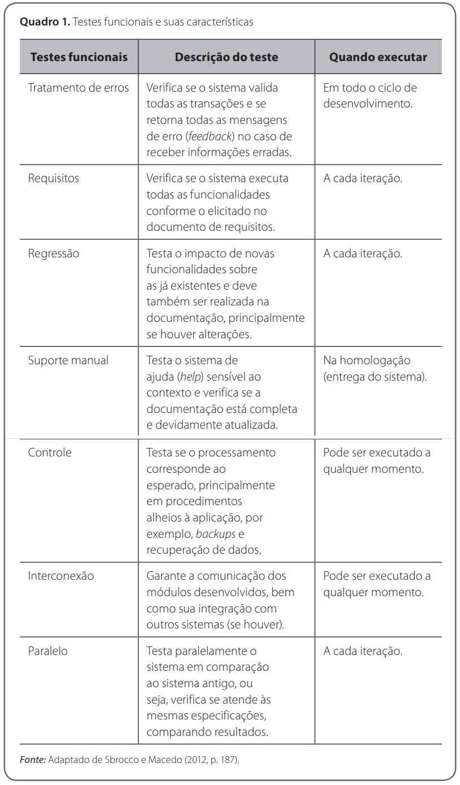
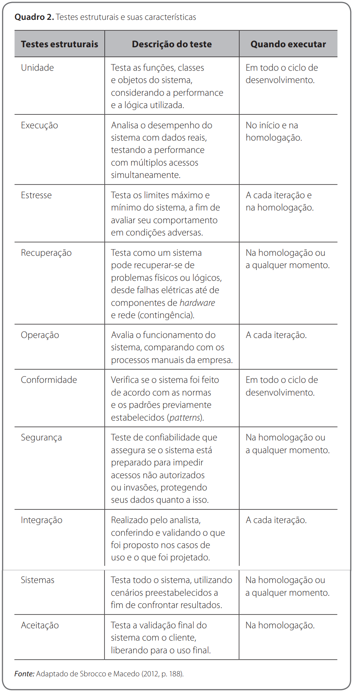
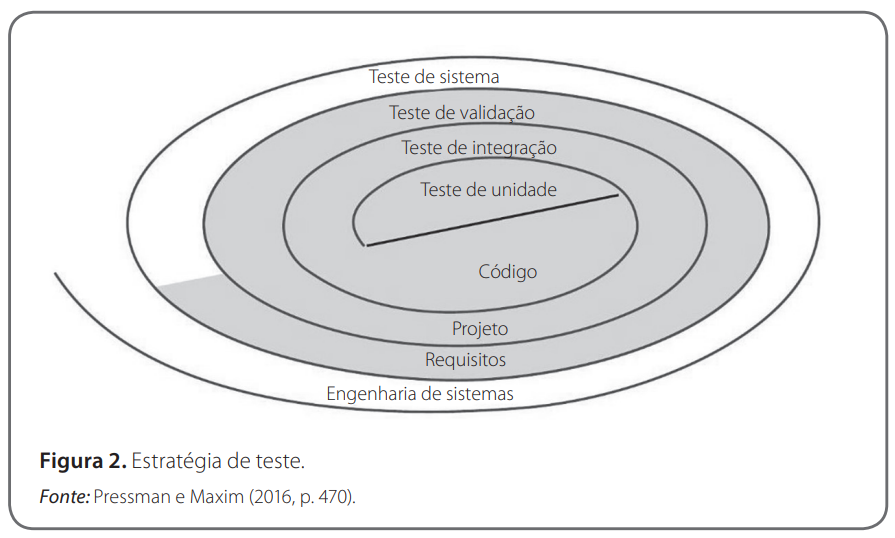
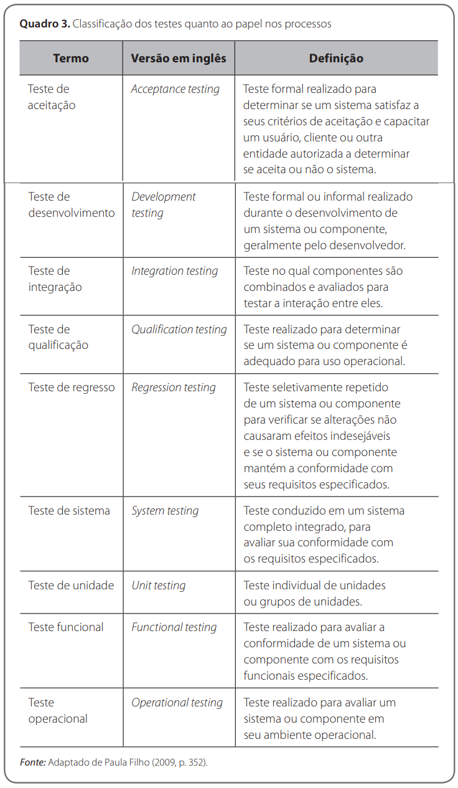

# Testes - Aula03
## Conhecimentos conforme Plano de Curso
- 1.2.Tipos
    - 1.2.1.Funcionais
    - 1.2.2.Não funcionais
- 1.4.Técnicas
	- 1.4.1.Regressão
	- 1.4.2.Estresse
	- 1.4.3.Recuperação
	- 1.4.4.Performance
	- 1.4.5.Segurança
	- 1.4.6.Paralelo
## Verificação e validação estáticas e dinâmicas
Verificação e a validação incluem uma ampla gama de atividades de SQA (software quality assurance — garantia da qualidade de software): revisões técnicas, auditorias de qualidade e configuração, monitoramento de desempenho, simulação, estudo de viabilidade, revisão de documentação, revisão de base de dados, análise de algoritmo, teste de desenvolvimento, teste de usabilidade, teste de qualificação, teste de aceitação e teste de instalação.

 

## Teste de Caixa Preta
também chamado de teste comportamental ou teste Verificação, validação e testes de software funcional, focaliza os requisitos funcionais do software. O teste caixa-preta tenta encontrar erros nas seguintes categorias:
- 1. funções incorretas ou ausentes;
- 2. erros de interface;
- 3. erros em estruturas de dados ou acesso a bases de dados externas;
- 4. erros de comportamento ou de desempenho;
- 5. erros de inicialização e término.
 
## Teste de Caixa Branca
Também chamado de teste da caixa-de-vidro ou teste estrutural, é uma filosofia de projeto de casos de teste que usa a estrutura de controle descrita como parte do projeto no nível de componentes para derivar casos de teste. Usando métodos de teste caixa-branca, o engenheiro de software pode criar casos de teste que:

- 1. garantam que todos os caminhos independentes de um módulo foram exercitados pelo menos uma vez;
- 2. exercitem todas as decisões lógicas nos seus estados verdadeiro e falso;
- 3. executem todos os ciclos em seus limites e dentro de suas fronteiras operacionais;
- 4. exercitem estruturas de dados internas para assegurar a sua validade.
 

## Tipos de testes de software
Um teste pode ser visto como uma coleção de procedimentos e casos de teste. Um procedimento de teste é um conjunto detalhado de instruções para execução de testes. Um caso de teste é uma especificação das entradas, dos resultados previstos e das condições de execução para um  item a testar, em que um procedimento de teste pode ser invocado em vários casos de teste, de forma direta, ou por meio de outros procedimentos de teste.

### Dois objetivos distintos:
- demonstrar ao desenvolvedor e ao cliente que o software atende a seus requisitos;
- descobrir situações em que o software se comporta de maneira incorreta, indesejável ou de forma diferente das especificações.
 

### Classificação quanto ao papel:

 