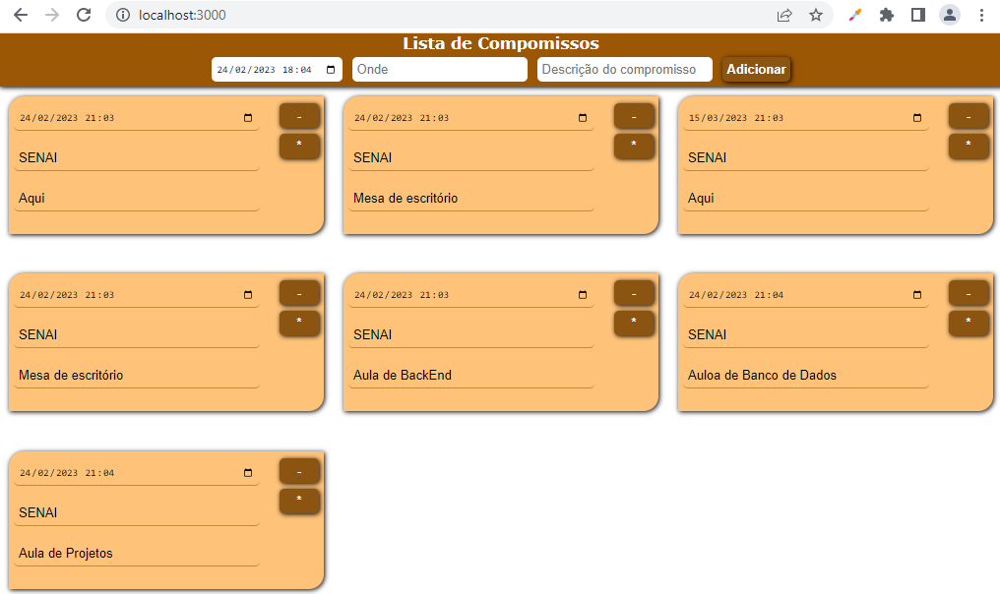

# Agenda exemplo BackEnd (Node + Mongo + Pug)
* Necessário ter NodeJS e MongoDB instalados
1. Clonar este reposiório:
    - git clone
2. Instalar as dependência
    - npm install
3. Iniciar a aplicação
    - npm start
    - ou node app.js
    - ou nodemon
4. Executar no caminho: http://localhost:3000
