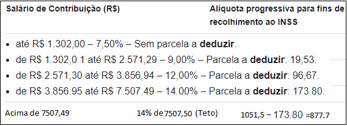
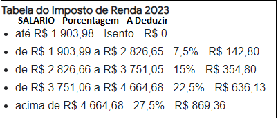
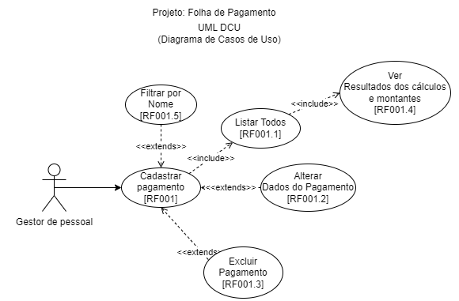
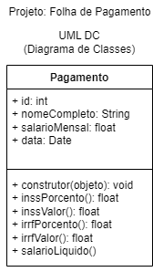
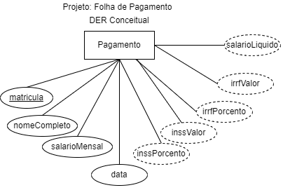
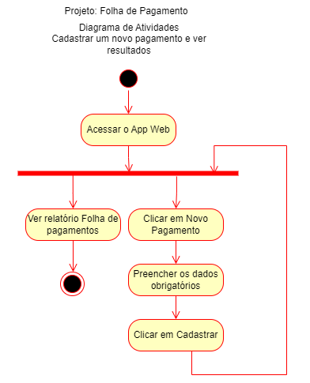
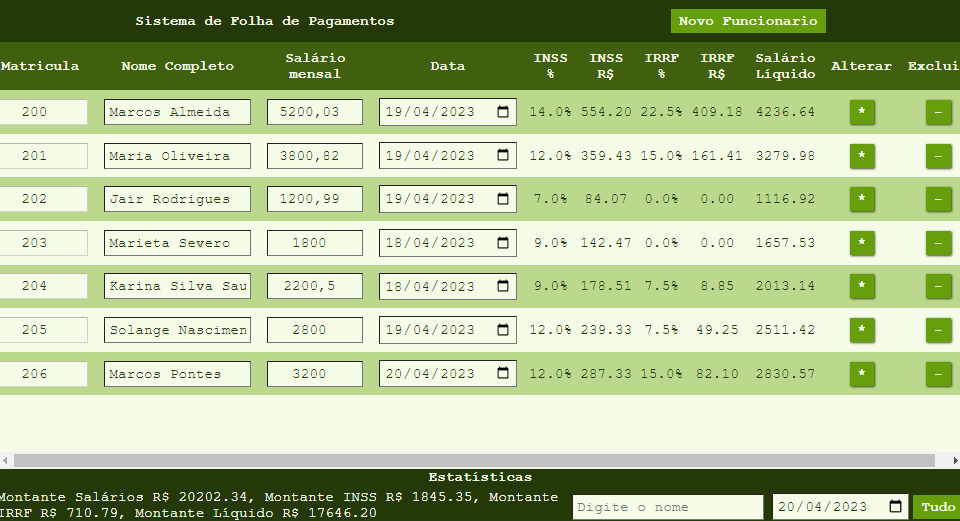
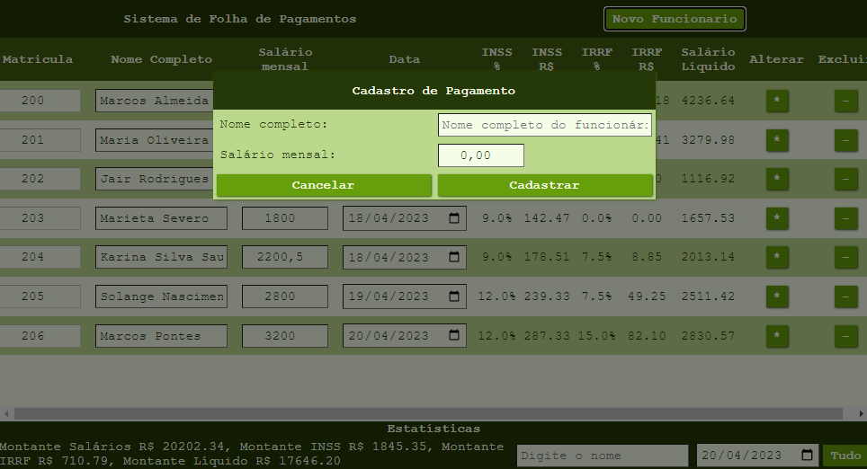

# Exemplo BackEnd (NodeJS + Prisma(ORM) MySQL + Pug)
* Necessário ter NodeJS e MySQL instalados
1. Clonar este reposiório:
    - git clone
2. Instalar as dependência
    - npm install
3. Criar um arquivo chamado **.env** contendo
```env
DATABASE_URL="mysql://root@localhost:3306/pagamentos?schema=public&timezone=UTC"
```
4. Instalar prisma globalmente e executar a migração
```cmd
npm i -g prisma
prisma migrate dev --name "primeira_migracao"
```
5. Instalar pelo menos os dados de teste a seguir no banco de dados, via phpmyadmin, mysqlworkbank ou cmd
```sql
USE pagamentos;
INSERT INTO pagamento VALUES
(200,'Marcos Almeida',5200.00,DATE_ADD(CURDATE(),INTERVAL -30 DAY)),
(201,'Maria Oliveira',3800.00,DATE_ADD(CURDATE(),INTERVAL -10 DAY)),
(202,'Jair Rodrigues',1200.00,DATE_ADD(CURDATE(),INTERVAL -10 DAY)),
(203,'Marieta Severo',1800.00,DATE_ADD(CURDATE(),INTERVAL -3 DAY)),
(204,'Karina Silva',2200.00,DATE_ADD(CURDATE(),INTERVAL -3 DAY)),
(205,'Solange Nascimento',2800.00,DATE_ADD(CURDATE(),INTERVAL -2 DAY)),
(206,'Marcos Pontes',3200.00,DATE_ADD(CURDATE(),INTERVAL -1 DAY)),
(207,'Mariana Vieira',6200.00,CURDATE()),
(208,'Suzana Oliveira',9200.00,CURDATE());
```
6. Iniciar a aplicação
    - npm start
    - ou node app.js
    - ou nodemon
7. Executar no caminho: http://localhost:3000<br>

# Situação Problema - Folha de Pagamento

|Contextualização:|
|-|
|O setor de Gestão de pessoas da empresa XPTO precisa de um sistema Web para validar a Folha de pagamentos, até o momento a esta empresa utiliza planilhas para fazer este controle. Necessita de um sistema que receba como entrada a matrícula do funcionário, nome completo, salário mensal e data do pagamento, de diversos funcionários  e este retorne além de todos estes dados o desconto de INSS em porcentagem e em dinheiro, o desconto do IRRF também em porcentagem e dinheiro e o salário líquido, o sistema deve também somar o montante pago de salário, INSS, IRRF e salário líquido|

- O Analista de sistemas já realizou a análise das regras de negócio, converteu em requisitos e documentou conforme diagramas a seguir:

|Documento|Conteúdo ou Diagrama|
|-|:-:|
|Regras de Negócio| **RN001**: O sistema deve receber como entrada os dados básicos de pagamento (Matrícula, Nome,Salário e Data)<br> **RN002**: Deve calcular INSS conforme a tabela:<br><br> **RN003**: Deve calcular o IRRF conforme tabela<br><br> **RN004**: Deve listar todos, permitir alterar, excluir e cadastrar novo<br> **RN005**: Deve permitir filtrar os pagamentos pelo nome do Funcionário|
|Os Requisitos Funcionais estão representados através do UML - DCU Diagrama de Casos de uso, atendendo as 5 regras de negócio||
|UML - DC Diagrama de Classes||
|MER DER Modelo Conceitual||
|UML - DA Diagrama de Atividades||

|Desafio:|
|-|
|Você foi contratado como Programador Full-Stack, por isso deve desenvolver a Aplicação Web com as funcionalidades documentadas, utilize os dados abaixo para testar sua aplicação e desenvolva o Front-End, BackEnd e Banco de Dados|

|Matricula|Nome Completo|Salário|Data|
|-|-|-|-|
|200|Marcos Almeida|5200.00|CURDATE()|
|201|Maria Oliveira|3800.00|CURDATE()|
|202|Jair Rodrigues|1200.00|CURDATE()|
|203|Marieta Severo|1800.00|CURDATE()|
|204|Karina Silva|2200.00|CURDATE()|
|205|Solange Nascimento|2800.00|CURDATE()|
|206|Marcos Pontes|3200.00|CURDATE()|
|207|Mariana Vieira|6200.00|CURDATE()|
|208|Suzana Oliveira|9200.00|CURDATE()|

Estes dados fictícios são apenas para teste, pode utilizar os de sua preferência.

|WireFrames|
|:-:|
||
|Wireframe 1 : Tela principal CRUD Folha de Pagamento|
||
|Wireframe 2 : Tela de cadastro de Novo de Pagamento|

As telas são meramente ilustrativas, estilze com cores e formas de sua preferência.

|Entregas|
|-|
|Crie um repositório público do github com o código fonte e as instruções de execução, passe o enderço do repositório ao seu instrutor|