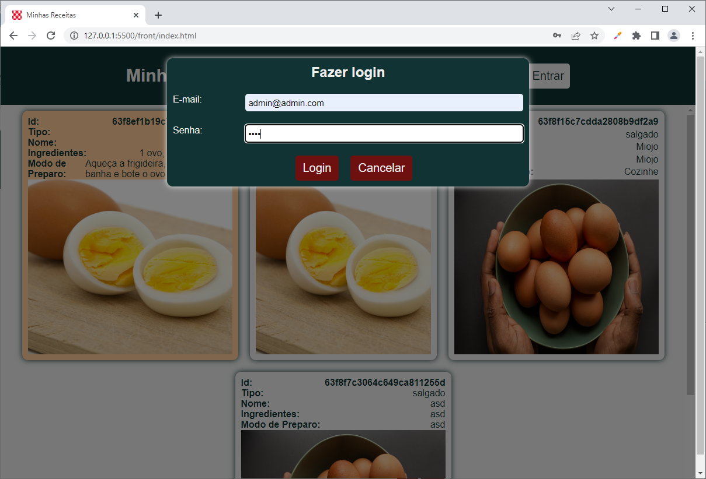
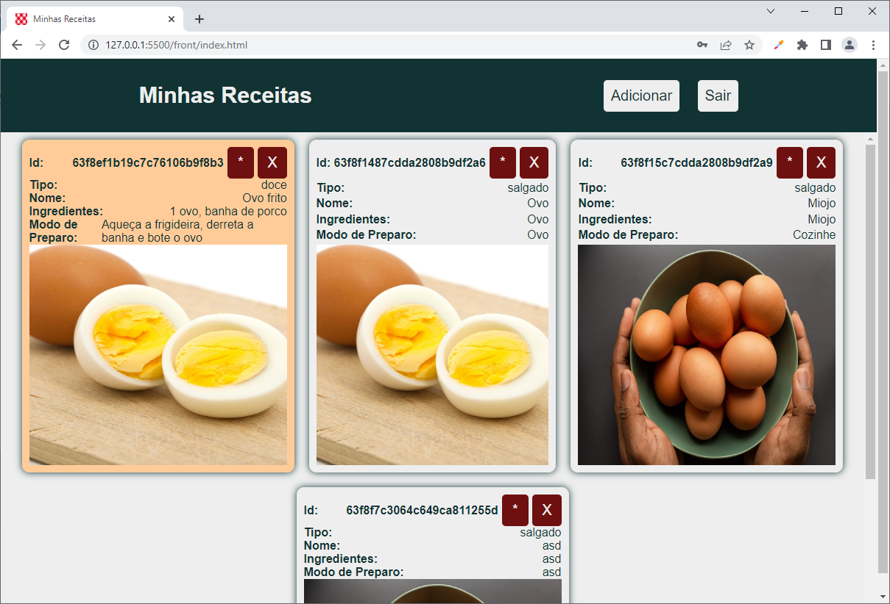

# Livro de Receitas, Exemplo CRUD (NodeJS+MongoDB)
## back (express mongoose) e front html, css, js (trabalhando com imagens Base64)
- Requisitos
    - Nodejs
    - MongoDB Compass
- Executar
    - Clonar este repositório
    - Abrir com VsCode **code .**
    - Na pasta /back:
        - Criar um arquivo **.env** com o conteúdo a seguir
        ```env
        MONGODB_URI=mongodb://localhost:27017
        USER=admin@admin.com
        USER_PASSWD=1234
        ```
    - Abrir o terminal **CTRL + "**
        ```cmd
        cd back
        npm i
        nodemon
        ```
    - Abra a pasta /front
        - Execute o index.html com o Live Server (Extensão do VsCode)

