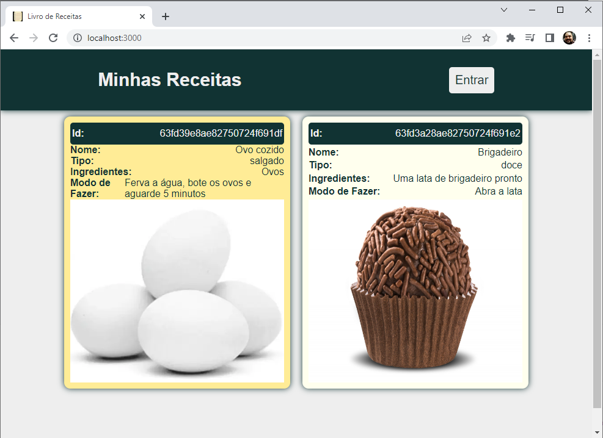
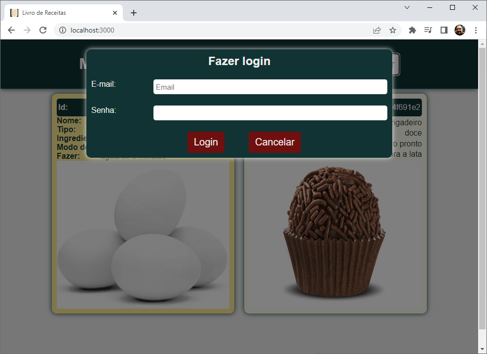
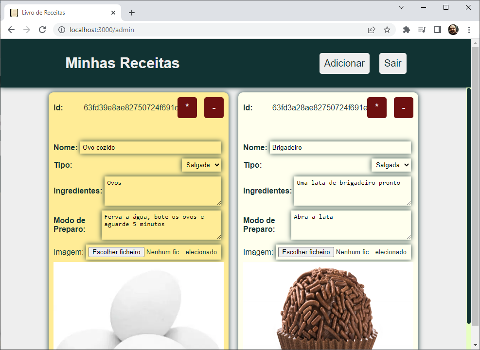
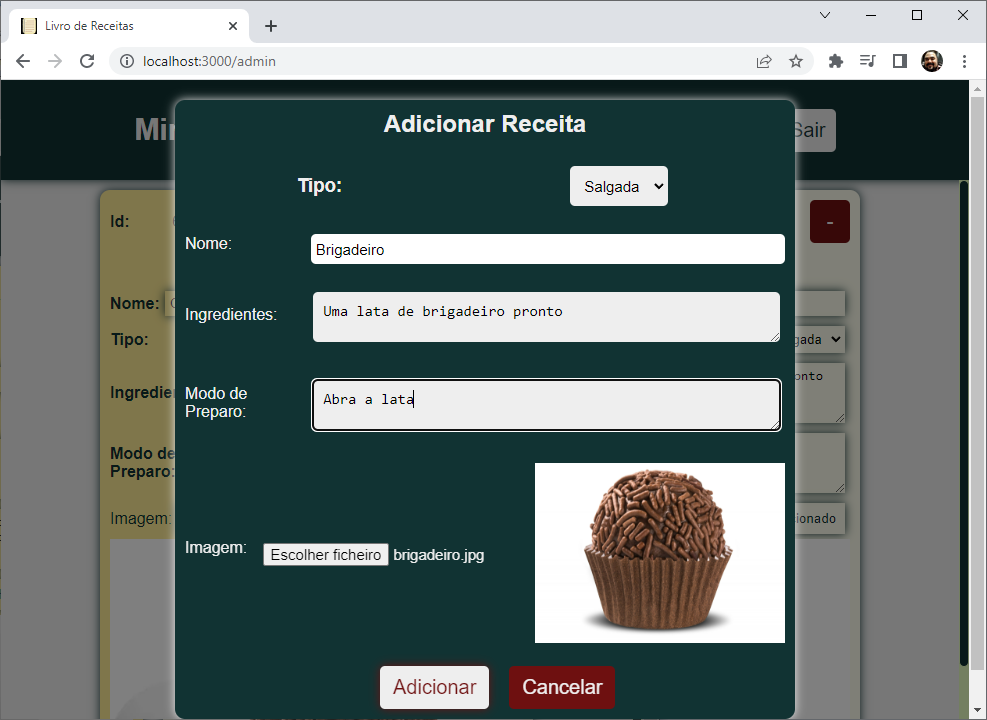

# Livro de Receitas exemplo BackEnd (Node + Mongo + Pug)
* Necessário ter NodeJS e MongoDB instalados
1. Clonar este reposiório:
    - git clone
2. Instalar as dependência
    - npm install
3. Iniciar a aplicação
    - npm start
    - ou node app.js
    - ou nodemon
4. Executar no caminho: http://localhost:3000

## MongoDB
Banco de dados não relacional de simples utilização

## PUG
Pug é uma linguagem de template para gerar HTML. Anteriormente conhecida como Jade, a linguagem foi criada pelo desenvolvedor de software T.J. Holowaychuk em 2010, com o objetivo de simplificar a escrita de código HTML.
<br>
A sintaxe do Pug é baseada em indentação e permite que você crie templates HTML de maneira mais concisa e legível. Em vez de usar tags HTML, o Pug usa indentação para indicar a hierarquia dos elementos e usa uma sintaxe curta para definir atributos, classes e IDs.
<br>
Por exemplo, um trecho de código HTML que cria um formulário de login:
```html
<form action="/login" method="post">
  <label for="email">E-mail:</label>
  <input type="email" id="email" name="email" required>

  <label for="password">Senha:</label>
  <input type="password" id="password" name="password" required>

  <button type="submit">Entrar</button>
</form>
```
Pode ser escrito em Pug da seguinte forma:
```pug
form(action="/login", method="post")
  label(for="email") E-mail:
  input(type="email", id="email", name="email", required)

  label(for="password") Senha:
  input(type="password", id="password", name="password", required)

  button(type="submit") Entrar
```
O código Pug é mais conciso e fácil de ler do que o HTML correspondente. O Pug também permite o uso de variáveis, loops, condicionais e outras estruturas de controle em templates, o que pode ser útil para gerar HTML dinamicamente.
<br>
O Pug é frequentemente usado com o Node.js para gerar páginas HTML dinamicamente em aplicativos da web. O Pug é instalado através do npm (Node Package Manager) e é facilmente integrado com outros pacotes do Node.js, como o Express.js, um framework popular para criação de aplicativos da web em Node.js.

### Fonte: ChatGPT 27/02/2023

## Protótipo



