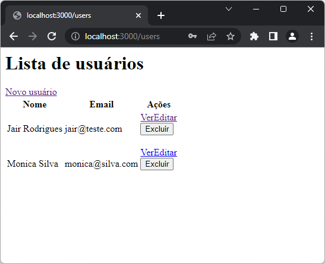
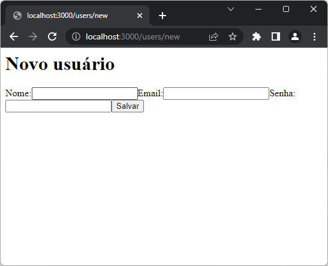
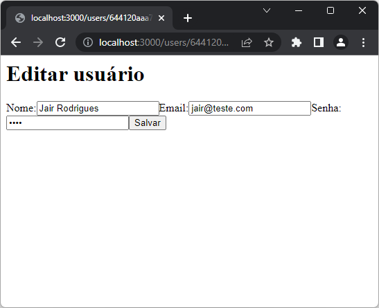
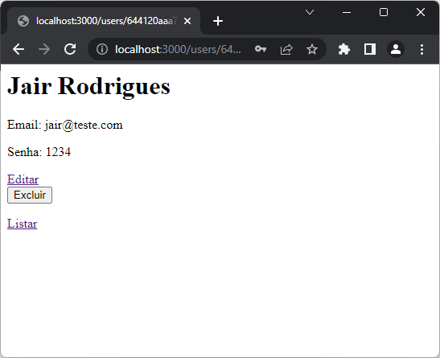

# App Users (CRUD) Exemplo (NodeJS + MongoDB + Pug)
* Necessário ter NodeJS e MongoDB instalados localmente
1. Clonar este reposiório:
2. Instalar as dependência
```cmd
    npm install
```
3. Iniciar a aplicação
```cmd
    npm start
    node app.js
    nodemon
```
4. Executar no caminho: http://localhost:3000

|Descrição/Arquivo|Tela|
|-|-|
|Tela principal Listar<br>index.pug||
|Tela cadastrar Novo<br>new.pug||
|Tela editar usuário<br>edit.pug||
|Tela detalhar<br>show.pug||