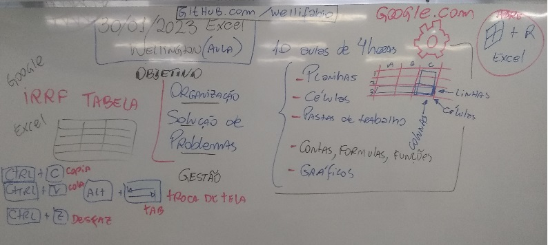
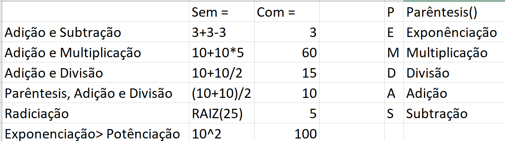

.Funções básicas das planilhas eletrônicas
----------------
- Manipulação das células
- Contas, Fórmulas e Funções
- Copiar, colar, selecionar, alça de preencimento
- Planilha simples de orçamento
- Cálculos básicos com porcentagem
- Planilha de notas e cálculos de médias
- 
- 
	