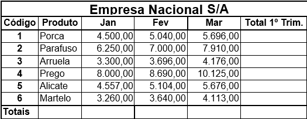
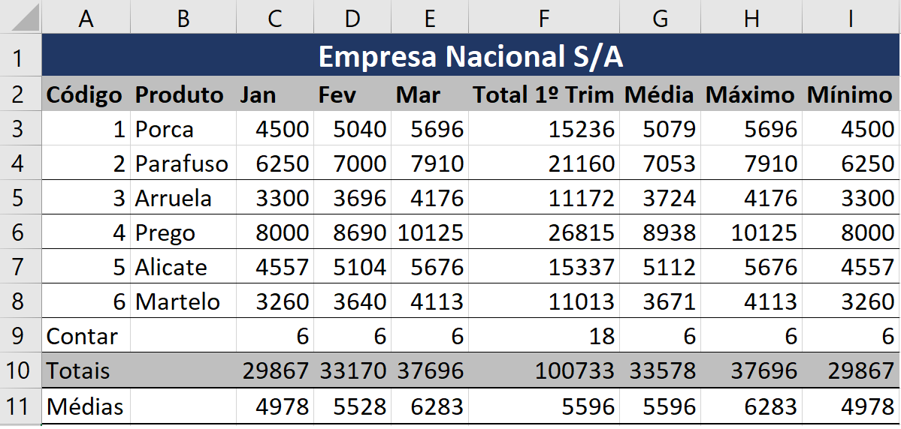
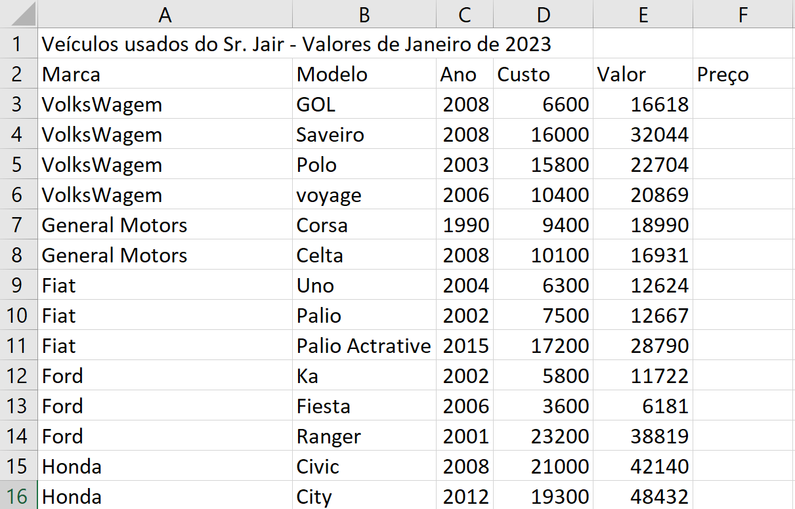

# Excel - Aula03
- Planilha base para estudarmos funções estatísticas:
	- Soma()
	- Média()
	- Maximo()
	- Mínimo()
	- Cont.Num()
# Atividade 1:
- 
- Atividade 1 corrigida:
- 
# Cálculos com porcentagem
- <b>10%</b> é o mesmo que dizer 10 <b>dividido por 100</b> ou 10/100
- Então, vemos que uma porcentagem é uma <b>divisão</b>
- Por isso toda conta de porcentagem é uma <b>multiplicação</b>
- Quanto é 10% de R$ 200,00
	- = 200 * 10%
	- = 20
- Desconto:
	- = Valor - Valor * Porcentagem
- Acrescimo:
	- = Valor + Valor * Porcentagem
# Atividade 2:
- 
