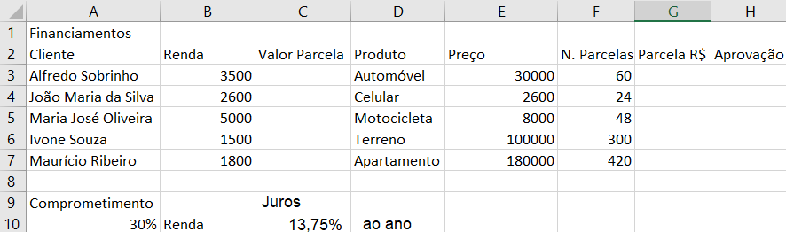
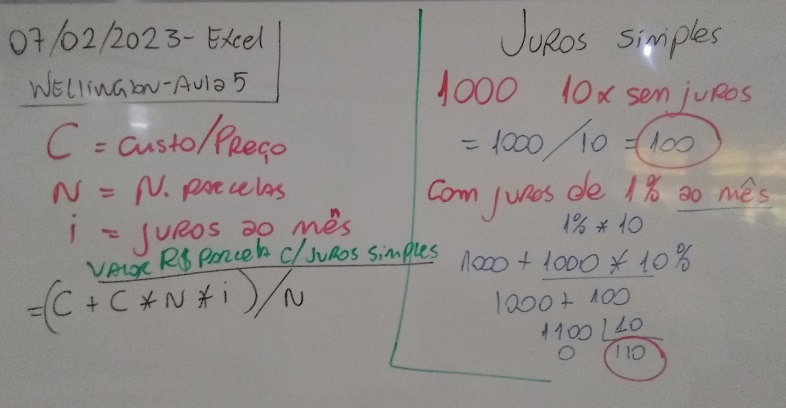

# Excel - Aula05
- Exercícios com cálculos de porcentagem e função SE()
- SE(Comparação > maior, Menor, igual...; se sim; senão)
- 
- 1. Calcule o "Valor da Parcela" na coluna "C" sabendo que o Cliente só pode comprometer até 30% de sua renda por parcela
- 2. Calcule a "Parcela R$" na coluna "G" sem juros.
- 3. Escreva na coluna "H" as palavras "Aprovado" se o "Parcela R$" for menor do que "Valor da Parcela" ou "Reprovado" senão.
- 4. Exclua os dados da coluna "G" e calcule novamenta agora aplicando jurtos simples de 13,75% ao ano.
	- OBS: Perceba que as parcelas são ao mês, desta forma antes de calcular converta os 13,75% ao ano para ao mês.
# Lousa
- 
- 5. Utilizando a função SE() faça com que o Excel calcule se o emprestimo será "Aprovado" ou "Reprovado".
- 6. Utiliza formatação condicional para deixar as palavras "Reprovado" em vermelho.
- 7. Por fim, calcule novamente a coluna "G" agora aplicando juros compostos.