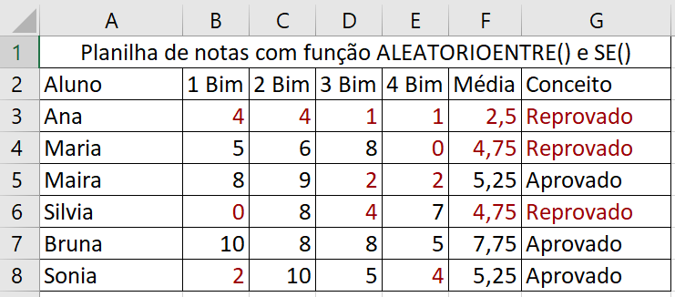
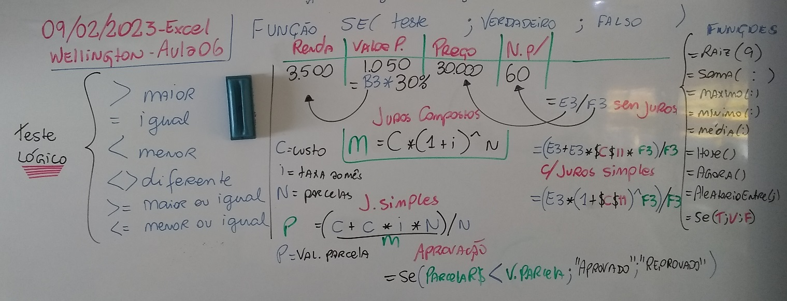
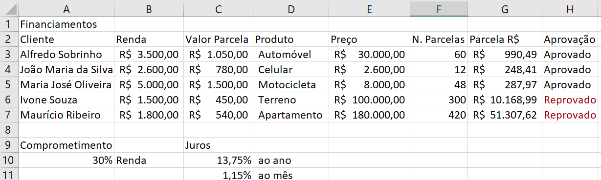
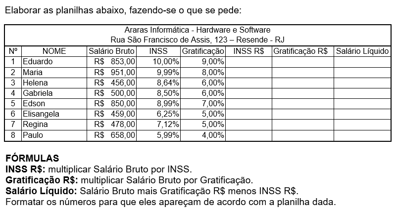

# Excel - Aula06
- Função SE()
- SE(Comparação > maior, Menor, igual...; se sim; senão)
	<table>
	<tr><td>></td><td>maior</td></tr>
	<tr><td><</td><td>menor</td></tr>
	<tr><td>=</td><td>igual</td></tr>
	<tr><td>>=</td><td>maior ou igual</td></tr>
	<tr><td><=</td><td>menor ou igual</td></tr>
	<tr><td><></td><td>Diferente</td></tr>
	</table>
- Função ALEATORIOENTRE(menor;maior)
	- Gera um número pseudo aleatório entre os números indicados
	- O computador verifica os milisegundos do relógio para escolher o número
- Formatação Condicional
	- A formatação condicional altera as cores das células utilizando os mesmos critérios
		- é maior do que
		- é menor do que
		- é igual a
		- é diferente de
		- ...
- 
# Lousa
- 
- 
# Atividade 02
- 
