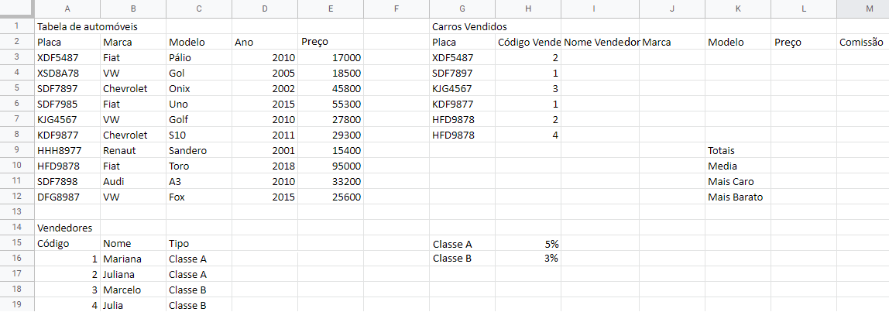

# Excel Aula 09
## Avaliação Formativa de Excel

1. Abra o Excel e copie esta planilha
2. Salve em Documentos com o nome de "Agência de automóveis"
3. Preencha a coluna **I** (Nome Vendedor) com os nomes respectivos aos códigos dos vendedores
   - Para isso utilize a função PROCV(**Cod. Vendedor;Vendedores;2;VERDADEIRO**)
4. Preencha a coluna **J** (Marca) com a marca de cada carro vendido
   - Utilize a função PROCV(**Placa;Tabela de automoveis;2;VERDADEIRO**)
5. Preencha a coluna **K** (Modelo) com o modelo de cada carro vendido
   - Utilize a função PROCV(**Placa;Tabela de automoveis;3;VERDADEIRO**)
6. Preencha a coluna **L** (Preço) com o preço de cada carro vendido
   - Utilize a função PROCV(**Placa;Tabela de automoveis;5;VERDADEIRO**)
7. Preencha a coluna **M** (Comissão) multiplicando o **Preço** pela **porcentagem** de comissão:
   - Sabendo que se o vendedor for **Classe A** a comissão é 5%
   - Se o vendedor for **Classe B** a comissão é 3%
   - A fórmula é o **Preço** * **Porcentagem**
8. Calcule as **estatísticas**:
   * Totais
   * Média
   * Mais caro
   * Mais Barato
9. Formate a planilha **Mesclando e centralizando** os títulos
   * Colocando, bordas, cores se necessário
   * Formate os preços colocando-os em reais (R$)
   * Destaque as estatísticas

10. Faça um gráfico selecionando as colunas **Modelo** e **Preço** dos automóveis, escolha um dos gráficos recomendados pelo Excel.
### Ao concluir chame o professor para corrigir

## Atividade 2
* Restaurante do Chiquinho

1. Abra uma planilha nova no Excel e copie a planilha conforme imagem acima:
2. Formate os preços em R$ Reais
3. Tratase de um cardápio e uma comanda
   * Seu Francisco precisa calcular rapidamente as contas de seus fregueses.
   * Para isso utilize a função **PROCV()** e preencha a coluna **B** com os nomes dos pratos, procure pelo **id do prato**
4. Preencha a coluna **C** com o preço dos pratos:
   * Utilize a função **PROCV()** também, procurando pelo **id do prato**
5. Calcule:
   * A: O **Subtotal**
   * B: O **Total**
   * C: E o **Troco**
6. Agora para testar, vamos apagar os dados da primeira coluna **A** e os da coluna das quantidades **D** e preecher com os seguintes valores:

|id do prato|quantidade|
|-|:-:|
|3|1|
|9|1|
|14|2|

* Quanto deu este almoço?
* O Cliente pagou com uma nota de R$100,00
* Quanto recebeu de troco?

7. Novamente vamos apagar os dados da primeira coluna **A** e os da coluna das quantidades **D** e preecher com os seguintes valores:

|id do prato|quantidade|
|-|:-:|
|4|1|
|17|1|

* Quanto deu este almoço?
* O Cliente pagou com uma nota de R$100,00
* Quanto recebeu de troco?