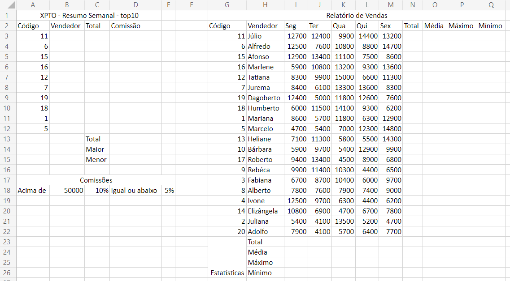
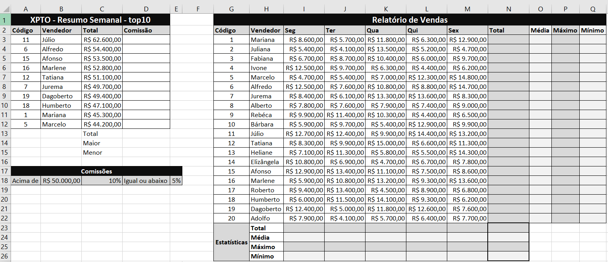

# Avaliação Somativa de Excel
- Abra uma nova pasta de trabalho do excel e digite a planilha a seguir:
  
- Ao concluir a digitação formate os dados, valores em reais, bordas, cores a sua escolha, e classifique os dados por código de A-Z conforme exemplo a seguir:
    - 20% Concluído
  
    - 30% Concluído
- Calcule as estatísticas por dia da semana (Total, Média, Máximo e Mínimo) somente até a coluna "M"
    - 40% Concluído
- Calcule as estátísticas por funcionário colunas (N, O, P e Q) somente até a linha "22"
    - 50% Concluído
- Calcule as estatísticas do Total "coluna N" (Soma(), Média(), Máximo() e Mínimo())
    - 60% Concluído
- Preencha a coluna "B" com os nomes dos vendedores:
  - Utilize a função PROCV(Código, Tabela Relatório, Coluna 2)
    - 70% Concluído
- Preencha a coluna "C" com os totais de cada vendedor
  - Utilize a função PROCV(Código, Tabela Relatório, Coluna 8)
    - 80% Concluído
- Na coluna "D" calcule a comissão de cada vendedor seguindo a regra das comissões descrita na linha 18. Se utilizar a função SE() corretamente 90%, se fizer manualmente 85%
- Selecione as colunas "B" e "D", vendedor e comissão e crie um gráfico recomendado.
- Calcule o Total, Maior e Menor comissão nas células (D13, D14, D15)
- Chame o professor para avaliar.
- Clique no link a seguir e responda o questionário: https://forms.gle/N3io1HFogznzxPh57