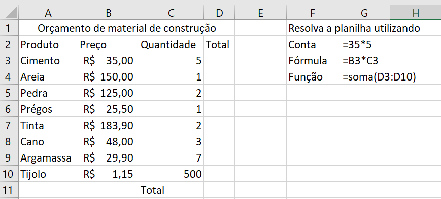
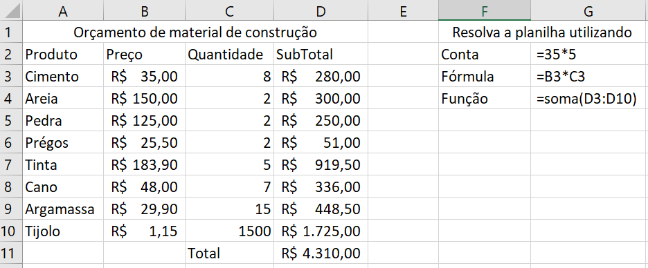
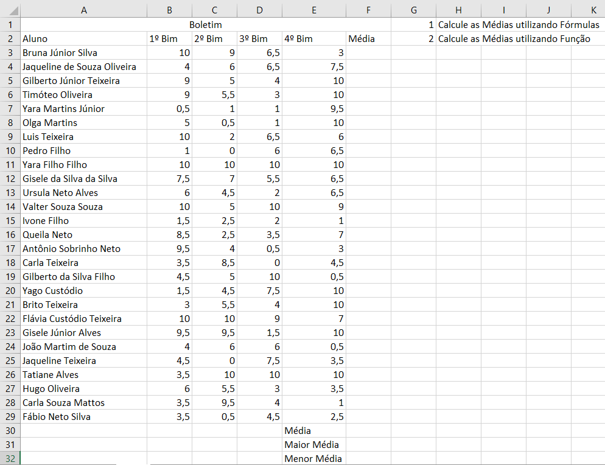
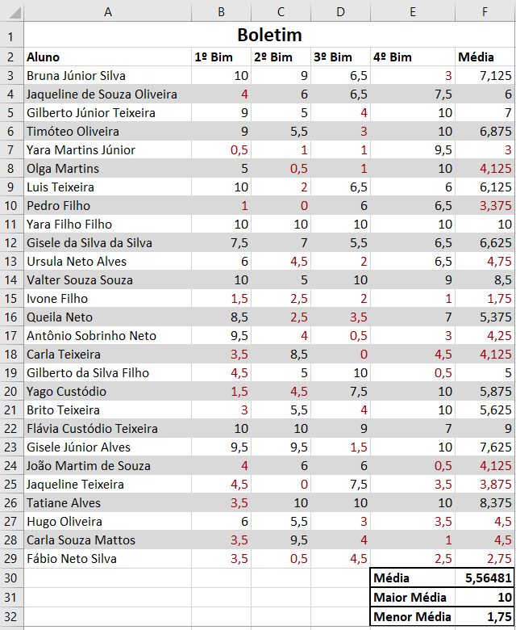
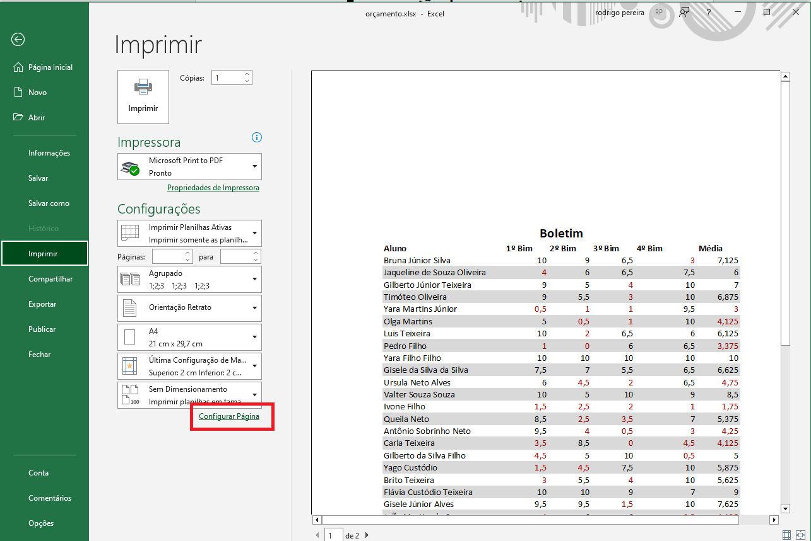
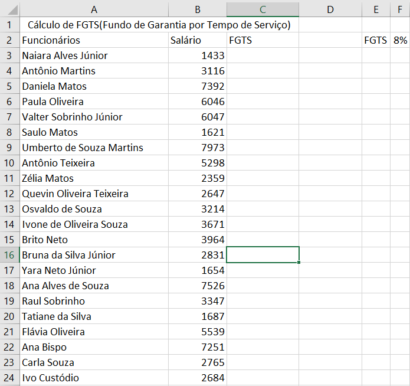

# Aula01 - Excel
## Funções básicas das planilhas eletrônicas
- Manipulação das células
- Contas, Fórmulas e Funções
- Copiar, colar, selecionar, alça de preencimento
- Planilha simples de orçamento
- Planilha de notas e cálculos de médias
- Cálculos básicos com porcentagem
## Exemplos práticos
- Planilha de um orçamento simples, conta de multiplicação
- 
- Resultados
- 
- Planilha de Notas (boletim escolar) Funções estatísticas
- 
- Resultados
- 
- Arquivo Imprimir
- 
- Calculando o FGTS (Porcentagem)
- 